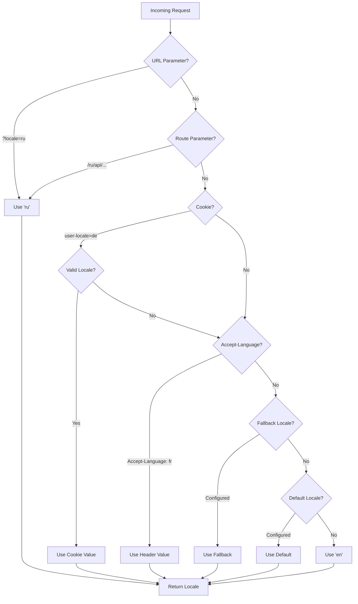

# 🌍 Nuxt I18n Micro 中的服务端翻译与语言信息

## 📖 概述

Nuxt I18n Micro 支持服务端翻译与语言信息,让你可以在服务端翻译内容并访问语言详情。这在需要在到达客户端之前完成本地化的 API 或服务端渲染应用中尤其有用。

翻译使用 Nuxt I18n 配置中定义的语言消息,并根据检测到的语言动态解析。

在默认的 `translationPayloads.mode: 'premerged'` 下,根级文件会在构建时以 `\{page\}/\{locale\}/data.json` 的形式被烘焙进每个页面的 payload。服务端加载的是与客户端在 `/\{apiBaseUrl\}/...` 下 fetch 相同的预构建文件,因此所有键(共享的与页面级的)都可在服务端处理器中使用。

在 `translationPayloads.mode: 'source'` 下,当调用 `loadTranslationsFromServer()`(或访问 `/_locales` 路由)时,紧凑的源文件会在运行时合并 —— 在 **Edge** 上通过 Nitro `serverAssets`,在 **Node** 上从可选的 public 副本读取。详情参见[性能指南 —— Serverless Payload 输出](/guides/performance#serverless-payload-output)与[缓存与存储架构](/api/cache)。

关于运行时与服务端 API 的完整清单,请参见 [API 参考](/api/overview)。

## 🛠️ 配置服务端中间件

要启用服务端翻译与语言信息,请使用提供的中间件函数:

- `useTranslationServerMiddleware` —— 用于翻译内容
- `useLocaleServerMiddleware` —— 用于访问语言信息

这两个中间件函数在所有服务端路由中都自动可用。

两个中间件都通过 `detectCurrentLocale` 工具函数共享语言检测逻辑,以确保模块内的一致性。

## ✨ 在服务端处理器中使用翻译

你可以在任意 `eventHandler` 中通过翻译中间件无缝地翻译内容。

### 示例:基础翻译用法

```typescript
import { defineEventHandler } from 'h3'

export default defineEventHandler(async (event) => {
  const t = await useTranslationServerMiddleware(event)
  return {
    message: t('greeting'), // Returns the translated value for the key "greeting"
  }
})
```

在此示例中:

- 用户的语言会根据查询参数、Cookie 或请求头自动检测。
- `t` 函数会为检测到的语言返回对应的翻译。

## 🌍 在服务端处理器中使用语言信息

### 基础语言信息用法

```typescript
import { defineEventHandler } from 'h3'

export default defineEventHandler((event) => {
  const localeInfo = useLocaleServerMiddleware(event)

  return {
    success: true,
    data: localeInfo,
    timestamp: new Date().toISOString(),
  }
})
```

### 提供自定义语言参数

```typescript
import { defineEventHandler } from 'h3'

export default defineEventHandler((event) => {
  // Force specific locale with custom default
  const localeInfo = useLocaleServerMiddleware(event, 'en', 'ru')

  return {
    success: true,
    data: localeInfo,
    timestamp: new Date().toISOString(),
  }
})
```

### 响应结构

语言中间件会返回一个包含以下属性的 `LocaleInfo` 对象:

```typescript
interface LocaleInfo {
  current: string // Current detected locale code
  default: string // Default locale code
  fallback: string // Fallback locale code
  available: string[] // Array of all available locale codes
  locale: Locale | null // Full locale configuration object
  isDefault: boolean // Whether current locale is the default
  isFallback: boolean // Whether current locale is the fallback
}
```

### 示例响应

```json
{
  "success": true,
  "data": {
    "current": "ru",
    "default": "en",
    "fallback": "en",
    "available": ["en", "ru", "de"],
    "locale": {
      "code": "ru",
      "iso": "ru-RU",
      "dir": "ltr",
      "displayName": "Русский"
    },
    "isDefault": false,
    "isFallback": false
  },
  "timestamp": "2024-01-15T10:30:00.000Z"
}
```

## 🌐 提供自定义语言

如果你需要手动指定语言(例如用于测试或某些请求),可将其传给翻译中间件:

### 示例:自定义语言

```typescript
import { defineEventHandler } from 'h3'

function detectLocale(event): string | null {
  const urlSearchParams = new URLSearchParams(event.node.req.url?.split('?')[1])
  const localeFromQuery = urlSearchParams.get('locale')
  if (localeFromQuery) return localeFromQuery

  return 'en'
}

export default defineEventHandler(async (event) => {
  const t = await useTranslationServerMiddleware(event, 'en', detectLocale(event)) // Force French local, en - default locale
  return {
    message: t('welcome'), // Returns the French translation for "welcome"
  }
})
```

## 📋 语言检测逻辑

两个中间件函数都会按以下优先级自动确定用户语言:



1. **URL 参数**:`?locale=ru`
2. **路由参数**:`/ru/api/endpoint`
3. **Cookie**:`user-locale` Cookie
4. **HTTP 请求头**:`Accept-Language` 请求头
5. **回退语言**:模块选项中配置的
6. **默认语言**:模块选项中配置的
7. **硬编码回退**:`'en'`

> **注意**:`useLocaleServerMiddleware` 与 `useTranslationServerMiddleware` 共享语言检测逻辑,以确保模块内的一致性。

## 📋 进阶用法示例

### 基于语言的条件响应

```typescript
import { defineEventHandler } from 'h3'

export default defineEventHandler((event) => {
  const { current, isDefault, locale } = useLocaleServerMiddleware(event)

  // Return different content based on locale
  if (current === 'ru') {
    return {
      message: 'Привет, мир!',
      locale: current,
      isDefault,
    }
  }

  if (current === 'de') {
    return {
      message: 'Hallo, Welt!',
      locale: current,
      isDefault,
    }
  }

  // Default English response
  return {
    message: 'Hello, World!',
    locale: current,
    isDefault,
  }
})
```

### 自定义语言检测

```typescript
import { defineEventHandler } from 'h3'

export default defineEventHandler((event) => {
  // Force German locale with English as fallback
  const { current, isDefault, locale } = useLocaleServerMiddleware(event, 'en', 'de')

  return {
    message: 'Hallo, Welt!',
    locale: current,
    isDefault: false, // Will be false since we forced German
  }
})
```

### 带校验的语言感知 API

```typescript
import { defineEventHandler, createError } from 'h3'

export default defineEventHandler((event) => {
  const { current, available, locale } = useLocaleServerMiddleware(event)

  // Validate if the detected locale is supported
  if (!available.includes(current)) {
    throw createError({
      statusCode: 400,
      statusMessage: `Unsupported locale: ${current}. Available locales: ${available.join(', ')}`,
    })
  }

  // Return locale-specific configuration
  return {
    locale: current,
    direction: locale?.dir || 'ltr',
    displayName: locale?.displayName || current,
    availableLocales: available,
  }
})
```

### 与翻译中间件整合

你可以将语言信息与翻译中间件结合使用,以实现完整的国际化:

```typescript
import { defineEventHandler } from 'h3'

export default defineEventHandler(async (event) => {
  const localeInfo = useLocaleServerMiddleware(event)
  const t = await useTranslationServerMiddleware(event)

  return {
    locale: localeInfo.current,
    message: t('welcome_message'),
    availableLocales: localeInfo.available,
    isDefault: localeInfo.isDefault,
  }
})
```

## 📝 最佳实践

1. **始终校验语言**:检查检测到的语言是否在可用语言列表中
2. **使用回退逻辑**:在语言检测失败时提供合理的默认值
3. **缓存语言信息**:对性能敏感的应用,可考虑缓存语言检测结果
4. **处理边缘情况**:考虑不支持的语言并返回合适的错误响应
5. **与翻译结合**:将语言信息与翻译中间件配合使用,以获得完整的 i18n 支持

## 🚀 性能考量

- 两个中间件函数都很轻量,设计为快速执行
- 语言检测使用高效的回退链
- 语言检测期间不发起任何外部 API 调用
- 结果同步计算,以获得最佳性能
