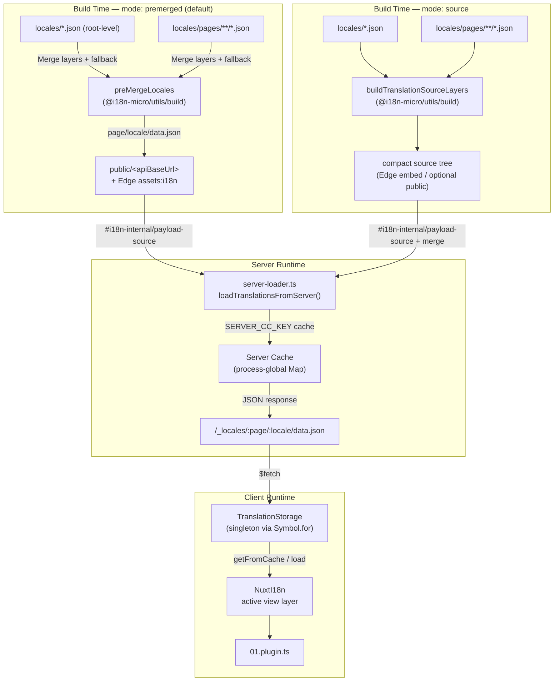

# 🗄️ 翻譯快取與儲存架構

## 📖 總覽

Nuxt I18n Micro v3 採用多層快取架構處理翻譯。payload 的載入方式取決於 `translationPayloads.mode`：

- **`premerged`**（預設）：根層、頁面、fallback 與 layer 檔案會在建置期透過 `@i18n-micro/utils/build` 合併為 `\{page\}/\{locale\}/data.json`
- **`source`**：保留精簡的原始檔，供執行期透過 `@i18n-micro/utils/source-loader` 與 `@i18n-micro/utils/merge-source` 合併（Edge 會將檔案嵌入 Nitro 的 `serverAssets`；Node 則會從 `public/` 讀取複製後的檔案）

本頁說明內建快取的運作方式，以及如何為自訂情境（例如管理工具、外部 API、快取失效）擴充它。

## 📊 架構總覽

### 資料流



## 🧱 核心元件

### 1. `TranslationStorage`（用戶端 + 伺服器）

**檔案**：`src/runtime/utils/storage.ts`

一個單例類別，為用戶端與伺服器提供統一的翻譯儲存。它會在 `globalThis` 上使用 `Symbol.for('__NUXT_I18N_STORAGE_CACHE__')`，即使載入多個 bundle 也能確保只存在一個實例。

**主要方法：**

| 方法                              | 說明                                                                     |
| --------------------------------- | ------------------------------------------------------------------------ |
| `getFromCache(locale, routeName?)`  | 同步檢查：回傳快取中的記憶體資料，若無則回傳 `null`                        |
| `load(locale, routeName?, options)` | 非同步載入並帶有快取機制：先檢查快取，未命中時透過 `$fetch` 取得              |
| `clear()`                           | 清除整個快取                                                              |

**快取鍵格式**：`\{locale\}:\{routeName\}`（例如 `en:index`、`fr:about`）

```typescript
import { translationStorage } from '../utils/storage'

// Synchronous cache check
const cached = translationStorage.getFromCache('en', 'index')

// Async load (with automatic caching)
const result = await translationStorage.load('en', 'index', {
  apiBaseUrl: '_locales',
  baseURL: '/',
  dateBuild: '2024-01-01',
})
// result.data — merged translations
// result.cacheKey — cache key used
```

### ⚙️ 決定性的快取破除（`i18n.dateBuild`）

預設情況下，此模組會在建置時使用 `Date.now()` 產生 `dateBuild`，並嵌入產生的 `#build/i18n.strategy.mjs`，作為查詢參數（`?v=...`）用於在重建之後讓翻譯的下載快取失效。

若你需要可重現的建置結果（例如提升滾動部署中的 chunk 快取命中率），可在 `nuxt.config` 設定固定值：

```ts
export default defineNuxtConfig({
  i18n: {
    // Any stable string/number (git SHA, CI build number, release tag, etc.)
    dateBuild: process.env.GIT_SHA ?? 'local-dev',
  },
})
```

### 2. `loadTranslationsFromServer()`（僅伺服器端）

**檔案**：`src/runtime/server/utils/server-loader.ts`

載入特定語系／頁面的翻譯，並將合併後的結果快取在一個由 `@i18n-micro/hmr/cache-keys` (`SERVER_CC_KEY`) 索引的行程全域 `CacheControl` Map 中。

行為：SSR 從 `#i18n-internal/payload-source` 載入。在 **Node** 環境下會以 `readFile` 讀取 `public/<apiBaseUrl>` 下的檔案（premerged 模式為 `\{page\}/\{locale\}/data.json`）；在 **Edge** 環境下則使用 `assets:i18n`。`premerged` 讀取單一檔案；`source` 則透過 `@i18n-micro/utils/source-loader` 合併根層／頁面／fallback。

```typescript
import { loadTranslationsFromServer } from '../server/utils/server-loader'

// Returns { data: Translations, json: string }
const { data, json } = await loadTranslationsFromServer('en', 'index')
```

### 3. 用戶端載入（不嵌入 HTML）

字典**不會**被寫入 `nuxtApp.payload`。伺服器會將其保留在記憶體中供 SSR 渲染使用；用戶端外掛則會 `await` `switchContext`，並載入 `/\{apiBaseUrl\}/:page/:locale/data.json`（與 `@nuxtjs/i18n` 在 `experimental.preload: false` 時預設行為相同）。

`NuxtI18n` 會保存 `$t()` 與 `$has()` 目前使用的檢視層字典。`NuxtTranslationLoader` 會切換語系／路由 context，並將 chunk 合併進該層。

### 4. 伺服器 API 路由

**路由**：`/_locales/\{page\}/\{locale\}/data.json`

**檔案**：`src/runtime/server/routes/i18n.ts`

這條 Nitro 路由會依目前的 payload 模式提供合併過的翻譯。它會呼叫 `loadTranslationsFromServer()`，並以 JSON 形式回傳結果。

在正式環境下，它也會設定：

```http
Cache-Control: public, max-age={httpCacheDuration}, immutable
```

`httpCacheDuration` 預設為 `31536000`（1 年）。這是安全的，因為用戶端請求 payload 時會使用 `?v=\{dateBuild\}` 進行快取破除。將 `httpCacheDuration: 0` 可省略此標頭。開發模式下不會套用此標頭。

## 📥 擴充：自訂翻譯載入

### 從快取讀取（伺服器路由）

```ts
// server/api/i18n/load-cache.[post].ts
import { defineEventHandler, readBody } from 'h3'
import { loadTranslationsFromServer } from '#imports'

export default defineEventHandler(async (event) => {
  const { page, locale } = await readBody<{ page: string; locale: string }>(event)
  const { data } = await loadTranslationsFromServer(locale, page)
  return { locale, page, data }
})
```

### 更新翻譯（寫檔並使快取失效）

```ts
// server/api/i18n/update.[post].ts
import { defineEventHandler, readBody, createError } from 'h3'
import { join } from 'node:path'
import { readFile, writeFile } from 'node:fs/promises'
import { deepMergeTranslations } from '@i18n-micro/utils/deep-merge'

export default defineEventHandler(async (event) => {
  const { path, updates } = await readBody<{ path: string; updates: Record<string, unknown> }>(event)

  if (!path || !updates) {
    throw createError({ statusCode: 400, statusMessage: 'Missing path or updates' })
  }

  const fullPath = join('locales', path)
  let existing: Record<string, unknown> = {}

  try {
    const content = await readFile(fullPath, 'utf-8')
    existing = JSON.parse(content) as Record<string, unknown>
  } catch {
    // File does not exist — create new
  }

  const merged = deepMergeTranslations(existing, updates)
  await writeFile(fullPath, JSON.stringify(merged, null, 2), 'utf-8')

  return { success: true, path, updated: merged }
})
```


## 🧹 清除快取

### 以程式化方式清除用戶端快取

使用內建的 `$clearCache` 方法：

```vue
<script setup>
const { $clearCache } = useNuxtApp()

// Clears both TranslationStorage and plugin-level cache
$clearCache()
</script>
```

### 伺服器端快取行為

伺服器端快取（`loadTranslationsFromServer`）為行程全域，會持續存在直到：

- 伺服器行程重新啟動
- 偵測到新的部署（`dateBuild` 值變更）

在 serverless 環境中，每次冷啟動都會有一份全新的快取。

## ⚙️ Serverless 設定

在 serverless 環境（Cloudflare Workers、AWS Lambda）中，內建快取使用記憶體中的 `Map` 物件。翻譯快取本身不需要任何外部儲存設定。

不過，Nitro 儲存原始翻譯檔案時可能需要額外設定：

```ts
export default defineNuxtConfig({
  nitro: {
    storage: {
      // Only needed if default file-system storage is unavailable
      'assets:server': {
        driver: 'cloudflare-kv-binding',
        binding: 'MY_KV_NAMESPACE',
      },
    },
  },
})
```

## 💡 與 v2 的主要差異

| 面向             | v2                            | v3                                                                        |
| ---------------- | ----------------------------- | ------------------------------------------------------------------------- |
| 用戶端快取       | `useStorage('cache')`         | `TranslationStorage` 單例（於 globalThis 使用 Symbol.for）                  |
| SSR 傳輸         | 執行時設定                    | 透過 `payload.data` 傳送完整 chunk（v3.0 使用 `useState`）                   |
| 伺服器端快取     | Nitro cache storage           | 透過 `Symbol.for` 的行程全域 `Map`                                        |
| 合併邏輯         | 用戶端                        | 建置期（`premerged`）或執行期（`source`），透過 `@i18n-micro/utils/*`         |
| 快取鍵格式       | `i18n:merged:\{page\}:\{locale\}` | `\{locale\}:\{routeName\}`                                                    |

## 📚 相關資源

- [效能指南](/guides/performance)：快取如何影響效能
- [伺服器端翻譯](/guides/server-side-translations)：在伺服器路由中使用翻譯
- [Firebase 部署](/guides/firebase)：部署相關的快取注意事項
