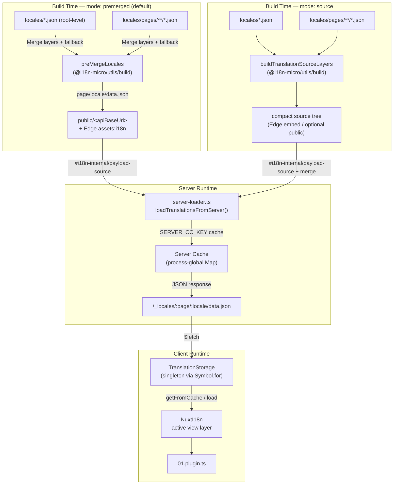

# 🗄️ 翻譯快取與儲存架構

## 📖 概觀

Nuxt I18n Micro v3 為翻譯採用多層快取架構。Payload 載入取決於 `translationPayloads.mode`:

- **`premerged`**(預設)—— root、page、fallback 與 layer 檔在建置期由 `@i18n-micro/utils/build` 合併為 `\{page\}/\{locale\}/data.json`
- **`source`** —— 保留精簡的來源檔,於執行時由 `@i18n-micro/utils/source-loader` 與 `@i18n-micro/utils/merge-source` 合併(Edge 將其嵌入 Nitro `serverAssets`;Node 在被複製時從 `public/` 讀取)

本頁說明內建快取的運作方式,以及如何為自訂用途(管理工具、外部 API、快取失效)加以擴充。

## 📊 架構概觀

### 資料流



## 🧱 核心元件

### 1. `TranslationStorage`(客戶端 + 伺服器)

**檔案**:`src/runtime/utils/storage.ts`

一個為客戶端與伺服器提供統一翻譯儲存的單例類別。它使用 `globalThis` 上的 `Symbol.for('__NUXT_I18N_STORAGE_CACHE__')`,即使載入多個 bundle,也只會有單一實例。

**主要方法:**

| 方法                                | 說明                                                                     |
| ----------------------------------- | ------------------------------------------------------------------------ |
| `getFromCache(locale, routeName?)`  | 同步檢查:回傳記憶體中的快取資料,或 `null`                              |
| `load(locale, routeName?, options)` | 具備快取的非同步載入:先檢查快取,再透過 `$fetch` 抓取                    |
| `clear()`                           | 清除整個快取                                                             |

**快取鍵格式**:`\{locale\}:\{routeName\}`(例如 `en:index`、`fr:about`)

```typescript
import { translationStorage } from '../utils/storage'

// Synchronous cache check
const cached = translationStorage.getFromCache('en', 'index')

// Async load (with automatic caching)
const result = await translationStorage.load('en', 'index', {
  apiBaseUrl: '_locales',
  baseURL: '/',
  dateBuild: '2024-01-01',
})
// result.data — merged translations
// result.cacheKey — cache key used
```

### ⚙️ 確定性的快取失效(`i18n.dateBuild`)

預設情況下,模組會在建置期使用 `Date.now()` 產生 `dateBuild`,並將其嵌入產生的 `#build/i18n.strategy.mjs`,作為查詢參數(`?v=...`),於重新建置後讓翻譯抓取的快取失效。

若你需要可重現的建置(例如在滾動式部署中提高 chunk 快取命中率),可在 `nuxt.config` 中設定穩定值:

```ts
export default defineNuxtConfig({
  i18n: {
    // Any stable string/number (git SHA, CI build number, release tag, etc.)
    dateBuild: process.env.GIT_SHA ?? 'local-dev',
  },
})
```

### 2. `loadTranslationsFromServer()`(僅伺服器)

**檔案**:`src/runtime/server/utils/server-loader.ts`

為某個語系/頁面載入翻譯,並將合併結果快取於程序全域的 `CacheControl` map,以 `@i18n-micro/hmr/cache-keys` 的 `SERVER_CC_KEY` 為鍵。

行為:SSR 由 `#i18n-internal/payload-source` 載入 —— **Node** 從 `public/<apiBaseUrl>` 使用 `readFile`(premerged 模式下為 `\{page\}/\{locale\}/data.json`),**Edge** 使用 `assets:i18n`。`premerged` 讀取單一檔案;`source` 透過 `@i18n-micro/utils/source-loader` 合併 root/page/fallback。

```typescript
import { loadTranslationsFromServer } from '../server/utils/server-loader'

// Returns { data: Translations, json: string }
const { data, json } = await loadTranslationsFromServer('en', 'index')
```

### 3. 客戶端載入(不嵌入 HTML)

字典**不會**被寫入 `nuxtApp.payload`。伺服器將它們保留在記憶體中供 SSR 渲染;客戶端外掛會 `await` `switchContext`,由它載入 `/\{apiBaseUrl\}/:page/:locale/data.json`(與 `@nuxtjs/i18n` 的 `experimental.preload: false` 為相同的預設姿態)。

`NuxtI18n` 保有作用中的 view-layer 字典,供 `$t()` 與 `$has()` 使用。`NuxtTranslationLoader` 切換語系/路由上下文,並將 chunk 合併進該層。

### 4. 伺服器 API 路由

**路由**:`/_locales/\{page\}/\{locale\}/data.json`

**檔案**:`src/runtime/server/routes/i18n.ts`

此 Nitro 路由為當前 payload 模式提供合併後的翻譯。它會呼叫 `loadTranslationsFromServer()` 並以 JSON 回傳結果。

在生產環境中,也會設定:

```http
Cache-Control: public, max-age={httpCacheDuration}, immutable
```

預設 `httpCacheDuration` 為 `31536000`(1 年)。這是安全的,因為客戶端會以 `?v=\{dateBuild\}` 進行快取失效。設定 `httpCacheDuration: 0` 可省略此標頭。開發模式下不套用此標頭。

## 📥 擴充:自訂翻譯載入

### 從快取讀取(伺服器路由)

```ts
// server/api/i18n/load-cache.[post].ts
import { defineEventHandler, readBody } from 'h3'
import { loadTranslationsFromServer } from '#imports'

export default defineEventHandler(async (event) => {
  const { page, locale } = await readBody<{ page: string; locale: string }>(event)
  const { data } = await loadTranslationsFromServer(locale, page)
  return { locale, page, data }
})
```

### 更新翻譯(檔案 + 失效快取)

```ts
// server/api/i18n/update.[post].ts
import { defineEventHandler, readBody, createError } from 'h3'
import { join } from 'node:path'
import { readFile, writeFile } from 'node:fs/promises'
import { deepMergeTranslations } from '@i18n-micro/utils/deep-merge'

export default defineEventHandler(async (event) => {
  const { path, updates } = await readBody<{ path: string; updates: Record<string, unknown> }>(event)

  if (!path || !updates) {
    throw createError({ statusCode: 400, statusMessage: 'Missing path or updates' })
  }

  const fullPath = join('locales', path)
  let existing: Record<string, unknown> = {}

  try {
    const content = await readFile(fullPath, 'utf-8')
    existing = JSON.parse(content) as Record<string, unknown>
  } catch {
    // File does not exist — create new
  }

  const merged = deepMergeTranslations(existing, updates)
  await writeFile(fullPath, JSON.stringify(merged, null, 2), 'utf-8')

  return { success: true, path, updated: merged }
})
```

<Tip>

</Tip>

## 🧹 清除快取

### 以程式清除快取(客戶端)

使用內建的 `$clearCache` 方法:

```vue
<script setup>
const { $clearCache } = useNuxtApp()

// Clears both TranslationStorage and plugin-level cache
$clearCache()
</script>
```

### 伺服器端快取行為

伺服器端快取(`loadTranslationsFromServer`)為程序全域,直到以下情況才會清除:

- 伺服器程序重啟
- 偵測到新部署(不同的 `dateBuild` 值)

在無伺服器環境中,每次冷啟動都會有全新的快取。

## ⚙️ 無伺服器設定

對於無伺服器環境(Cloudflare Workers、AWS Lambda),內建快取使用記憶體中的 `Map` 物件。翻譯快取本身無需外部儲存設定。

不過,來源翻譯檔的 Nitro 儲存可能需要設定:

```ts
export default defineNuxtConfig({
  nitro: {
    storage: {
      // Only needed if default file-system storage is unavailable
      'assets:server': {
        driver: 'cloudflare-kv-binding',
        binding: 'MY_KV_NAMESPACE',
      },
    },
  },
})
```

## 💡 與 v2 的主要差異

| 面向             | v2                            | v3                                                                       |
| ---------------- | ----------------------------- | ------------------------------------------------------------------------ |
| 客戶端快取       | `useStorage('cache')`         | `TranslationStorage` 單例(globalThis 上的 Symbol.for)                  |
| SSR 傳輸         | Runtime config                | 完整 chunk 透過 `payload.data`(v3.0 使用 `useState`)                    |
| 伺服器端快取     | Nitro cache storage           | 程序全域的 `Map`,以 `Symbol.for` 建立                                    |
| 合併邏輯         | 客戶端                        | 建置期(`premerged`)或執行時(`source`),透過 `@i18n-micro/utils/*`      |
| 快取鍵格式       | `i18n:merged:\{page\}:\{locale\}` | `\{locale\}:\{routeName\}`                                                   |

## 📚 相關

- [效能指南](/guides/performance) —— 快取如何影響效能
- [伺服器端翻譯](/guides/server-side-translations) —— 在伺服器路由中使用翻譯
- [Firebase 部署](/guides/firebase) —— 部署相關的快取考量
