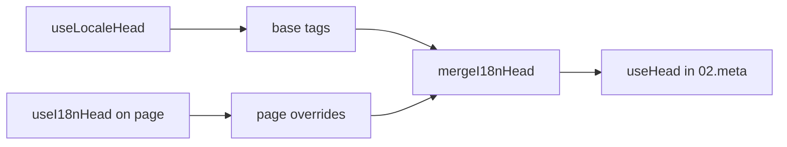

# `useI18nHead` composable

`useI18nHead` 讓你**逐頁**自訂 i18n SEO 標籤，而不需另外撰寫自訂 meta 外掛。當 `meta: true` 時，模組會將你的輸入合併於 [`useLocaleHead`](/api/composables/use-locale-head) 產出的內容之上。

常見情境：

- **CMS／部落格文章**：只有部分語系有翻譯；不同語言的替代 URL 不同（不同 slug 或路徑）。
- **動態 canonical**：canonical URL 必須符合 API 提供的文章 URL，而非 `$switchLocalePath`。
- **額外的 Open Graph**：`og:title`、`og:description`、`og:image` 與自動產生的 `og:locale`／`og:url` 並存。
- **部分控制**：保留模組產生的 canonical 與 `og:url`，僅取代 `hreflang` 與 `og:locale:alternate`。

---

## 型別簽章

{/* generated:symbol:useI18nHead — do not edit; run `pnpm run docs:generate` */}

```ts
useI18nHead(input?: MaybeRefOrGetter<I18nHeadInput | null>): { pageHead: any; resetPageHead: () => void }
```

註冊頁面層級的 i18n SEO head 標籤覆寫。
會由 `02.meta` 外掛合併於 `useLocaleHead` 產出的內容之上。

| 參數 | 型別 | 說明 |
| --- | --- | --- |
| `input`（選填） | `MaybeRefOrGetter<I18nHeadInput \| null>` |  |

{/* /generated:symbol:useI18nHead */}

## 在流程中的位置



你會在頁面元件中呼叫 `useI18nHead`。`02.meta` 外掛會在每次 `updateMeta()`（路由變更、`$setI18nRouteParams`、用戶端的 `page:finish`）後套用這些覆寫。

---

## 範例 1：僅部分語系有翻譯的文章

常見模式：API 會回傳存在的語系與其絕對或相對 URL。

```ts
interface Article {
  title: string
  slug: string
  /** Locale code → page URL (absolute or site-relative) */
  locales: Record<string, string>
}
```

```vue
<script setup lang="ts">
const route = useRoute()
const { data: article } = await useFetch<Article>(`/api/articles/${route.params.slug}`)

const localeCodes = computed(() => Object.keys(article.value?.locales ?? {}))

useI18nHead(() => {
  if (!article.value) return null

  return {
    meta: [
      { property: 'og:title', content: article.value.title },
      { property: 'og:type', content: 'article' },
    ],
    replace: {
      hreflang: localeCodes.value.map((locale) => ({
        rel: 'alternate',
        hreflang: locale,
        href: article.value!.locales[locale]!,
      })),
      ogAlternates: localeCodes.value,
    },
  }
})
</script>
```

`ogAlternates` 接受你 `i18n.locales` 設定中的**語系代碼**。`og:locale:alternate` 的值會透過 `locale.og` 或 `iso` 解析（Open Graph `en_US` 格式）。

---

## 範例 2：使用逐語系 slug 的文章（`$defineI18nRoute` + `$setI18nRouteParams`）

當 URL 是由多語系路由樣板與動態參數組合而來時：

```vue
<script setup lang="ts">
const { $defineI18nRoute, $setI18nRouteParams } = useNuxtApp()
const route = useRoute()

const { data: article } = await useFetch(`/api/articles/${route.params.slug}`)

$defineI18nRoute({
  localeRoutes: {
    en: '/blog/[slug]',
    de: '/de/blog/[slug]',
    fr: '/fr/blog/[slug]',
  },
})

if (article.value) {
  $setI18nRouteParams({
    en: { slug: article.value.slugEn },
    de: { slug: article.value.slugDe },
    fr: { slug: article.value.slugFr },
  })

  const availableLocales = article.value.availableLocales as string[]

  useI18nHead({
    meta: [{ property: 'og:title', content: article.value.title }],
    replace: {
      hreflang: availableLocales.map((locale) => ({
        rel: 'alternate',
        hreflang: locale,
        href: article.value!.urls[locale],
      })),
      ogAlternates: availableLocales,
    },
  })
}
</script>
```

模組產生的 alternates 會列出**所有**已設定語系。`replace.hreflang` 可將標籤限縮到實際有翻譯的語系。

---

## 範例 3：為預設語系文章 URL 使用自訂 `x-default`

預設情況下，`x-default` 會指向 `$switchLocalePath` 中的預設語系 URL。對於文章，可以改為指向預設語系翻譯 URL：

```vue
<script setup lang="ts">
const { $defaultLocale } = useNuxtApp()
const article = await loadArticle()

const defaultLocale = $defaultLocale() ?? 'en'
const defaultHref = article.locales[defaultLocale]

useI18nHead({
  replace: {
    hreflang: Object.entries(article.locales).map(([locale, href]) => ({
      rel: 'alternate',
      hreflang: locale,
      href,
    })),
    xDefault: defaultHref ? { rel: 'alternate', hreflang: 'x-default', href: defaultHref } : false,
    ogAlternates: Object.keys(article.locales),
  },
})
</script>
```

---

## 範例 4：以 API 資料取代 canonical 與 `og:url`

當 canonical 必須符合 CMS 提供的 URL（多網域、自訂路徑或預先建構的絕對 URL）：

```vue
<script setup lang="ts">
const article = await loadArticle()
const canonical = article.canonicalUrl // e.g. https://www.example.com/en/blog/my-post

useI18nHead({
  replace: {
    canonical,
    ogUrl: canonical,
    hreflang: buildAlternateLinks(article),
    ogAlternates: Object.keys(article.locales),
  },
  meta: [
    { property: 'og:title', content: article.title },
    { name: 'description', content: article.excerpt },
  ],
})
</script>
```

---

## 範例 5：保留自動 canonical／`og:url`，僅取代替代語系

若 `$switchLocalePath` + `$setI18nRouteParams` 已產生正確的 canonical 與 `og:url`，只需取代探索用標籤：

```vue
<script setup lang="ts">
const article = await loadArticle()

useI18nHead({
  replace: {
    hreflang: buildAlternateLinks(article),
    ogAlternates: Object.keys(article.locales),
  },
})
</script>
```

---

## 範例 6：內容詳細頁的完整 head（meta + link）

類似於將「頁面 meta」與「替代連結」拆成不同輔助函式的做法，但這裡合併於一次呼叫：

```vue
<script setup lang="ts">
const article = await loadArticle()
const alternates = Object.entries(article.locales).map(([locale, href]) => ({
  rel: 'alternate' as const,
  hreflang: locale,
  href: normalizeSeoUrl(href), // strip ?query and #hash if needed
}))

useI18nHead({
  meta: [
    { property: 'og:title', content: article.title },
    { property: 'og:description', content: article.description },
    { property: 'og:image', content: article.imageUrl },
    { name: 'twitter:card', content: 'summary_large_image' },
    { name: 'twitter:title', content: article.title },
  ],
  replace: {
    canonical: article.canonicalUrl,
    ogUrl: article.canonicalUrl,
    hreflang: alternates,
    ogAlternates: Object.keys(article.locales),
  },
})
</script>
```

```ts
/** Remove query and hash — useful when CMS URLs must be clean for SEO */
function normalizeSeoUrl(href: string): string {
  try {
    const url = new URL(href, 'https://placeholder.local')
    url.search = ''
    url.hash = ''
    return href.startsWith('http') ? url.href : `${url.pathname}`
  } catch {
    return href.split(/[?#]/)[0] ?? href
  }
}
```

---

## 範例 7：兩種內容類型、同一模式（news 與 guides）

API 結構相同、路由名稱不同，可用小型輔助函式重用：

```ts
// composables/useArticleHead.ts
import type { I18nHeadInput } from '@i18n-micro/types'

interface LocalizedContent {
  title: string
  locales: Record<string, string>
  canonicalUrl?: string
}

export function buildArticleHead(content: LocalizedContent): I18nHeadInput {
  const localeCodes = Object.keys(content.locales)
  const canonical = content.canonicalUrl ?? content.locales.en

  return {
    meta: [{ property: 'og:title', content: content.title }],
    replace: {
      canonical,
      ogUrl: canonical,
      hreflang: localeCodes.map((locale) => ({
        rel: 'alternate',
        hreflang: locale,
        href: content.locales[locale]!,
      })),
      ogAlternates: localeCodes,
    },
  }
}
```

```vue
<!-- pages/blog/[slug].vue -->
<script setup lang="ts">
const article = await loadArticle()
useI18nHead(buildArticleHead(article))
</script>
```

```vue
<!-- pages/guides/[slug].vue -->
<script setup lang="ts">
const guide = await loadGuide()
useI18nHead(buildArticleHead(guide))
</script>
```

---

## 範例 8：停用內建替代語系並提供自訂清單

等同於停用模組的 hreflang 產生器，並自行傳入清單（不會出現重複的替代語系集合）：

```vue
<script setup lang="ts">
const article = await loadArticle()

useI18nHead({
  disable: ['hreflang', 'x-default', 'og-alternates'],
  link: Object.entries(article.locales).map(([locale, href]) => ({
    rel: 'alternate',
    hreflang: locale,
    href,
  })),
  replace: {
    ogAlternates: Object.keys(article.locales),
  },
})
</script>
```

或者不使用 `disable`，改用 `replace.hreflang`：它會一次性取代所有 `rel="alternate"` 連結。

---

## 範例 9：Landing 頁：僅新增 OG，保留所有 i18n 標籤

```vue
<script setup lang="ts">
const { t } = useI18n()

useI18nHead({
  meta: [
    { property: 'og:title', content: t('landing.ogTitle') },
    { property: 'og:description', content: t('landing.ogDescription') },
  ],
})
</script>
```

---

## 範例 10：產品頁：為單一語系實驗停用 hreflang

```vue
<script setup lang="ts">
useI18nHead({
  disable: ['hreflang', 'x-default'],
  // canonical, og:locale, og:url still generated
})
</script>
```

---

## 範例 11：用戶端 fetch 之後的響應式更新

```vue
<script setup lang="ts">
const article = ref<Article | null>(null)

onMounted(async () => {
  article.value = await $fetch('/api/articles/latest')
})

useI18nHead(() => {
  if (!article.value) return null
  return {
    meta: [{ property: 'og:title', content: article.value.title }],
    replace: {
      hreflang: Object.entries(article.value.locales).map(([locale, href]) => ({
        rel: 'alternate',
        hreflang: locale,
        href,
      })),
    },
  }
})
</script>
```

Head 會在 `page:finish` 以及 `pageHead` state 變動時重新整理。

---

## 範例 12：位於反向代理後的 HTTPS origin

若你之前用「public origin」composable 為 canonical／alternate 產生絕對 URL，改用模組設定即可：

```ts
// nuxt.config.ts
export default defineNuxtConfig({
  i18n: {
    meta: true,
    // undefined = origin from current request (multi-domain friendly)
    metaBaseUrl: undefined,
    metaTrustForwardedHost: true,
    metaTrustForwardedProto: true,
  },
})
```

然後在 `replace.hreflang`／`replace.canonical` 中傳入**路徑或完整 URL**。SSR 期間模組會使用 `useRequestURL` 搭配 `X-Forwarded-Host`／`X-Forwarded-Proto`。

---

## API 參考

### `meta`

額外的 `<meta>` 標籤。以 `id`、`property` 或 `name` 去重。

### `link`

額外的 `<link>` 標籤。以 `id` 或 `rel` + `hreflang` 去重。

### `htmlAttrs`

合併至 `useLocaleHead` 的 `<html>` 屬性中（`lang`、`dir`）。

### `replace`

| 鍵             | 型別                       | 效果                                             |
| -------------- | ------------------------- | ----------------------------------------------- |
| `canonical`    | `string \| false`         | 取代或移除 canonical 連結                          |
| `hreflang`     | `I18nHeadLink[] \| false` | 取代或移除所有 `rel="alternate"` 連結              |
| `xDefault`     | `I18nHeadLink \| false`   | 取代或移除 `hreflang="x-default"`                  |
| `ogLocale`     | `string \| false`         | 取代或移除 `og:locale`                            |
| `ogUrl`        | `string \| false`         | 取代或移除 `og:url`                               |
| `ogAlternates` | `string[] \| false`       | 依語系代碼重建 `og:locale:alternate`               |

### `disable`

| 值               | 移除項目                                    |
| --------------- | ----------------------------------------- |
| `hreflang`      | 語系替代連結（不含 `x-default`）              |
| `x-default`     | `hreflang="x-default"` 連結                |
| `canonical`     | canonical 連結                             |
| `og`            | `og:locale` 與 `og:url`                    |
| `og-alternates` | `og:locale:alternate` 標籤                  |
| `html`          | `<html>` 上的 `lang`／`dir`                 |

---

## `useLocaleHead` 與 `useI18nHead` 比較

| Composable      | 範圍                    | 使用時機                                     |
| --------------- | ---------------------- | ------------------------------------------- |
| `useLocaleHead` | 全域／手動 head        | `meta: false` 且完全自訂 `useHead`             |
| `useI18nHead`   | 頁面層級覆寫            | `meta: true` 且要自訂特定頁面                  |

當 `meta: true` 時，僅使用 `useI18nHead` 的頁面**不需要**再呼叫 `useLocaleHead`。

---

## 從自訂 i18n head 外掛遷移

許多專案會維護一個自訂外掛，內容包含：

- 從共用 state 合併頁面專屬替代連結；
- 過濾重複的地區 `hreflang` 條目；
- 標準化 `og:locale` 值；
- 從 SEO URL 移除 query string。

你可以將這些邏輯替換為在每個內容頁使用 `useI18nHead`，並搭配模組預設值。

| 舊做法                                                | 使用 `useI18nHead`                                    |
| ----------------------------------------------------- | ---------------------------------------------------- |
| 共用 state + 「此文章存在哪些語系」                     | `replace: \{ ogAlternates: localeCodes \}`             |
| 另寫輔助函式建立 `rel="alternate"` 連結                | `replace: \{ hreflang: links \}`                       |
| 自訂外掛將頁面 state 合併進 head                       | `02.meta` 內建合併                                    |
| 為絕對 URL 建立自訂「public origin」                    | `metaBaseUrl` + forwarded 標頭（見範例 12）             |
| 使用短版 `og:locale`（`en` 而非 `en_US`）              | 設定 `locale.og`，或使用 `iso` → `en_US`（OG 協定）     |

**由 `iso` 產生 `hreflang`：**每個語系會發出一個 alternate，其 `hreflang = iso || code`。若已設定 `iso`，則永遠不使用路由 `code`（避免產生 `hreflang="mx"` 這類無效標籤）。若要啟用僅含語言的 fallback（`es-ES` → 也發出 `es`），設定 `hreflangBaseLanguage: true`，其推導自 `iso` 而非 `code`。若需要完全自訂清單，請使用 `replace.hreflang`。

**JSON-LD：** `useI18nHead` 不會產生結構化資料。請繼續使用 `useHead(\{ script: [...] \})` 或專屬的 JSON-LD 輔助工具，兩者可並存。

---

## 另請參閱

- [SEO 指南](/guides/seo)：自動 meta 產生與頁面層級覆寫
- [`useLocaleHead`](/api/composables/use-locale-head)：底層 head API
