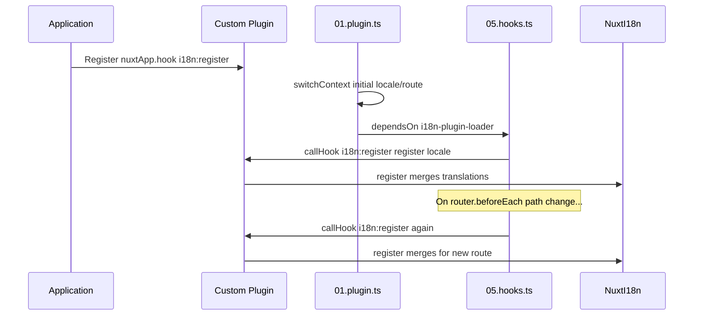

# 📢 事件

## 🔄 `i18n:register`

`Nuxt I18n Micro` 中的 `i18n:register` 事件可讓你動態地將翻譯加入應用的 i18n context，使國際化流程更彈性、更順暢。此事件允許你視需要整合新的翻譯，強化應用的在地化能力。

### 📝 事件細節

- **用途**：
  - 讓額外的翻譯能動態併入特定語系既有的翻譯集合中。

- **Payload**：
  - **`register`**：
    - 事件所提供的函式，接受兩個參數：
      - **`translations`**（`Translations`）：
        - 包含翻譯鍵值對的物件，其結構須符合 `Translations` 介面。
      - **`locale`**（`string`，選填）：
        - 註冊翻譯所適用的語系代碼（例如 `'en'`、`'ru'`）。若未指定，會使用事件所提供的語系。

- **行為**：
  - 被觸發時，`register` 函式會將新翻譯合併至指定語系的目前 context，更新應用中可用的翻譯。

### ⏱️ 觸發時機

模組的 hooks 外掛（`05.hooks.ts`，`dependsOn: ['i18n-plugin-loader']`）會呼叫 `nuxtApp.callHook('i18n:register', …)`：

1. **啟動時呼叫一次**：在主要 i18n 外掛（`01.plugin.ts`）為初始路由載入翻譯之後。
2. **導覽時呼叫**：在 `router.beforeEach` 中路徑變更時呼叫；當 `strategy: 'no_prefix'` 時，每次導覽都會呼叫。

在一般 Nuxt 外掛中使用 `nuxtApp.hook('i18n:register', …)` 註冊監聽器。hooks 外掛會等 loader 就緒後才執行，因此當翻譯需要擴充時，你的 callback 就會被呼叫。

在 `nuxt.config` 中設定 `hooks: false` 可停用自動 `i18n:register` 呼叫（詳見[設定 — `hooks`](/guides/configuration#hooks)）。

### 💡 用法範例

以下範例示範如何透過 `i18n:register` 事件動態新增翻譯：

```typescript
nuxt.hook('i18n:register', async (register: (translations: unknown, locale?: string) => void, locale: string) => {
  register(
    {
      greeting: 'Hello',
      farewell: 'Goodbye',
    },
    locale,
  )
})
```

### 🛠️ 說明



- **觸發事件**：
  - hooks 外掛（`05.hooks.ts`）會在主要 loader 就緒後與相關導覽時觸發 `i18n:register`。

- **加入翻譯**：
  - 範例為 `"greeting"` 與 `"farewell"` 註冊英文翻譯。
  - `register` 函式會將這些翻譯合併進所指定語系的既有翻譯集合中。

### 🔗 主要優點

- **動態更新**：
  - 不需重新部署整個應用即可輕鬆更新或新增翻譯。

- **在地化彈性**：
  - 支援依使用者或應用需求即時調整在地化。

透過 `i18n:register` 事件，你可以讓應用的在地化策略保持彈性且可靈活調整，提升整體使用者體驗。

---

## 🛠️ 使用外掛修改翻譯

若要在 Nuxt 應用中動態修改翻譯，建議使用外掛。外掛能為在地化更新提供結構化的處理方式，尤其是在搭配模組或外部翻譯檔時特別有用。

### **註冊外掛**

若你正在建立模組，請在模組設定中註冊要處理翻譯修改的外掛：

```javascript
addPlugin({
  src: resolve('./plugins/extend_locales'),
})
```

這會註冊位於 `./plugins/extend_locales` 的外掛，該外掛會負責動態載入與註冊翻譯。

### **實作外掛**

在外掛中即可管理語系修改邏輯。以下是 Nuxt 外掛的實作範例：

```typescript
import { defineNuxtPlugin } from '#app'

export default defineNuxtPlugin(async (nuxtApp) => {
  // Function to load translations from JSON files and register them
  const loadTranslations = async (lang: string) => {
    try {
      const translations = await import(`../locales/${lang}.json`)
      return translations.default
    } catch (error) {
      console.error(`Error loading translations for language: ${lang}`, error)
      return null
    }
  }

  // Hook into the 'i18n:register' event to dynamically add translations
  // eslint-disable-next-line @typescript-eslint/ban-ts-comment
  // @ts-expect-error
  nuxtApp.hook('i18n:register', async (register: (translations: unknown, locale?: string) => void, locale: string) => {
    const translations = await loadTranslations(locale)
    if (translations) {
      register(translations, locale)
    }
  })
})
```

### 📝 詳細說明

1. **載入翻譯**：

- `loadTranslations` 函式會依語系動態匯入翻譯檔。翻譯檔預期放在 `locales` 目錄，並以語系代碼命名（例如 `en.json`、`de.json`）。
- 載入成功時會回傳翻譯內容；否則會記錄錯誤。

2. **註冊翻譯**：

- 外掛使用 `nuxtApp.hook` 掛入 `i18n:register` 事件。
- 事件被觸發時，會呼叫 `register` 函式並傳入載入的翻譯與對應語系。
- 此動作會將新翻譯合併進指定語系的 i18n context，更新整個應用可用的翻譯。

### 🔗 使用外掛修改翻譯的優點

- **關注點分離**：
  - 將在地化邏輯與主要應用程式碼分離，便於管理與維護。

- **動態且可擴充**：
  - 動態載入與註冊翻譯，讓內容更新不需重新部署整個應用；對於內容頻繁更新或多語系內容特別有用。

- **提升在地化彈性**：
  - 外掛可視需要修改或擴充翻譯，提供更能因應使用者偏好或業務需求的在地化策略。

採用此方式後，你就能透過結構化且可維護的流程，有效率地擴充與修改應用的在地化，讓國際化流程能適應各種變化並提升使用者體驗。
