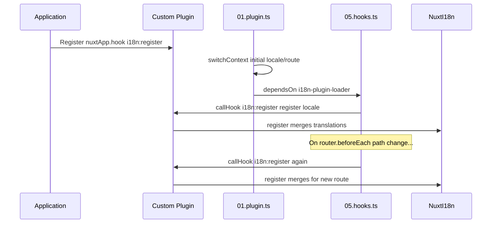

# 📢 事件

## 🔄 `i18n:register`

`Nuxt I18n Micro` 中的 `i18n:register` 事件可讓翻譯動態加入應用的 i18n 上下文中,使國際化過程無縫且具彈性。此事件讓你能在需要時整合新的翻譯,強化應用的在地化能力。

### 📝 事件細節

- **目的**:
  - 允許將額外翻譯動態併入特定語系的既有集合中。

- **Payload**:
  - **`register`**:
    - 事件提供的函式,接收兩個引數:
      - **`translations`**(`Translations`):
        - 依 `Translations` 介面組織、以 key-value 表示翻譯的物件。
      - **`locale`**(`string`,選用):
        - 註冊翻譯所對應的語系代碼(例如 `'en'`、`'ru'`)。未指定時,使用事件提供的語系。

- **行為**:
  - 觸發時,`register` 函式會將新翻譯合併到指定語系的當前上下文中,更新整個應用可用的翻譯。

### ⏱️ 觸發時機

模組的 hooks 外掛(`05.hooks.ts`,`dependsOn: ['i18n-plugin-loader']`)會呼叫 `nuxtApp.callHook('i18n:register', …)`:

1. **啟動時一次** —— 在主 i18n 外掛(`01.plugin.ts`)為初始路由載入翻譯之後
2. **導覽時** —— 在 `router.beforeEach` 中路徑改變時;若 `strategy: 'no_prefix'`,則每次導覽都觸發

在一般的 Nuxt 外掛中使用 `nuxtApp.hook('i18n:register', …)` 註冊你的監聽者。hooks 外掛會在 loader 就緒後執行,所以當需要擴充翻譯時,你的 callback 會被呼叫。

於 `nuxt.config` 設定 `hooks: false` 可停用自動的 `i18n:register` 呼叫(見 [Configuration — `hooks`](/guides/configuration#hooks))。

### 💡 範例用法

以下範例示範如何使用 `i18n:register` 事件動態加入翻譯:

```typescript
nuxt.hook('i18n:register', async (register: (translations: unknown, locale?: string) => void, locale: string) => {
  register(
    {
      greeting: 'Hello',
      farewell: 'Goodbye',
    },
    locale,
  )
})
```

### 🛠️ 說明



- **觸發事件**:
  - hooks 外掛(`05.hooks.ts`)在主 loader 就緒後,以及在相關導覽時觸發 `i18n:register`。

- **加入翻譯**:
  - 範例為 `"greeting"` 與 `"farewell"` 註冊英文翻譯。
  - `register` 函式將這些翻譯合併到所提供語系的現有集合中。

### 🔗 主要好處

- **動態更新**:
  - 可輕鬆更新或加入翻譯,無需重新部署整個應用。

- **在地化彈性**:
  - 依使用者或應用需求即時調整在地化。

透過 `i18n:register` 事件,你可以確保應用的在地化策略保持彈性與適應性,提升整體使用者體驗。

---

## 🛠️ 以外掛修改翻譯

要在 Nuxt 應用中動態修改翻譯,建議使用外掛。外掛提供了處理在地化更新的結構化方式,特別適合搭配模組或外部翻譯檔。

### **註冊外掛**

若你使用模組,可在模組設定中註冊將處理翻譯修改的外掛:

```javascript
addPlugin({
  src: resolve('./plugins/extend_locales'),
})
```

這會註冊位於 `./plugins/extend_locales` 的外掛,由它處理翻譯的動態載入與註冊。

### **實作外掛**

在外掛中,你可以管理語系修改。以下是 Nuxt 外掛的範例實作:

```typescript
import { defineNuxtPlugin } from '#app'

export default defineNuxtPlugin(async (nuxtApp) => {
  // Function to load translations from JSON files and register them
  const loadTranslations = async (lang: string) => {
    try {
      const translations = await import(`../locales/${lang}.json`)
      return translations.default
    } catch (error) {
      console.error(`Error loading translations for language: ${lang}`, error)
      return null
    }
  }

  // Hook into the 'i18n:register' event to dynamically add translations
  // eslint-disable-next-line @typescript-eslint/ban-ts-comment
  // @ts-expect-error
  nuxtApp.hook('i18n:register', async (register: (translations: unknown, locale?: string) => void, locale: string) => {
    const translations = await loadTranslations(locale)
    if (translations) {
      register(translations, locale)
    }
  })
})
```

### 📝 詳細說明

1. **載入翻譯**:

- `loadTranslations` 函式依語系動態 import 翻譯檔。檔案預期位於 `locales` 目錄,並以語系代碼命名(例如 `en.json`、`de.json`)。
- 成功時回傳翻譯;否則記錄錯誤。

2. **註冊翻譯**:

- 外掛透過 `nuxtApp.hook` 掛勾 `i18n:register` 事件。
- 事件觸發時,`register` 函式會以載入的翻譯與對應語系被呼叫。
- 這會將新翻譯合併到指定語系的 i18n 上下文,更新整個應用的可用翻譯。

### 🔗 使用外掛修改翻譯的好處

- **關注點分離**:
  - 將在地化邏輯與主應用程式碼分離封裝,便於管理與維護。

- **動態且可擴展**:
  - 藉由動態載入與註冊翻譯,可無需完整重新部署即可更新內容,對經常更新或多語內容的應用特別有用。

- **強化在地化彈性**:
  - 外掛可依需求修改或擴充翻譯,提供更靈活、能因應使用者偏好或商業需求的在地化策略。

透過此方式,你可以透過結構化且易於維護的流程,以外掛有效擴充與修改應用的在地化,讓國際化保持適應變化的能力,並提升整體使用者體驗。
