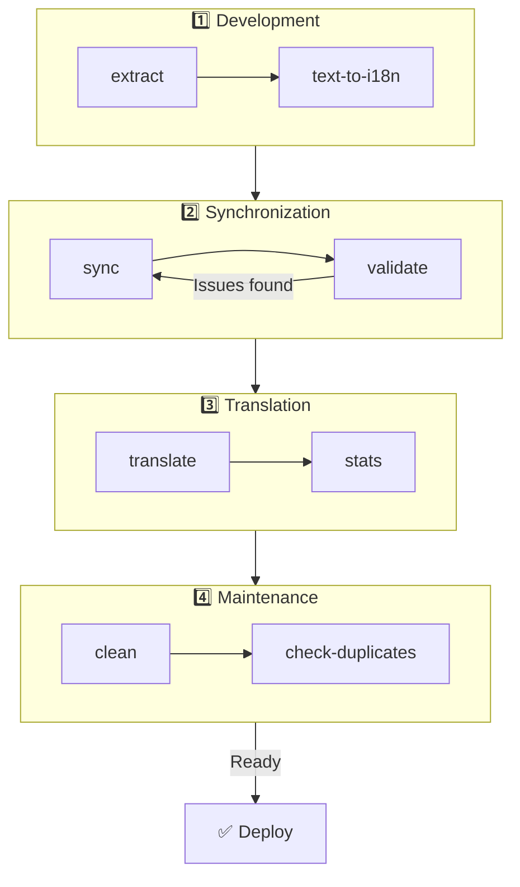

# 🌐 nuxt-i18n-micro-cli 指南

## 📖 簡介

`nuxt-i18n-micro-cli` 是一個命令列工具,旨在簡化使用 `nuxt-i18n-micro` 模組(Nuxt I18n Micro)的 Nuxt.js 專案中之在地化與國際化流程。它提供工具,可從程式碼中擷取翻譯鍵、管理翻譯檔、跨語系同步翻譯,並透過外部翻譯服務自動化翻譯流程。

本指南將帶你安裝、設定並使用 `nuxt-i18n-micro-cli`,以有效管理專案的翻譯。此套件於 [npmjs.com](https://www.npmjs.com/package/nuxt-i18n-micro-cli) 提供。

## 🔧 安裝與設定

### 📦 安裝 nuxt-i18n-micro-cli

在你的 Nuxt 專案中全域安裝或作為開發依賴(建議在 CI 中使用)安裝:

```bash
# global
npm install -g nuxt-i18n-micro-cli

# or per project
pnpm add -D nuxt-i18n-micro-cli
pnpm exec i18n-micro text-to-i18n --dryRun
```

若你的專案使用 Nuxt 4 的 `app/` 目錄(`app/pages`、`app/components`、…),請使用 **`nuxt-i18n-micro-cli` ≥ 2.1.1**。舊版 CLI 只會掃描專案根目錄下的 `pages/`。

### 🛠 在專案中初始化

安裝完成後,你可以在 Nuxt.js 專案目錄中執行 `i18n-micro` 指令。

請確認你的專案已設定好 `nuxt-i18n-micro`,並在 `nuxt.config.ts`(或 `nuxt.config.js`)中具備必要設定。

### 📄 常用參數

- `--cwd`:指定當前工作目錄(預設為 `.`)。
- `--logLevel`:設定日誌等級(`silent`、`info`、`verbose`)。
- `--translationDir`:包含 JSON 翻譯檔的目錄(預設:`locales`)。

## 📊 CLI 工作流程概覽



### 工作流程步驟

| 階段            | 指令                        | 目的                                 |
| --------------- | --------------------------- | ------------------------------------ |
| **開發**        | `extract`、`text-to-i18n`   | 尋找並擷取翻譯鍵                     |
| **同步**        | `sync`、`validate`          | 確保所有語系擁有相同的鍵             |
| **翻譯**        | `translate`、`stats`        | 自動翻譯缺失的鍵                     |
| **維護**        | `clean`、`check-duplicates` | 保持翻譯檔的整潔                     |

## 📋 指令

### 🔄 `text-to-i18n` 指令

CLI 套件:[`nuxt-i18n-micro-cli`](https://www.npmjs.com/package/nuxt-i18n-micro-cli)

**描述**:掃描 Vue/TS/JS 檔中面向使用者的硬編碼字串,將它們替換為 `$t('...')`,並將新鍵合併到 JSON 翻譯檔。請從 **Nuxt 專案根目錄**(`nuxt.config` 所在處)執行。

**用法**:

```bash
i18n-micro text-to-i18n [options]
```

**選項**:

| 選項                    | 預設              | 說明                                                                        |
| ----------------------- | ----------------- | --------------------------------------------------------------------------- |
| `--translationFile`     | `locales/en.json` | 用於新鍵的 JSON 檔案(相對於專案根目錄)。                                  |
| `--path`                | —                 | 只處理單一檔案或目錄(例如 `app/pages/about.vue`)。                        |
| `--context`             | —                 | 鍵的前綴(例如 `auth` → `auth.*`)。                                        |
| `--dryRun`              | `false`           | 預覽而不寫入檔案。                                                          |
| `--verbose`             | `false`           | 額外的日誌輸出。                                                            |
| `--interactive`         | `false`           | 套用前確認或編輯每個鍵。                                                    |
| `--extractOnlyDirs`     | `plugins`         | 只擷取但**不**改寫原始檔的目錄。                                            |
| `--extractOnlyPatterns` | —                 | 類似 glob 的僅擷取模式(例如 `**/*.plugin.ts`)。                           |

**範例**:

```bash
i18n-micro text-to-i18n --translationFile locales/en.json --context auth --dryRun
```

#### 會掃描哪些資料夾?

<Info>
自 CLI **v2.1.1** 起,`text-to-i18n` 會同時掃描傳統的根資料夾與 `app/*` 對應資料夾。請從**專案根目錄**執行——不要 `cd app`。
</Info>

會蒐集下列位置中的 `*.vue`、`*.js` 與 `*.ts` 檔案:

| Nuxt 3(專案根目錄)  | Nuxt 4(`app/` 目錄)     |
| --------------------- | ------------------------- |
| `pages/`              | `app/pages/`              |
| `components/`         | `app/components/`         |
| `plugins/`            | `app/plugins/`            |
| `layouts/`            | `app/layouts/`            |

其他資料夾(`server/`、`composables/`、`middleware/`、…)會被略過,除非使用 `--path`。若使用 Nuxt 4,請從專案根目錄執行(不需 `cd app`)。若 `i18n.translationDir` 不是 `locales/`,請在 `--translationFile` 中對應調整。

```bash
i18n-micro text-to-i18n --path app/pages
```

#### 運作方式

1. 從上述目錄(或從 `--path`)蒐集檔案。
2. 將字面值/範本文字替換為 `$t('generated.key')`(`plugins/` 預設為僅擷取)。
3. 將新鍵合併到 `--translationFile`,不移除既有項目。

**轉換範例**:

轉換前:

```vue
<template>
  <div>
    <h1>Welcome to our site</h1>
    <p>Please sign in to continue</p>
  </div>
</template>
```

轉換後:

```vue
<template>
  <div>
    <h1>{{ $t('pages.home.welcome_to_our_site') }}</h1>
    <p>{{ $t('pages.home.please_sign_in') }}</p>
  </div>
</template>
```

**最佳實務**:先進行 dry run;在完整執行前先提交(commit);將 `--translationFile` 與 `nuxt.config` 中的 `i18n.translationDir` 對齊;針對啟動用程式碼保留 `--extractOnlyDirs plugins`。

**限制**:為獨立的 npm 套件(未與模組打包);不會自動讀取 `nuxt.config`;輸出為 `$t(...)`;複雜的動態字串可能需要改用 `extract` / `search`。

### 📊 `stats` 指令

**描述**:`stats` 指令用於顯示 Nuxt.js 專案中每個語系的翻譯統計。它可幫助你了解翻譯進度,顯示已翻譯的鍵數與可用鍵總數的比較。

**用法**:

```bash
i18n-micro stats [options]
```

**選項**:

- `--full`:僅顯示合併後的翻譯統計(預設:`false`)。

**範例**:

```bash
i18n-micro stats --full
```

### 🌍 `translate` 指令

**描述**:`translate` 指令使用外部翻譯服務自動翻譯缺失的鍵。它透過 Google Translate、DeepL 等服務的 API 來填補缺失的翻譯,以簡化翻譯流程。

**用法**:

```bash
i18n-micro translate [options]
```

**選項**:

- `--service`:要使用的翻譯服務(例如 `google`、`deepl`、`yandex`)。若未指定,指令會提示你選擇。
- `--token`:所選翻譯服務對應的 API 金鑰。若未提供,會提示你輸入。
- `--options`:翻譯服務的額外選項,以逗號分隔的 key:value 配對提供(例如 `model:gpt-3.5-turbo,max_tokens:1000`)。
- `--replace`:翻譯所有鍵,並取代既有翻譯(預設:`false`)。

**範例**:

```bash
i18n-micro translate --service deepl --token YOUR_DEEPL_API_KEY
```

#### 🌐 支援的翻譯服務

`translate` 指令支援多種翻譯服務,部分支援的服務如下:

- **Google Translate**(`google`)
- **DeepL**(`deepl`)
- **Yandex Translate**(`yandex`)
- **OpenAI**(`openai`)
- **Azure Translator**(`azure`)
- **IBM Watson**(`ibm`)
- **Baidu Translate**(`baidu`)
- **LibreTranslate**(`libretranslate`)
- **MyMemory**(`mymemory`)
- **Lingva Translate**(`lingvatranslate`)
- **Papago**(`papago`)
- **Tencent Translate**(`tencent`)
- **Systran Translate**(`systran`)
- **Yandex Cloud Translate**(`yandexcloud`)
- **ModernMT**(`modernmt`)
- **Lilt**(`lilt`)
- **Unbabel**(`unbabel`)
- **Reverso Translate**(`reverso`)

#### ⚙️ 服務設定

有些服務需要特定設定或 API 金鑰。使用 `translate` 指令時,你可以指定服務,並在需要時提供必要的 `--token`(API 金鑰)與額外的 `--options`。

例如:

```bash
i18n-micro translate --service openai --token YOUR_OPENAI_API_KEY --options openaiModel:gpt-3.5-turbo,max_tokens:1000
```

### 🛠️ `extract` 指令

**描述**:從程式碼擷取翻譯鍵,並依作用域組織。

**用法**:

```bash
i18n-micro extract [options]
```

**選項**:

- `--prod, -p`:以生產模式執行。

**範例**:

```bash
i18n-micro extract
```

### 🔄 `sync` 指令

**描述**:跨語系同步翻譯檔,確保所有語系擁有相同的鍵。

**用法**:

```bash
i18n-micro sync [options]
```

**範例**:

```bash
i18n-micro sync
```

### ✅ `validate` 指令

**描述**:比對參考語系,驗證翻譯檔是否有缺少或多餘的鍵。

**用法**:

```bash
i18n-micro validate [options]
```

**範例**:

```bash
i18n-micro validate
```

### 🧹 `clean` 指令

**描述**:從翻譯檔中移除未使用的翻譯鍵。

**用法**:

```bash
i18n-micro clean [options]
```

**範例**:

```bash
i18n-micro clean
```

### 📤 `import` 指令

**描述**:將 PO 檔轉換回 JSON 格式,並儲存到翻譯目錄。

**用法**:

```bash
i18n-micro import [options]
```

**選項**:

- `--potsDir`:包含 PO 檔的目錄(預設:`pots`)。

**範例**:

```bash
i18n-micro import --potsDir pots
```

### 📥 `export` 指令

**描述**:將翻譯匯出成 PO 檔,以便由外部翻譯管理系統使用。

**用法**:

```bash
i18n-micro export [options]
```

**選項**:

- `--potsDir`:儲存 PO 檔的目錄(預設:`pots`)。

**範例**:

```bash
i18n-micro export --potsDir pots
```

### 🗂️ `export-csv` 指令

**描述**:`export-csv` 指令會將 JSON 檔中的翻譯鍵與值(包含檔案路徑)匯出為 CSV 格式。這對於偏好在試算表軟體中處理翻譯資料的團隊非常有用。

**用法**:

```bash
i18n-micro export-csv [options]
```

**選項**:

- `--csvDir`:匯出 CSV 檔的儲存目錄。
- `--delimiter`:指定 CSV 檔的分隔符號(預設:`,`)。

**範例**:

```bash
i18n-micro export-csv --csvDir csv_files
```

### 📑 `import-csv` 指令

**描述**:`import-csv` 指令會從 CSV 檔匯入翻譯資料,並更新對應的 JSON 檔。這對於從試算表批次套用翻譯更新非常有用。

**用法**:

```bash
i18n-micro import-csv [options]
```

**選項**:

- `--csvDir`:包含要匯入 CSV 檔的目錄。
- `--delimiter`:指定 CSV 檔所使用的分隔符號(預設:`,`)。

**範例**:

```bash
i18n-micro import-csv --csvDir csv_files
```

### 🧾 `diff` 指令

**描述**:比對同一目錄(含子目錄)中預設語系與其他語系的翻譯檔。指令會找出預設語系中相較於其他語系缺失的鍵及其值,以便更容易追蹤翻譯進度或差異。

**用法**:

```bash
i18n-micro diff [options]
```

**範例**:

```bash
i18n-micro diff
```

### 🔍 `check-duplicates` 指令

**描述**:`check-duplicates` 指令會檢查每個語系中所有翻譯檔(包含根層級與頁面專屬翻譯)是否有重複的翻譯值。它可確保同一語言中的不同鍵不會有相同的翻譯值,有助於維持翻譯的清晰度與一致性。

**用法**:

```bash
i18n-micro check-duplicates [options]
```

**範例**:

```bash
i18n-micro check-duplicates
```

**運作方式**:

- 指令會檢查每個語系的根層級與頁面專屬翻譯檔。
- 若某個翻譯值出現在多個位置(不論是根層級翻譯或不同頁面),就會回報重複的值,並附上發現該值的檔案與鍵。
- 若沒有發現重複,指令會確認該語系沒有重複的翻譯值。

此指令可協助確保翻譯鍵的值保持唯一,避免在同一語系中意外重複。

### 🔄 `replace-values` 指令

**描述**:`replace-values` 指令可讓你跨所有語系批次替換翻譯值。它支援簡單文字替換與使用正規表示式(regex)的進階替換。你也可以在 regex 模式中使用擷取群組,並在替換字串中引用,適合較複雜的替換情境。

**用法**:

```bash
i18n-micro replace-values [options]
```

**選項**:

- `--search`:要在翻譯中搜尋的文字或 regex 模式。這是必要選項。
- `--replace`:替換用的文字。這是必要選項。
- `--useRegex`:啟用使用正規表示式模式的搜尋(預設:`false`)。

**範例 1**:簡單替換

跨所有語系將字串「Hello」替換為「Hi」:

```bash
i18n-micro replace-values --search "Hello" --replace "Hi"
```

**範例 2**:regex 替換

啟用 regex 搜尋,並跨所有語系將任何以「Hello」開頭後接數字的字串(例如「Hello123」)替換為「Hi」:

```bash
i18n-micro replace-values --search "Hello\\d+" --replace "Hi" --useRegex
```

**範例 3**:使用 regex 擷取群組

使用擷取群組將已匹配字串的一部分動態插入替換內容。例如,將「Hello [name]」替換為「Hi [name]」,同時保留名字:

```bash
i18n-micro replace-values --search "Hello (\\w+)" --replace "Hi $1" --useRegex
```

在此案例中,`$1` 指的是第一個擷取群組,即匹配「Hello」之後的 `[name]` 部分。替換後將保留原始字串中的名字。

**運作方式**:

- 指令會掃描所有翻譯檔(全域與頁面專屬)。
- 當根據搜尋字串或 regex 模式找到匹配時,會將匹配到的文字替換為所提供的內容。
- 若使用 regex,可透過 `$1`、`$2` 等在替換字串中引用擷取群組。
- 所有變更都會被記錄,顯示檔案路徑、翻譯鍵,以及翻譯值的前後狀態。

**日誌**:
每次替換,指令會記錄下列詳細資訊:

- 語系與檔案路徑
- 正在修改的翻譯鍵
- 舊值與替換後的新值
- 若使用具擷取群組的 regex,日誌會顯示群組的匹配情形以及替換方式

這讓你能精確追蹤替換過程中在哪裡進行了什麼變更,為所有翻譯檔的修改提供清楚的紀錄。

## 🛠 範例

- **擷取翻譯**:

  ```bash
  i18n-micro extract
  ```

- **使用 Google Translate 翻譯缺失的鍵**:

  ```bash
  i18n-micro translate --service google --token YOUR_GOOGLE_API_KEY
  ```

- **翻譯所有鍵並取代既有翻譯**:

  ```bash
  i18n-micro translate --service deepl --token YOUR_DEEPL_API_KEY --replace
  ```

- **驗證翻譯檔**:

  ```bash
  i18n-micro validate
  ```

- **清理未使用的翻譯鍵**:

  ```bash
  i18n-micro clean
  ```

- **同步翻譯檔**:

  ```bash
  i18n-micro sync
  ```

## ⚙️ 設定指南

`nuxt-i18n-micro-cli` 依賴你在 `nuxt.config.ts`(或 `nuxt.config.js`)中的 Nuxt.js i18n 設定。請確認已安裝並設定 `nuxt-i18n-micro` 模組。

### 🔑 nuxt.config.js 範例

```ts
export default defineNuxtConfig({
  modules: ['nuxt-i18n-micro'],
  i18n: {
    locales: [
      { code: 'en', iso: 'en-US' },
      { code: 'fr', iso: 'fr-FR' },
    ],
    defaultLocale: 'en',
    fallbackLocale: 'en',
    translationDir: 'locales', // or 'app/locales' for Nuxt 4 colocation
  },
})
```

請確保 `translationDir` 與 `nuxt-i18n-micro-cli` 所使用的目錄一致(預設為 `locales`)。

## 📝 最佳實務

### 🔑 一致的鍵命名

確保翻譯鍵一致且具描述性,以避免混淆與重複。

### 🧹 定期維護

定期使用 `clean` 指令移除未使用的翻譯鍵,保持翻譯檔的整潔。

### 🛠 自動化翻譯工作流程

將 `nuxt-i18n-micro-cli` 指令整合到開發流程或 CI/CD 管線中,以自動化擷取、翻譯、驗證與同步翻譯檔的工作。

### 🛡️ 保護 API 金鑰

在使用需要 API 金鑰的翻譯服務時,請確保金鑰安全,勿提交至版本控制。可考慮使用環境變數或安全的金鑰管理方案。

## 📞 支援與貢獻

若你遇到問題或有改進建議,歡迎為專案貢獻或在專案儲存庫開啟 issue。

---

依循本指南,你將能有效使用 `nuxt-i18n-micro-cli` 管理 Nuxt.js 專案中的翻譯,簡化國際化工作,並為不同語系的使用者帶來順暢的體驗。
