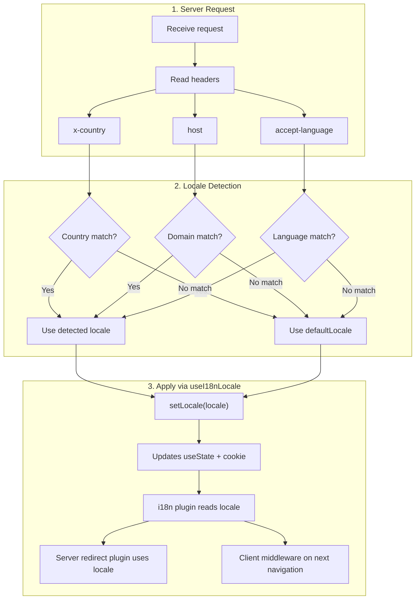

# 🔧 Nuxt I18n Micro 中的自訂語言偵測

## 📖 總覽

Nuxt I18n Micro v3 提供一個集中式 composable `useI18nLocale()` 來管理所有語系狀態，取代 v2 中手動使用 `useState`／`useCookie` 的做法。在伺服器外掛中使用 `useI18nLocale().setLocale()`，你可以實作任何自訂偵測邏輯，同時完全相容於模組的重新導向與 cookie 系統。

## 🏗️ 架構

```mermaid
flowchart TB
    subgraph Plugins["Plugin Execution Order"]
        A["Your plugin<br/>order: -10"] -->|setLocale()| B["01.plugin.ts<br/>order: -5"]
        B --> C["06.redirect.ts server<br/>order: 10"]
    end

    subgraph Client["Client SPA Navigation"]
        D["i18n-redirect.global.ts<br/>route middleware"]
    end

    subgraph State["Locale State"]
        E["useState('i18n-locale')"]
        F["localeCookie"]
    end

    A -->|"setLocale() updates both"| E
    A -->|"setLocale() updates both"| F
    B -->|reads| E
    C -->|reads| E
    C -->|reads| F
    D -->|reads target route +| E
```

**核心原則**：在伺服器外掛中呼叫 `useI18nLocale().setLocale()`，並設 `order: -10`。此動作會以原子操作同時更新 `useState('i18n-locale')` 與語系 cookie，因此 i18n 外掛（`order: -5`）與伺服器重新導向外掛（`order: 10`）能在第一個 SSR 請求就看到正確語系。後續導覽的用戶端自動重新導向會在全域路由 middleware 中執行。

## 🛠️ 停用內建自動偵測

若你想完全掌控語系偵測，請停用內建機制：

```ts
export default defineNuxtConfig({
  i18n: {
    autoDetectLanguage: false,
  },
})
```

## ✨ 範例：以 `useI18nLocale` 進行伺服器端偵測

這是**建議做法**，適用於所有策略。

### 步驟 1：設定 `nuxt.config.ts`

```ts
export default defineNuxtConfig({
  modules: ['nuxt-i18n-micro'],
  i18n: {
    strategy: 'no_prefix', // Works with ANY strategy
    defaultLocale: 'en',
    localeCookie: 'user-locale',
    autoDetectLanguage: false,
    locales: [
      { code: 'en', iso: 'en-US' },
      { code: 'de', iso: 'de-DE' },
      { code: 'ja', iso: 'ja-JP' },
    ],
  },
})
```

### 步驟 2：建立 `plugins/i18n-loader.server.ts`

```ts
import { defineNuxtPlugin, useRequestHeaders } from '#imports'

export default defineNuxtPlugin({
  name: 'i18n-custom-loader',
  enforce: 'pre',
  order: -10, // Execute BEFORE the i18n plugin (which has order -5)

  setup() {
    const { setLocale } = useI18nLocale()
    const headers = useRequestHeaders(['host', 'x-country', 'accept-language'])
    let detectedLocale = 'en'

    // --- YOUR DETECTION LOGIC ---

    // Example 1: By domain
    const host = headers['host']
    if (host?.includes('example.de')) {
      detectedLocale = 'de'
    }
    // Example 2: By custom header
    else if (headers['x-country'] === 'JP') {
      detectedLocale = 'ja'
    }
    // Example 3: By Accept-Language header
    else if (headers['accept-language']?.includes('de')) {
      detectedLocale = 'de'
    }

    // --- APPLY THE LOCALE ---
    setLocale(detectedLocale)
  },
})
```

### 運作方式



1. **外掛先執行**（`order: -10`）：從標頭、網域或其他來源偵測語系
2. **`setLocale()` 同時更新**：`useState('i18n-locale')` 與 cookie 皆會被更新，確保所有後續外掛都能立即看到
3. **i18n 外掛**（`order: -5`）：讀取語系並載入正確翻譯
4. **伺服器重新導向外掛**（`order: 10`）：SSR 期間依此語系決定是否重新導向
5. **用戶端路由 middleware**（`i18n-redirect`）：當 URL 語系與偏好不符時，SPA 導覽會套用重新導向

## 🌐 各策略的行為

`useI18nLocale().setLocale()` 適用於**所有策略**。重新導向行為則依策略而定：

<Tip>
| 策略 | `setLocale('de')` 的效果 |
|----------|---------------------------|
| `no_prefix` | 以德文渲染，URL 不變 |
| `prefix` | 302 → `/de/`（伺服器端重新導向） |
| `prefix_except_default` | 若 `de` ≠ 預設，302 → `/de/`；若 `de` = 預設，則不重新導向 |
| `prefix_and_default` | 不重新導向（`/` 與 `/de/` 都有效） |
</Tip>

**重要提醒：**

- Cookie 基礎的語系偵測預設停用（`localeCookie: null`）
- 設定 `localeCookie: 'user-locale'` 可啟用 cookie 持久化
- 若 cookie／state 值不在 `locales` 清單中，會退回 `defaultLocale`

## 🏢 進階：以網域偵測

適用於每個網域對應不同語系的多網域架構：

```ts
import { defineNuxtPlugin, useRequestHeaders } from '#imports'

export default defineNuxtPlugin({
  name: 'i18n-domain-loader',
  enforce: 'pre',
  order: -10,

  setup() {
    const { setLocale } = useI18nLocale()
    const headers = useRequestHeaders(['host'])
    const host = headers['host'] || ''

    let detectedLocale = 'en'

    if (host.endsWith('.de') || host.includes('german.')) {
      detectedLocale = 'de'
    } else if (host.endsWith('.fr') || host.includes('french.')) {
      detectedLocale = 'fr'
    } else if (host.endsWith('.jp') || host.includes('japanese.')) {
      detectedLocale = 'ja'
    }

    setLocale(detectedLocale)
  },
})
```

## 🔄 進階：尊重使用者偏好

若使用者能手動切換語系，應優先於自動偵測尊重其選擇：

```ts
import { defineNuxtPlugin, useRequestHeaders } from '#imports'

export default defineNuxtPlugin({
  name: 'i18n-smart-loader',
  enforce: 'pre',
  order: -10,

  setup() {
    const { getLocale, setLocale } = useI18nLocale()

    // If user already has a preference (from cookie), respect it
    if (getLocale()) {
      return
    }

    // Otherwise, detect locale from headers
    const headers = useRequestHeaders(['accept-language'])
    let detectedLocale = 'en'

    const acceptLanguage = headers['accept-language'] || ''
    if (acceptLanguage.includes('de')) {
      detectedLocale = 'de'
    } else if (acceptLanguage.includes('ja')) {
      detectedLocale = 'ja'
    }

    setLocale(detectedLocale)
  },
})
```

## ⚙️ 僅伺服器或僅用戶端外掛

使用 [Nuxt 檔名慣例](https://nuxt.com/docs/getting-started/directory-structure#plugins)控制外掛執行位置：

- **僅伺服器**：`i18n-loader.server.ts`：只在 SSR 執行（建議用於基於標頭的偵測）
- **僅用戶端**：`i18n-loader.client.ts`：只在瀏覽器執行（用於 `localStorage` 或 DOM 基礎的偵測）


## ✅ 總結

| 功能                                    | 說明                                                                    |
| -------------------------------------- | ---------------------------------------------------------------------- |
| `useI18nLocale().setLocale()`          | 以原子操作更新 `useState` + cookie；適用於所有策略                        |
| `useI18nLocale().getLocale()`          | 從 state 或 cookie 回傳目前語系                                          |
| `useI18nLocale().getPreferredLocale()` | 回傳偏好語系（已依 `locales` 清單驗證）                                   |
| 外掛 `order: -10`                       | 確保外掛在 i18n 初始化之前執行                                            |
| `enforce: 'pre'`                       | 於「pre」外掛群組執行                                                    |

**請勿：**

- 直接使用 `useCookie('user-locale')`：cookie 由 `useI18nLocale()` 內部管理
- 直接使用 `useState('i18n-locale')`：請改用 `useI18nLocale().setLocale()`
- 設 `order` >= -5：外掛必須在 i18n 外掛之前執行
