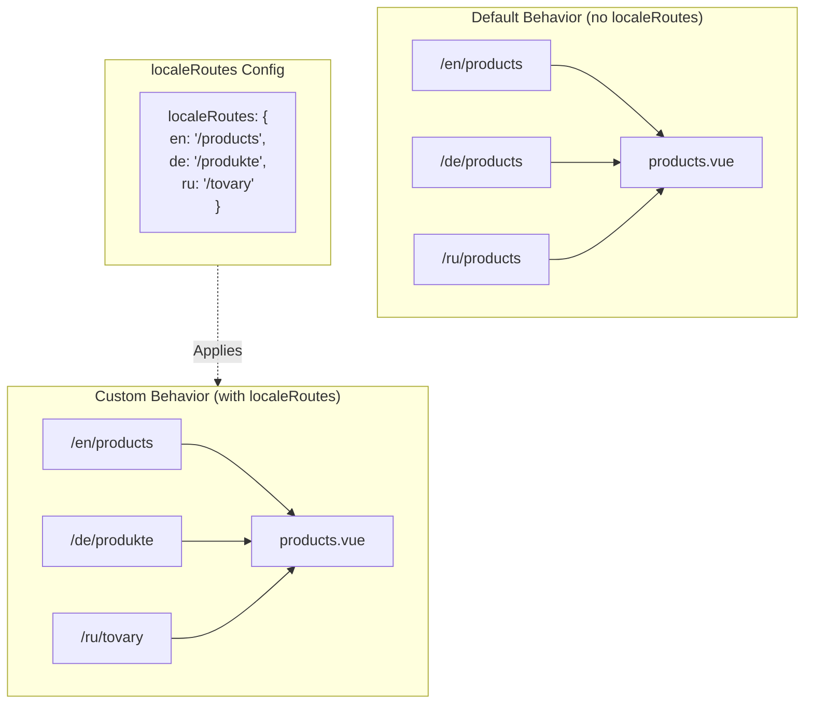

# 🔗 在 `Nuxt I18n Micro` 中透過 `localeRoutes` 自訂在地化路由

## 📖 `localeRoutes` 介紹

`Nuxt I18n Micro` 的 `localeRoutes` 功能可讓你為特定語系定義自訂路由,提供對應用路由結構的彈性與控制能力。此功能特別適用於某些語系需要不同 URL 結構、量身打造的路徑,或需要遵循特定地區或語言慣例的情境。

## 🚀 `localeRoutes` 的主要用途

`localeRoutes` 的主要用途是為不同語系提供獨立路由,透過確保 URL 對目標對象直觀且相關,提升使用者體驗。例如,你可能對英文與俄文版本的同一頁面採用不同路徑,俄文語系使用在地化的 URL 格式。

### 📄 範例:在 `$defineI18nRoute` 中定義 `localeRoutes`

以下是如何在 `$defineI18nRoute` 中使用 `localeRoutes` 為特定語系定義自訂路由:

```typescript
import { useNuxtApp } from '#imports'

const { $defineI18nRoute } = useNuxtApp()

$defineI18nRoute({
  localeRoutes: {
    ru: '/localesubpage', // Custom route path for the Russian locale
    de: '/lokaleseite', // Custom route path for the German locale
  },
})
```

> [!IMPORTANT]
> `$defineI18nRoute` 不是全域函式。在 `script setup` 中,請先從 `useNuxtApp()` 取得,再呼叫它。

### 🔄 `localeRoutes` 的運作方式



- **預設行為**:未使用 `localeRoutes` 時,所有語系使用主路徑定義的共同路由結構。
- **自訂行為**:使用 `localeRoutes` 後,特定語系可有自己的路由,以設定中定義的語系專屬路由覆寫預設路徑。

## 🌱 `localeRoutes` 的使用情境

### 📄 範例:在頁面中使用 `localeRoutes`

以下是一個簡單的 Vue 元件,示範 `$defineI18nRoute` 搭配 `localeRoutes` 的用法:

```vue
<template>
  <div>
    <!-- Display greeting message based on the current locale -->
    <p>{{ $t('greeting') }}</p>

    <!-- Navigation links -->
    <div>
      <NuxtLink :to="$localeRoute({ name: 'index' })"> Go to Index </NuxtLink>
      |
      <NuxtLink :to="$localeRoute({ name: 'about' })"> Go to About Page </NuxtLink>
    </div>
  </div>
</template>

<script setup>
import { useNuxtApp } from '#imports'

const { $getLocale, $switchLocale, $getLocales, $localeRoute, $t, $defineI18nRoute } = useNuxtApp()

// Define translations and custom routes for specific locales
$defineI18nRoute({
  localeRoutes: {
    ru: '/localesubpage', // Custom route path for Russian locale
  },
})
</script>
```

### 🛠️ 在不同情境中使用 `localeRoutes`

- **登陸頁面**:使用自訂路由為登陸頁面在地化 URL,確保與行銷活動一致。
- **文件網站**:為每個語系提供不同路由,使 URL 更符合在地化的內容結構。
- **電商網站**:為每個語系量身打造商品或分類的 URL,提升 SEO 與使用者體驗。

## 搭配 `localeRoutes` 的導覽

由於在地化路由並不會直接對應 pages 目錄下的檔名,你必須以物件方式引用導覽,而非以名稱。

```vue
<template>
  /**
   * Exemple page: /pages/about-us.vue
   * EN /about-us
   * ES /sobre-nosotros
   * FR /a-propos
   */

  // Using NuxtLink
  <NuxtLink :to="$localeRoute({ name: 'about-us' })">
    Go to About Page
  </NuxtLink>

  // Using I18nLink
  <I18nLink :to="{ name: 'about-us' }">
    Go to About Page
  </NuxtLink>

  // The string literal navigation wouldn't work for any locale but english
  <I18nLink to="/about-us">
    Go to About Page
  </NuxtLink>
</template>
```

### 巢狀頁面的命名

預設情況下,頁面的名稱是根據其檔名與路徑產生。這代表:

- `/pages/about-us.vue` 可透過 `$localeRoute(\{ name: 'about-us' \})` 存取
- `/pages/about-us/physical-stores.vue` 可透過 `$localeRoute(\{ name: 'about-us-physical-stores' \})` 存取

要覆寫此行為,請以 `definePageMeta` 明確為頁面命名。

```vue
// /pages/about-us/physical-stores.vue
<script setup>
definePageMeta({
  name: 'our-stores'
})
```

此頁面即可透過 `$localeRoute` 或 `I18nLink` 使用其名稱引用:`:to='\{ name: "our-stores" \}'`。

## 🎯 使用 slug 的動態路由與 `$setI18nRouteParams`

處理含有 slug 或參數的動態路由時,可搭配 `localeRoutes` 使用動態片段,並用 `$setI18nRouteParams` 為每個語系提供對應的 slug。

### `localeRoutes` 中的動態路由參數

你可以使用 Nuxt 的路由參數語法定義動態路由(`[...slug]` 表示 catch-all 路由,`[param]` 表示單一參數,`:param()` 表示具名參數):

```vue
<script setup lang="ts">
import { useNuxtApp, useRoute, useFetch, createError } from '#imports'

const { $defineI18nRoute, $setI18nRouteParams } = useNuxtApp()

// Define custom routes with dynamic segments
$defineI18nRoute({
  localeRoutes: {
    en: '/our-products/[...slug]',
    es: '/nuestros-productos/[...slug]',
  },
})
</script>
```

### 設定語系專屬的路由參數

`$setI18nRouteParams` 函式可讓你為每個語系設定不同的參數值(例如 slug)。當內容有語系專屬 URL 時特別有用。

**重要**:`$setI18nRouteParams` 應在取得包含語系專屬 slug 的資料後呼叫,通常在 `useFetch` 或 `useAsyncData` 內。

```vue
<script setup lang="ts">
import { useNuxtApp, useRoute, useFetch, createError } from '#imports'

interface Product {
  title: string
  price: string
  urlEn: string // English slug
  urlEs: string // Spanish slug
}

const { $defineI18nRoute, $setI18nRouteParams } = useNuxtApp()

const route = useRoute()
const slug = Array.isArray(route.params.slug) ? route.params.slug[0] : route.params.slug

// Fetch product data that includes locale-specific slugs
const { data: product, error } = await useFetch<Product>(`/api/product/${slug}`)
if (error.value)
  throw createError({
    statusCode: error.value?.statusCode,
    statusMessage: error.value?.statusMessage,
    fatal: true,
  })

// Define custom routes with dynamic segments
$defineI18nRoute({
  localeRoutes: {
    en: '/our-products/[...slug]',
    es: '/nuestros-productos/[...slug]',
  },
})

// Set different slugs for different locales
if (product.value) {
  $setI18nRouteParams({
    en: { slug: product.value.urlEn },
    es: { slug: product.value.urlEs },
  })
}
</script>
```

### 完整範例:含語系專屬 slug 的商品頁面

以下是完整範例,示範如何在商品詳細頁中同時使用 `localeRoutes` 與 `$setI18nRouteParams`:

```vue
<template>
  <div v-if="product">
    <h1>{{ product.title }}</h1>
    <p>{{ $t('price') }}: {{ product.price }}</p>
    <div class="locale-switcher">
      <a :href="$switchLocalePath('en')">English</a>
      <a :href="$switchLocalePath('es')">Español</a>
    </div>
  </div>
</template>

<script setup lang="ts">
import { useNuxtApp, useRoute, useFetch, createError } from '#imports'

interface Product {
  title: string
  price: string
  urlEn: string
  urlEs: string
}

const { $t, $defineI18nRoute, $setI18nRouteParams, $switchLocalePath } = useNuxtApp()

// Set page name for easier navigation
definePageMeta({ name: 'product-slug' })

const route = useRoute()
const slug = Array.isArray(route.params.slug) ? route.params.slug[0] : route.params.slug

// Fetch product data
const { data: product, error } = await useFetch<Product>(`/api/product/${slug}`)
if (error.value)
  throw createError({
    statusCode: error.value?.statusCode,
    statusMessage: error.value?.statusMessage,
    fatal: true,
  })

// Define locale-specific routes with dynamic segments
$defineI18nRoute({
  localeRoutes: {
    en: '/our-products/[...slug]',
    es: '/nuestros-productos/[...slug]',
  },
})

// Set locale-specific slugs so $switchLocalePath works correctly
if (product.value) {
  $setI18nRouteParams({
    en: { slug: product.value.urlEn },
    es: { slug: product.value.urlEs },
  })
}
</script>
```

### 範例:商品列表頁

從列表頁連結到動態路由時,使用路由名稱搭配參數:

```vue
<template>
  <div>
    <h1>{{ $t('title') }}</h1>
    <ul>
      <li v-for="product in products?.[$getLocale()] || []" :key="product.id">
        <I18nLink :to="{ name: 'product-slug', params: { slug: product.url } }"> {{ product.title }} – {{ product.price }} </I18nLink>
      </li>
    </ul>
  </div>
</template>

<script setup lang="ts">
import { useNuxtApp, useFetch, createError } from '#imports'

interface Product {
  id: string
  title: string
  price: string
  url: string
}

type ProductsByLocale = Record<string, Product[]>

const { $t, $defineI18nRoute, $getLocale } = useNuxtApp()

const { data: products, error } = await useFetch<ProductsByLocale>('/api/product')
if (error.value)
  throw createError({
    statusCode: error.value?.statusCode,
    statusMessage: error.value?.statusMessage,
    fatal: true,
  })

$defineI18nRoute({
  locales: {
    en: {
      title: 'Our Product Range',
      description: 'Discover our collection of high-quality products.',
    },
    es: {
      title: 'Nuestra Gama de Productos',
      description: 'Descubra nuestra colección de productos de alta calidad.',
    },
  },
  localeRoutes: {
    en: '/our-products',
    es: '/nuestros-productos',
  },
})
</script>
```

### 運作方式

1. **路由定義**:`localeRoutes` 為每個語系定義基本路徑結構,包括 `[...slug]` 或 `[id]` 等動態片段。

2. **參數設定**:`$setI18nRouteParams` 為每個語系設定實際的參數值。當使用者透過 `$switchLocalePath` 切換語系時,模組會使用這些參數建構正確的 URL。

3. **參數格式**:參數物件應符合以下結構:

   ```typescript
   {
     [localeCode]: {
       [paramName]: paramValue
     }
   }
   ```

4. **導覽**:使用 `I18nLink` 或 `$localeRoute` 搭配路由名稱與參數,在動態路由的不同語系版本間導覽。

### 重要說明

- **時機**:`$setI18nRouteParams` 應在取得包含語系專屬 slug 的資料後呼叫,通常在 `useFetch` 或 `useAsyncData` 內。

- **參數名稱**:`$setI18nRouteParams` 中的參數名稱必須符合路由參數名稱(例如 `[...slug]` 對應 `slug`,`[id]` 對應 `id`)。

- **路由名稱**:使用 `definePageMeta(\{ name: 'route-name' \})` 時,以 `I18nLink` 或 `$localeRoute` 連結該路由時請使用此名稱。

- **Catch-all 路由**:對於 catch-all 路由(`[...slug]`),slug 參數應為陣列或會被轉為陣列的字串。

## 🧩 程式化路由(`pages:extend`)—— #244

在 `pages:extend` 中建立的路由沒有位置可放 `defineI18nRoute()`,且多個路由常會共用同一個包裝 SFC。以檔案為鍵的掃描會將它們摺疊為單一項目。

**請勿**將在地化路徑放到 `route.meta`(它們會被納入客戶端路由表)。請維持一份註冊清單,並將其投射兩次:

1. 進入 `pages:extend`(建立 Nuxt 路由)
2. 進入 `i18n.globalLocaleRoutes`,以路由**名稱**(非檔案路徑)作為鍵

使用 `@i18n-micro/utils/split-locale-routes` 中的 `splitLocaleRoutes`:

```typescript
import { splitLocaleRoutes } from '@i18n-micro/utils/split-locale-routes'

const dynamic = splitLocaleRoutes([
  {
    name: 'products_tag',
    path: '/products/:tag',
    file: '~/pages/_dynamic.vue',
    paths: { fr: '/produits/:tag', de: '/produkte/:tag' },
  },
  {
    name: 'products_category',
    path: '/products/category/:category',
    file: '~/pages/_dynamic.vue',
    paths: { fr: '/produits/categorie/:category' },
  },
  // Disable localization for a programmatic route:
  // { name: 'internal', path: '/internal', file: '~/pages/_dynamic.vue', paths: false },
])

export default defineNuxtConfig({
  hooks: {
    'pages:extend'(pages) {
      pages.push(...dynamic.pages)
    },
  },
  i18n: {
    globalLocaleRoutes: dynamic.globalLocaleRoutes,
  },
})
```

兩份資料會保持同步;共用的包裝就不會互相覆蓋。單靠 `globalLocaleRoutes` 是不夠的 —— 它只會為 Nuxt 頁面表中已存在的路由客製化路徑。

## 📝 使用 `localeRoutes` 的最佳實務

- **🚀 只在相關語系使用**:主要在 URL 結構會顯著影響使用者體驗或 SEO 時,才使用 `localeRoutes`。避免因細微差異而過度使用。
- **🔧 保持一致性**:除非有充分理由,否則在各語系間保持一致的路由模式。這有助於維持清晰度、降低複雜度。
- **📚 文件化自訂路由**:清楚記錄以 `localeRoutes` 定義的自訂路由,尤其在模組化應用中,以確保團隊成員理解路由邏輯。
