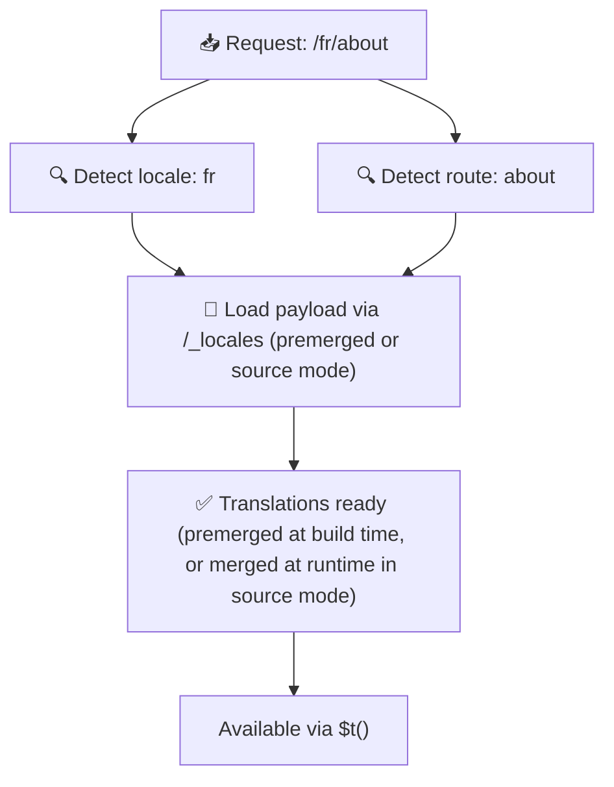

# 📂 資料夾結構指南

## 📖 介紹

有效組織翻譯檔對於維護可擴充且高效的國際化（i18n）系統至關重要。`Nuxt I18n Micro` 透過清晰的方式管理根層與頁面專屬翻譯，讓這個流程更簡單。本指南將帶你了解建議的資料夾結構，並說明 `Nuxt I18n Micro` 如何處理這些翻譯。

## 🗂️ 建議的資料夾結構

`Nuxt I18n Micro` 會將翻譯組織為根層檔案與 `pages` 目錄下的頁面專屬檔案。啟用 `translationPayloads.mode: 'premerged'`（預設）時，根層翻譯會在建置期自動合併進每個頁面檔案，因此每個頁面都擁有完整翻譯，執行期無需再合併。

使用 `mode: 'source'` 時，來源檔會分開留在 Nitro 資產中，並在執行期透過 `/_locales` 路由合併。請見 [Serverless payload 輸出](/guides/performance#serverless-payload-output)。

### 🔧 基本結構

以下是應遵循的基本資料夾結構範例：

```text
locales/
├── pages/
│   ├── index/
│   │   ├── en.json
│   │   ├── fr.json
│   │   └── ar.json
│   ├── about/
│   │   ├── en.json
│   │   ├── fr.json
│   │   └── ar.json
├── en.json
├── fr.json
└── ar.json

```

### 📄 結構說明

#### 1. 🌍 根層翻譯檔

- **路徑**：`/locales/\{locale\}.json`（例如 `/locales/en.json`）
- **用途**：這些檔案包含整個應用共用的翻譯（導覽選單、標頭、頁尾等）。當 `mode: 'premerged'`（預設）啟用時，它們會在建置期自動合併進每個頁面專屬檔案，因此伺服器每頁只需回傳單一預先建構的檔案。

  **範例內容（`/locales/en.json`）：**

  ```json
  {
    "menu": {
      "home": "Home",
      "about": "About Us",
      "contact": "Contact"
    },
    "footer": {
      "copyright": "© 2024 Your Company"
    }
  }
  ```

#### 2. 📄 頁面專屬翻譯檔

- **路徑**：`/locales/pages/\{routeName\}/\{locale\}.json`（例如 `/locales/pages/index/en.json`）
- **用途**：這些檔案包含特定頁面的翻譯。當 `mode: 'premerged'`（預設）啟用時，根層翻譯會在建置期作為基底合併進來，因此每個頁面檔案都能獨立使用。

  **範例內容（`/locales/pages/index/en.json`）：**

  ```json
  {
    "title": "Welcome to Our Website",
    "description": "We offer a wide range of products and services to meet your needs."
  }
  ```

  **範例內容（`/locales/pages/about/en.json`）：**

  ```json
  {
    "title": "About Us",
    "description": "Learn more about our mission, vision, and values."
  }
  ```

### 📂 處理動態路由與巢狀路徑

`Nuxt I18n Micro` 會依特定命名慣例，自動將路由中的動態片段與巢狀路徑轉換為扁平化的資料夾結構。這確保所有翻譯都以一致且易於存取的方式儲存。

#### 動態路由的翻譯資料夾結構

處理 `/products/[id]` 這類動態路由時，模組會將動態片段 `[id]` 轉換為檔案結構中的靜態形式。

**動態路由的資料夾結構範例：**

對於 `/products/[id]`，翻譯檔會放在名為 `products-id` 的資料夾中：

```text
locales/pages/
├── products-id/
│   ├── en.json
│   ├── fr.json
│   └── ar.json

```

**巢狀動態路由的資料夾結構範例：**

對於 `/products/key/[id]`，翻譯檔會放在名為 `products-key-id` 的資料夾中：

```text
locales/pages/
├── products-key-id/
│   ├── en.json
│   ├── fr.json
│   └── ar.json

```

**多層巢狀路由的資料夾結構範例：**

對於 `/products/category/[id]/details` 這類較複雜的巢狀路由，翻譯檔會放在名為 `products-category-id-details` 的資料夾中：

```text
locales/pages/
├── products-category-id-details/
│   ├── en.json
│   ├── fr.json
│   └── ar.json

```

### 🛠 自訂目錄結構

若你偏好將翻譯放在不同目錄，`Nuxt I18n Micro` 允許你自訂翻譯檔的存放目錄，可在 `nuxt.config.ts` 中設定。

**範例：自訂翻譯目錄**

```typescript
export default defineNuxtConfig({
  i18n: {
    translationDir: 'i18n', // Custom directory path
  },
})
```

這會讓 `Nuxt I18n Micro` 從 `/i18n` 目錄尋找翻譯檔，而不是預設的 `/locales`。

## ⚙️ 翻譯如何被載入

### 🌍 動態語系路由

`Nuxt I18n Micro` 使用動態語系路由有效率地載入翻譯。當使用者造訪頁面時，模組會判斷合適的語系，並依當前路由與語系載入對應翻譯檔。



例如：

- 造訪 `/en/index` 會從 `/locales/pages/index/en.json` 載入翻譯。
- 造訪 `/fr/about` 會從 `/locales/pages/about/fr.json` 載入翻譯。

此方式確保只載入必要的翻譯，同時最佳化伺服器負載與用戶端效能。

### 💾 快取與預先渲染

為進一步提升效能，`Nuxt I18n Micro` 支援翻譯檔的快取與預先渲染：

- **快取**：翻譯檔載入後會被快取，後續請求無需重複取得相同資料。
- **預先渲染**：建置期可為所有已設定的語系與路由預先渲染翻譯檔，讓它們能直接由伺服器提供，避免執行期延遲。

## 📝 最佳實務

### 📂 明智使用頁面專屬檔

善用頁面專屬檔以保持翻譯的組織性。這能讓每個頁面的翻譯保持精簡且載入迅速，對於內容複雜或龐大的頁面尤其重要。

### 🔑 保持翻譯鍵一致

在檔案間為翻譯鍵使用一致的命名慣例。這有助於維持清晰度，並在應用擴大時避免翻譯管理上的問題。

### 🗂️ 依情境組織翻譯

將相關的翻譯在檔案內歸類。例如將所有按鈕標籤放在 `buttons` 鍵下、所有表單相關文字放在 `forms` 鍵下。這不只提升可讀性，也讓跨語系管理翻譯更容易。

### ⚠️ 巢狀深度上限（建議 2 層）

用戶端導覽期間，`Nuxt I18n Micro` 使用 2 層深度合併來結合離開頁面與進入頁面的翻譯。這確保在轉場動畫期間，重疊的巢狀鍵（例如兩頁都有 `common.*`）不會遺失。

**這適用於標準的 `Section → Key → Value` 結構（2 層）：**

```json
// Page A translations
{ "common": { "fromA": "Text A" } }

// Page B translations
{ "common": { "fromB": "Text B" } }

// During transition, both are available:
// { "common": { "fromA": "Text A", "fromB": "Text B" } }
```

**但若使用 3 層或更深的巢狀，較深的鍵在轉場期間可能被覆蓋：**

```json
// Page A translations
{ "auth": { "form": { "login": "Login" } } }

// Page B translations
{ "auth": { "form": { "register": "Register" } } }

// During transition: "login" key is lost
// { "auth": { "form": { "register": "Register" } } }
```


### 🧹 定期清理未使用的翻譯

隨著時間累積，應用可能會累積未使用的翻譯鍵，特別是功能被移除或重整之後。定期檢視並清理翻譯檔，保持它們精簡、可維護。
