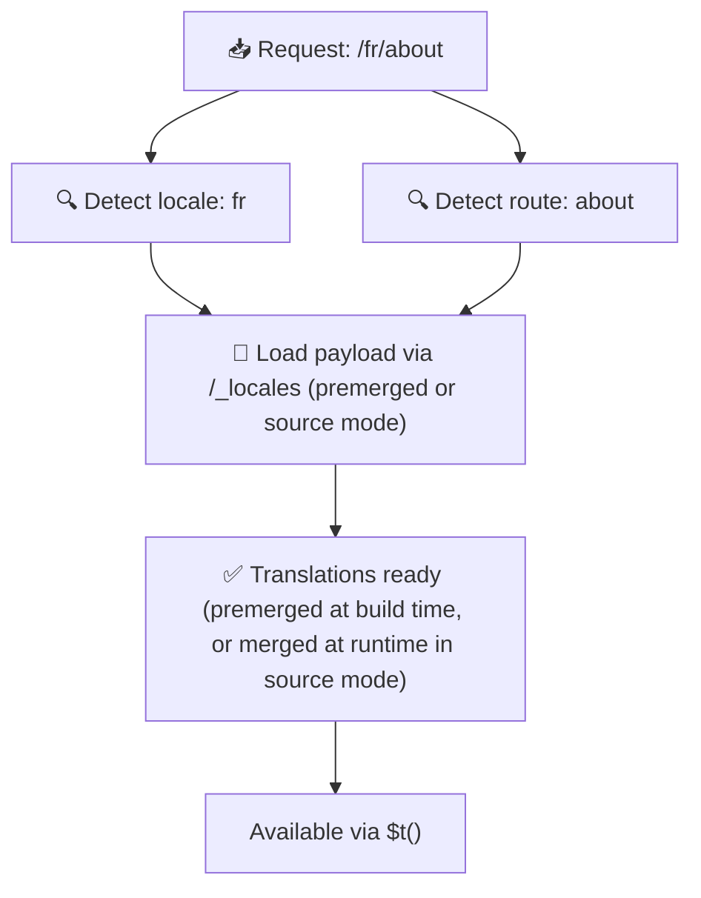

# 📂 資料夾結構指南

## 📖 簡介

有效地組織翻譯檔對於維護可擴展、有效率的國際化(i18n)系統至關重要。`Nuxt I18n Micro` 透過提供清晰的方式管理根層級與頁面專屬翻譯,簡化了這個過程。本指南將介紹建議的資料夾結構,並說明 `Nuxt I18n Micro` 如何處理這些翻譯。

## 🗂️ 建議的資料夾結構

`Nuxt I18n Micro` 將翻譯組織為根層級檔案與位於 `pages` 目錄下的頁面專屬檔案。在 `translationPayloads.mode: 'premerged'`(預設)下,根層級翻譯會在建置期自動合併到每個頁面檔中,因此每個頁面都有完整的翻譯,不需要執行時合併的額外負擔。

在 `mode: 'source'` 下,來源檔會分開保留在 Nitro assets 中,並透過 `/_locales` 路由於執行時合併。參見[無伺服器 payload 輸出](/guides/performance#serverless-payload-output)。

### 🔧 基本結構

以下是應遵循的資料夾結構基本範例:

```text
locales/
├── pages/
│   ├── index/
│   │   ├── en.json
│   │   ├── fr.json
│   │   └── ar.json
│   ├── about/
│   │   ├── en.json
│   │   ├── fr.json
│   │   └── ar.json
├── en.json
├── fr.json
└── ar.json

```

### 📄 結構說明

#### 1. 🌍 根層級翻譯檔

- **路徑:**`/locales/\{locale\}.json`(例如 `/locales/en.json`)
- **用途:**這些檔案包含整個應用共用的翻譯(導覽選單、頁首、頁尾等)。在 `mode: 'premerged'`(預設)下,它們會在建置期自動合併到每個頁面專屬檔中,因此伺服器對每個頁面回傳單一預建檔案。

  **範例內容(`/locales/en.json`):**

  ```json
  {
    "menu": {
      "home": "Home",
      "about": "About Us",
      "contact": "Contact"
    },
    "footer": {
      "copyright": "© 2024 Your Company"
    }
  }
  ```

#### 2. 📄 頁面專屬翻譯檔

- **路徑:**`/locales/pages/\{routeName\}/\{locale\}.json`(例如 `/locales/pages/index/en.json`)
- **用途:**這些檔案包含個別頁面專屬的翻譯。在 `mode: 'premerged'`(預設)下,根層級翻譯會在建置期作為基底合併進來,使每個頁面檔成為自足式。

  **範例內容(`/locales/pages/index/en.json`):**

  ```json
  {
    "title": "Welcome to Our Website",
    "description": "We offer a wide range of products and services to meet your needs."
  }
  ```

  **範例內容(`/locales/pages/about/en.json`):**

  ```json
  {
    "title": "About Us",
    "description": "Learn more about our mission, vision, and values."
  }
  ```

### 📂 處理動態路由與巢狀路徑

`Nuxt I18n Micro` 會自動將路由中的動態片段與巢狀路徑轉換為扁平的資料夾結構,遵循特定的重新命名慣例。這確保所有翻譯都以一致且易於存取的方式儲存。

#### 動態路由的翻譯資料夾結構

處理動態路由(例如 `/products/[id]`)時,模組會將動態片段 `[id]` 於檔案結構中轉為靜態格式。

**動態路由的資料夾結構範例:**

對於 `/products/[id]` 這類路由,翻譯檔會儲存在名為 `products-id` 的資料夾中:

```text
locales/pages/
├── products-id/
│   ├── en.json
│   ├── fr.json
│   └── ar.json

```

**巢狀動態路由的資料夾結構範例:**

對於 `/products/key/[id]` 這類巢狀路由,翻譯檔會儲存在名為 `products-key-id` 的資料夾中:

```text
locales/pages/
├── products-key-id/
│   ├── en.json
│   ├── fr.json
│   └── ar.json

```

**多層巢狀路由的資料夾結構範例:**

對於更複雜的巢狀路由(如 `/products/category/[id]/details`),翻譯檔會儲存在名為 `products-category-id-details` 的資料夾中:

```text
locales/pages/
├── products-category-id-details/
│   ├── en.json
│   ├── fr.json
│   └── ar.json

```

### 🛠 客製化目錄結構

若你偏好將翻譯儲存於不同目錄,`Nuxt I18n Micro` 允許客製化翻譯檔的儲存目錄。可在 `nuxt.config.ts` 中設定。

**範例:客製化翻譯目錄**

```typescript
export default defineNuxtConfig({
  i18n: {
    translationDir: 'i18n', // Custom directory path
  },
})
```

這會指示 `Nuxt I18n Micro` 從 `/i18n` 目錄(而非預設的 `/locales`)尋找翻譯檔。

## ⚙️ 翻譯如何載入

### 🌍 動態語系路由

`Nuxt I18n Micro` 使用動態語系路由來高效載入翻譯。當使用者造訪頁面時,模組會判定合適的語系,並依當前路由與語系載入對應的翻譯檔。



例如:

- 造訪 `/en/index` 會從 `/locales/pages/index/en.json` 載入翻譯。
- 造訪 `/fr/about` 會從 `/locales/pages/about/fr.json` 載入翻譯。

此方法確保只載入必要的翻譯,同時最佳化伺服器負載與客戶端效能。

### 💾 快取與預渲染

為進一步提升效能,`Nuxt I18n Micro` 支援翻譯檔的快取與預渲染:

- **快取**:翻譯檔載入後,會為後續請求加以快取,減少重複抓取相同資料。
- **預渲染**:於建置期,你可以為所有已設定語系與路由預渲染翻譯檔,讓它們可直接由伺服器提供,無需執行時延遲。

## 📝 最佳實務

### 📂 明智地使用頁面專屬檔案

善用頁面專屬檔案,讓翻譯井然有序。這使每個頁面的翻譯精簡且載入快速,對於內容複雜或龐大的頁面尤其重要。

### 🔑 翻譯鍵保持一致

各檔案間使用一致的翻譯鍵命名慣例。這有助於維持清晰,並在應用成長時減少管理翻譯的問題。

### 🗂️ 依情境組織翻譯

將相關翻譯集中組織。例如,把所有按鈕文字放在 `buttons` 鍵下,所有表單相關文字放在 `forms` 鍵下。這不僅改善可讀性,也讓跨語系翻譯管理更容易。

### ⚠️ 巢狀深度限制(建議 2 層)

在客戶端導覽期間,`Nuxt I18n Micro` 使用最佳化的 2 層深度合併,將離開頁面與進入頁面的翻譯合併。這可確保在轉場動畫期間,重疊的巢狀鍵(例如兩個頁面在 `common.*` 下都有鍵)得以保留。

**這對標準的 `Section → Key → Value` 結構(2 層)可正常運作:**

```json
// Page A translations
{ "common": { "fromA": "Text A" } }

// Page B translations
{ "common": { "fromB": "Text B" } }

// During transition, both are available:
// { "common": { "fromA": "Text A", "fromB": "Text B" } }
```

**但若使用 3 層以上的巢狀,較深的鍵可能於轉場期間被覆蓋:**

```json
// Page A translations
{ "auth": { "form": { "login": "Login" } } }

// Page B translations
{ "auth": { "form": { "register": "Register" } } }

// During transition: "login" key is lost
// { "auth": { "form": { "register": "Register" } } }
```

<Tip>

</Tip>

### 🧹 定期清理未使用的翻譯

隨著時間推移,你的應用可能累積未使用的翻譯鍵,尤其在功能被移除或重構後。請定期檢視並清理翻譯檔,讓它們保持精簡與可維護。
