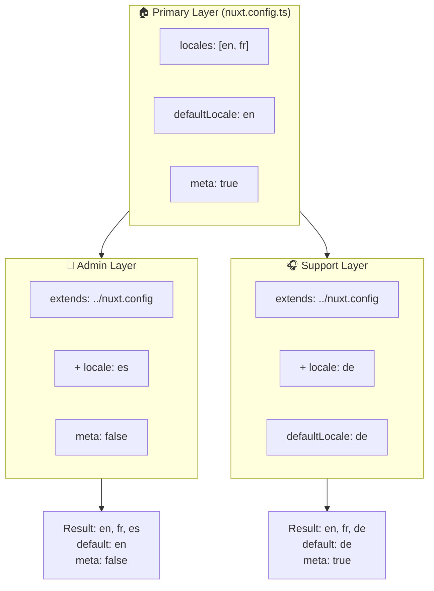

# 🗂️ `Nuxt I18n Micro` 中的 Layers

## 📖 Layers 介紹

`Nuxt I18n Micro` 中的 layers 允許你以彈性的方式在應用不同部分間管理與客製化在地化設定。透過定義不同的 layer,你可為各種情境調整設定,例如覆寫網站特定區塊的設定,或建立可被應用其他部分擴充的可重用基礎設定。

### Layer 繼承流程



## 🛠️ 主要設定 Layer

**主要設定 Layer** 是設定整個應用預設在地化設定的地方。此 layer 至關重要,定義了全域設定,包括支援的語系、預設語言及其他關鍵 i18n 設定。

### 📄 範例:定義主要設定 Layer

以下是如何在 `nuxt.config.ts` 中定義主要設定 layer 的範例:

```typescript
export default defineNuxtConfig({
  i18n: {
    locales: [
      { code: 'en', iso: 'en-EN', dir: 'ltr' },
      { code: 'fr', iso: 'fr-FR', dir: 'ltr' },
      { code: 'ar', iso: 'ar-SA', dir: 'rtl' },
    ],
    defaultLocale: 'en', // The default locale for the entire app
    translationDir: 'locales', // Directory where translations are stored
    meta: true, // Automatically generate SEO-related meta tags like `alternate`
    autoDetectLanguage: true, // Automatically detect and use the user's preferred language
  },
})
```

## 🌱 子 Layer

子 layer 用於擴充或覆寫應用特定部分的主要設定。例如,你可能想為網站特定區塊新增語系,或修改預設語系。子 layer 在模組化應用中特別有用,因為應用不同部分可能有不同的在地化需求。

### 📄 範例:在子 Layer 中擴充主要 Layer

假設你網站有一個區塊需要支援額外語系,或想在特定情境下停用某語系。以下示範如何透過擴充主要設定 layer 達成:

```typescript
// basic/nuxt.config.ts (Primary Layer)
export default defineNuxtConfig({
  i18n: {
    locales: [
      { code: 'en', iso: 'en-EN', dir: 'ltr' },
      { code: 'fr', iso: 'fr-FR', dir: 'ltr' },
    ],
    defaultLocale: 'en',
    meta: true,
    translationDir: 'locales',
  },
})
```

```typescript
// extended/nuxt.config.ts (Child Layer)
export default defineNuxtConfig({
  extends: '../basic', // Inherit the base configuration from the 'basic' layer
  i18n: {
    locales: [
      { code: 'en', iso: 'en-EN', dir: 'ltr' }, // Inherited from the base layer
      { code: 'fr', iso: 'fr-FR', dir: 'ltr' }, // Inherited from the base layer
      { code: 'de', iso: 'de-DE', dir: 'ltr' }, // Added in the child layer
    ],
    defaultLocale: 'fr', // Override the default locale to French for this section
    autoDetectLanguage: false, // Disable automatic language detection in this section
  },
})
```

### 🌐 在模組化應用中使用 Layers

在較大型的模組化 Nuxt 應用中,你可能有多個區塊,各自需要不同 i18n 設定。透過善用 layers,你能維持整潔且可擴展的設定結構。

### 📄 範例:模組化應用中的分層設定

想像你有一個電商網站,包含主網站、管理後台、客戶支援入口等不同區塊。每個區塊可能需要不同的語系或其他 i18n 設定。

#### **主要 Layer(全域設定):**

```typescript
// nuxt.config.ts
export default defineNuxtConfig({
  i18n: {
    locales: [
      { code: 'en', iso: 'en-EN', dir: 'ltr' },
      { code: 'fr', iso: 'fr-FR', dir: 'ltr' },
    ],
    defaultLocale: 'en',
    meta: true,
    translationDir: 'locales',
    autoDetectLanguage: true,
  },
})
```

#### **管理後台的子 Layer:**

```typescript
// admin/nuxt.config.ts
export default defineNuxtConfig({
  extends: '../nuxt.config', // Inherit the global settings
  i18n: {
    locales: [
      { code: 'en', iso: 'en-EN', dir: 'ltr' }, // Inherited
      { code: 'fr', iso: 'fr-FR', dir: 'ltr' }, // Inherited
      { code: 'es', iso: 'es-ES', dir: 'ltr' }, // Specific to the admin panel
    ],
    defaultLocale: 'en',
    meta: false, // Disable automatic meta generation in the admin panel
  },
})
```

#### **客戶支援入口的子 Layer:**

```typescript
// support/nuxt.config.ts
export default defineNuxtConfig({
  extends: '../nuxt.config', // Inherit the global settings
  i18n: {
    locales: [
      { code: 'en', iso: 'en-EN', dir: 'ltr' }, // Inherited
      { code: 'fr', iso: 'fr-FR', dir: 'ltr' }, // Inherited
      { code: 'de', iso: 'de-DE', dir: 'ltr' }, // Specific to the support portal
    ],
    defaultLocale: 'de', // Default to German in the support portal
    autoDetectLanguage: false, // Disable automatic language detection
  },
})
```

在此模組化範例中:

- 每個區塊(admin、support)有自己的 i18n 設定,但都繼承基本設定。
- 管理後台加入西班牙文(`es`)並停用 meta 標籤產生。
- 客戶支援入口加入德文(`de`)並將使用者介面預設為德文。

## 📝 使用 Layers 的最佳實務

- **🔧 讓主要 Layer 簡潔:**主要 layer 應包含最常用、全域套用的設定。保持簡潔以確保一致性。
- **⚙️ 只在必要時於子 Layer 客製化:**只在需要時才在子 layer 覆寫或擴充設定,可避免設定過度複雜。
- **📚 記錄你的 Layers:**清楚記錄每個 layer 的用途與細節,有助於維持清晰,並讓他人(或未來的自己)更容易理解設定。
