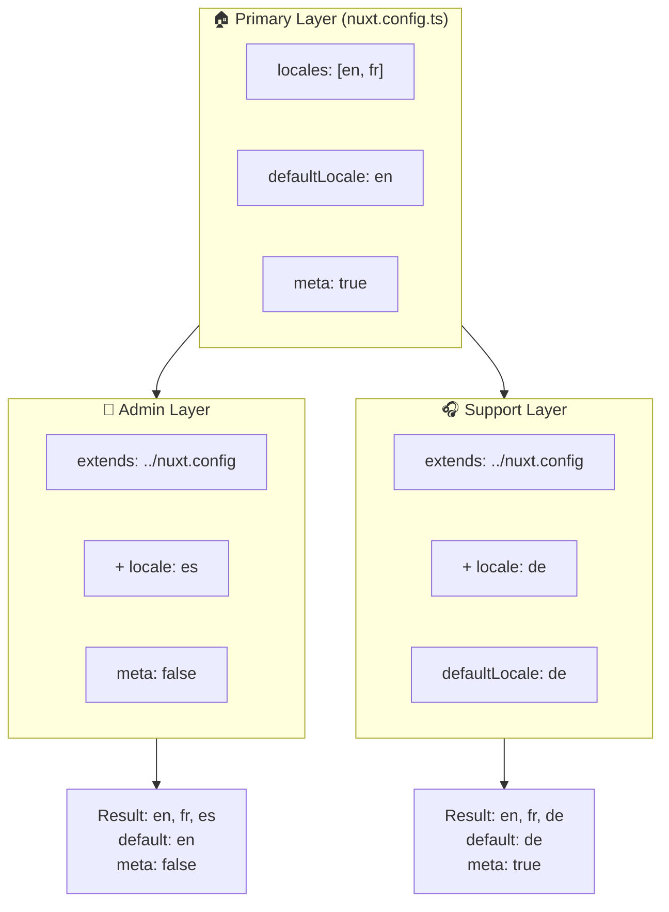

# 🗂️ `Nuxt I18n Micro` 中的 Layers

## 📖 Layers 簡介

`Nuxt I18n Micro` 中的 Layers 讓你能為應用的不同部分彈性地管理與自訂在地化設定。透過定義不同 layer，你可以為各種情境調整設定，例如覆寫站點特定區塊的設定，或建立可被其他部分擴充的可重用基底設定。

### Layer 繼承流程



## 🛠️ 主要設定 Layer

**主要設定 layer** 是整個應用預設在地化設定的所在。這個 layer 至關重要，因為它定義了全域設定，包括支援的語系、預設語言與其他關鍵 i18n 設定。

### 📄 範例：定義主要設定 Layer

以下範例展示如何在 `nuxt.config.ts` 中定義主要設定 layer：

```typescript
export default defineNuxtConfig({
  i18n: {
    locales: [
      { code: 'en', iso: 'en-EN', dir: 'ltr' },
      { code: 'fr', iso: 'fr-FR', dir: 'ltr' },
      { code: 'ar', iso: 'ar-SA', dir: 'rtl' },
    ],
    defaultLocale: 'en', // The default locale for the entire app
    translationDir: 'locales', // Directory where translations are stored
    meta: true, // Automatically generate SEO-related meta tags like `alternate`
    autoDetectLanguage: true, // Automatically detect and use the user's preferred language
  },
})
```

## 🌱 子 Layer

子 layer 用於為應用的特定部分擴充或覆寫主要設定。例如，你可能想為站點某個區塊新增語系或修改預設語言。子 layer 在模組化應用中特別有用，因為不同區塊可能有不同的在地化需求。

### 📄 範例：在子 layer 中擴充主要 layer

假設你的站點某個區塊需要支援額外語系，或需要在特定情境中停用某個語系，可透過擴充主要設定 layer 達成：

```typescript
// basic/nuxt.config.ts (Primary Layer)
export default defineNuxtConfig({
  i18n: {
    locales: [
      { code: 'en', iso: 'en-EN', dir: 'ltr' },
      { code: 'fr', iso: 'fr-FR', dir: 'ltr' },
    ],
    defaultLocale: 'en',
    meta: true,
    translationDir: 'locales',
  },
})
```

```typescript
// extended/nuxt.config.ts (Child Layer)
export default defineNuxtConfig({
  extends: '../basic', // Inherit the base configuration from the 'basic' layer
  i18n: {
    locales: [
      { code: 'en', iso: 'en-EN', dir: 'ltr' }, // Inherited from the base layer
      { code: 'fr', iso: 'fr-FR', dir: 'ltr' }, // Inherited from the base layer
      { code: 'de', iso: 'de-DE', dir: 'ltr' }, // Added in the child layer
    ],
    defaultLocale: 'fr', // Override the default locale to French for this section
    autoDetectLanguage: false, // Disable automatic language detection in this section
  },
})
```

### 🌐 在模組化應用中使用 Layer

在較大型的模組化 Nuxt 應用中，你可能有多個區塊，每個都需要自己的 i18n 設定。運用 layer 可維持整潔且可擴充的設定結構。

### 📄 範例：模組化應用的 Layer 設定

想像你有一個電商站點，包含主站點、後台管理與客服入口等不同區塊。每個區塊可能需要不同語系或其他 i18n 設定。

#### **主要 Layer（全域設定）：**

```typescript
// nuxt.config.ts
export default defineNuxtConfig({
  i18n: {
    locales: [
      { code: 'en', iso: 'en-EN', dir: 'ltr' },
      { code: 'fr', iso: 'fr-FR', dir: 'ltr' },
    ],
    defaultLocale: 'en',
    meta: true,
    translationDir: 'locales',
    autoDetectLanguage: true,
  },
})
```

#### **後台管理的子 Layer：**

```typescript
// admin/nuxt.config.ts
export default defineNuxtConfig({
  extends: '../nuxt.config', // Inherit the global settings
  i18n: {
    locales: [
      { code: 'en', iso: 'en-EN', dir: 'ltr' }, // Inherited
      { code: 'fr', iso: 'fr-FR', dir: 'ltr' }, // Inherited
      { code: 'es', iso: 'es-ES', dir: 'ltr' }, // Specific to the admin panel
    ],
    defaultLocale: 'en',
    meta: false, // Disable automatic meta generation in the admin panel
  },
})
```

#### **客服入口的子 Layer：**

```typescript
// support/nuxt.config.ts
export default defineNuxtConfig({
  extends: '../nuxt.config', // Inherit the global settings
  i18n: {
    locales: [
      { code: 'en', iso: 'en-EN', dir: 'ltr' }, // Inherited
      { code: 'fr', iso: 'fr-FR', dir: 'ltr' }, // Inherited
      { code: 'de', iso: 'de-DE', dir: 'ltr' }, // Specific to the support portal
    ],
    defaultLocale: 'de', // Default to German in the support portal
    autoDetectLanguage: false, // Disable automatic language detection
  },
})
```

此模組化範例中：

- 每個區塊（admin、support）都有自己的 i18n 設定，同時繼承基底設定。
- 後台管理額外加入西班牙文（`es`），並停用 meta 標籤產生。
- 客服入口額外加入德文（`de`），並將使用者介面預設為德文。

## 📝 使用 Layer 的最佳實務

- **🔧 主要 Layer 保持簡潔**：主要 layer 應包含在整個應用中最常使用的設定。保持直接明確可確保一致性。
- **⚙️ 只在必要時透過子 Layer 自訂**：僅在必要時於子 layer 中覆寫或擴充設定，避免設定變得過於複雜。
- **📚 為 Layer 撰寫文件**：清楚記錄專案中每個 layer 的用途與細節。這有助於維持清晰，讓其他人（或未來的自己）更容易理解設定。
