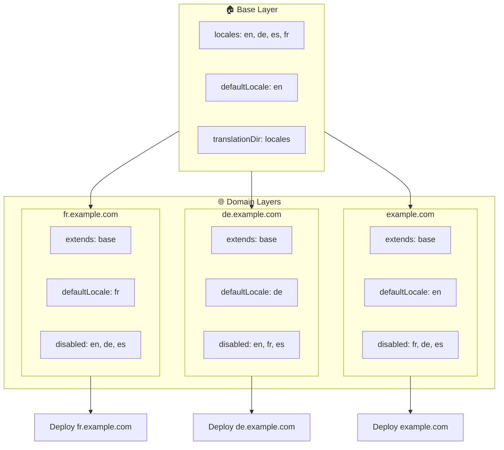

# 🌍 使用 Layers 在 `Nuxt I18n Micro` 中設定多網域語系

## 📝 簡介

透過善用 `Nuxt I18n Micro` 的 layers,你可建立彈性且易於維護的多網域在地化設定。此方式不僅簡化網域管理(不需複雜功能),也可有效分散負載並降低專案複雜度。透過為不同語系執行不同專案,你的應用可輕鬆擴展、適應跨多網域的不同語系需求,為全球應用提供強大且可擴展的解決方案。

## 🎯 目標

建立一套設定,讓不同網域提供特定語系,並在子 layer 中客製化設定。此方法善用 Nuxt 的 layering 系統,讓你能維持基礎設定,並針對每個網域擴充或修改。

### 多網域架構



## 🛠 實作多網域語系的步驟

### 1. **建立基礎 Layer**

先建立包含所有共通語系設定的基礎設定 layer。此設定將作為其他網域專屬設定的基礎。

#### **基礎 Layer 設定**

建立基礎設定檔 `base/nuxt.config.ts`:

```typescript
// base/nuxt.config.ts

export default defineNuxtConfig({
  i18n: {
    locales: [
      { code: 'en', iso: 'en-US', dir: 'ltr' },
      { code: 'de', iso: 'de-DE', dir: 'ltr' },
      { code: 'es', iso: 'es-ES', dir: 'ltr' },
    ],
    defaultLocale: 'en',
    translationDir: 'locales',
    meta: true,
    autoDetectLanguage: true,
  },
})
```

### 2. **建立網域專屬子 Layer**

為每個網域建立一個子 layer,修改基礎設定以符合該網域的特定需求。你可停用該網域不需要的語系。

#### **範例:法文網域的設定**

於 `fr/nuxt.config.ts` 建立法文網域的子 layer 設定:

```typescript
// fr/nuxt.config.ts

export default defineNuxtConfig({
  extends: '../base', // Inherit from the base configuration

  i18n: {
    locales: [
      { code: 'en', iso: 'en-US', dir: 'ltr', disabled: true }, // Disable English
      { code: 'fr', iso: 'fr-FR', dir: 'ltr' }, // Add and enable the French locale
      { code: 'de', iso: 'de-DE', dir: 'ltr', disabled: true }, // Disable German
      { code: 'es', iso: 'es-ES', dir: 'ltr', disabled: true }, // Disable Spanish
    ],
    defaultLocale: 'fr', // Set French as the default locale
    autoDetectLanguage: false, // Disable automatic language detection
  },
})
```

#### **範例:德文網域的設定**

同樣地,於 `de/nuxt.config.ts` 建立德文網域的子 layer 設定:

```typescript
// de/nuxt.config.ts

export default defineNuxtConfig({
  extends: '../base', // Inherit from the base configuration

  i18n: {
    locales: [
      { code: 'en', iso: 'en-US', dir: 'ltr', disabled: true }, // Disable English
      { code: 'fr', iso: 'fr-FR', dir: 'ltr', disabled: true }, // Disable French
      { code: 'de', iso: 'de-DE', dir: 'ltr' }, // Use the German locale
      { code: 'es', iso: 'es-ES', dir: 'ltr', disabled: true }, // Disable Spanish
    ],
    defaultLocale: 'de', // Set German as the default locale
    autoDetectLanguage: false, // Disable automatic language detection
  },
})
```

### 3. **為每個網域部署應用**

以對應設定為每個網域部署應用。例如:

- 將 `fr` layer 設定部署到 `fr.example.com`。
- 將 `de` layer 設定部署到 `de.example.com`。

### 4. **為不同語系建立多個專案**

對於每個語系與網域,你需要執行一個獨立的應用實例。這可確保每個網域提供正確的語系設定,最佳化負載分散並簡化專案結構。透過為每個語系執行量身打造的專案,可保持設定間清晰分離、降低整體設定複雜度。

### 5. **依網域設定路由**

確保你的路由能依使用者所存取的網域,將他們導向到正確的專案。這能確保每個網域提供適當語系,提升使用者體驗並在不同地區間維持一致性。

### 6. **部署與驗證**

在設定好 layer 並部署到各對應網域後,請確認每個網域提供了正確的語系。徹底測試應用,確認會依網域載入正確的語系。

## 📝 最佳實務

- **保持基礎設定通用性**:基礎設定應涵蓋適用於所有網域的通用設定。
- **隔離網域專屬邏輯**:將網域專屬設定保留在對應的 layer 中,以維持清晰與關注點分離。

## 🎉 結語

透過善用 `Nuxt I18n Micro` 的 layers,你可以建立彈性且易於維護的多網域在地化設定。此方式不僅省去複雜的網域管理功能,也讓你能高效分散負載並降低專案複雜度。為不同語系執行獨立專案,可確保你的應用能輕鬆擴展並適應跨網域的不同語系需求,為全球應用提供強大且可擴展的解決方案。
