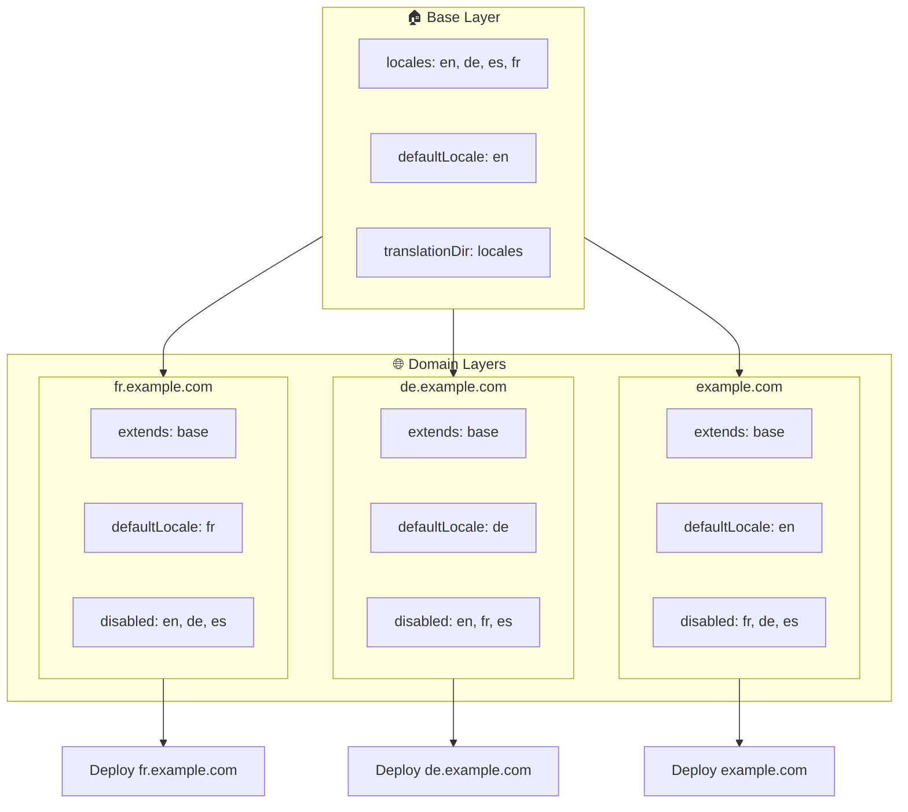

# 🌍 使用 Layers 為 `Nuxt I18n Micro` 打造多網域語系

## 📝 介紹

透過 `Nuxt I18n Micro` 的 layer，你可以打造彈性且易維護的多網域在地化設定。此做法不僅省下複雜的多網域功能，還能有效分散負載並降低專案複雜度。透過為不同語系執行獨立專案，你的應用可輕鬆擴展並適應多個網域上不同的語系需求，為全球性應用提供穩健且可擴充的解決方案。

## 🎯 目標

建立一個由子 layer 自訂設定，讓不同網域提供特定語系的架構。此方式運用 Nuxt 的 layer 系統，讓你維持一份基底設定，並針對每個網域擴充或修改。

### 多網域架構



## 🛠 建置多網域語系的步驟

### 1. **建立 Base Layer**

先建立一個 base 設定 layer，包含應用共用的所有語系設定。此設定將作為其他各網域專屬設定的基礎。

#### **Base Layer 設定**

建立 base 設定檔 `base/nuxt.config.ts`：

```typescript
// base/nuxt.config.ts

export default defineNuxtConfig({
  i18n: {
    locales: [
      { code: 'en', iso: 'en-US', dir: 'ltr' },
      { code: 'de', iso: 'de-DE', dir: 'ltr' },
      { code: 'es', iso: 'es-ES', dir: 'ltr' },
    ],
    defaultLocale: 'en',
    translationDir: 'locales',
    meta: true,
    autoDetectLanguage: true,
  },
})
```

### 2. **建立各網域專屬的子 Layer**

為每個網域建立子 layer，將 base 設定調整為該網域所需的內容。你可以停用該網域不需要的語系。

#### **範例：法文網域設定**

在 `fr/nuxt.config.ts` 為法文網域建立子 layer 設定：

```typescript
// fr/nuxt.config.ts

export default defineNuxtConfig({
  extends: '../base', // Inherit from the base configuration

  i18n: {
    locales: [
      { code: 'en', iso: 'en-US', dir: 'ltr', disabled: true }, // Disable English
      { code: 'fr', iso: 'fr-FR', dir: 'ltr' }, // Add and enable the French locale
      { code: 'de', iso: 'de-DE', dir: 'ltr', disabled: true }, // Disable German
      { code: 'es', iso: 'es-ES', dir: 'ltr', disabled: true }, // Disable Spanish
    ],
    defaultLocale: 'fr', // Set French as the default locale
    autoDetectLanguage: false, // Disable automatic language detection
  },
})
```

#### **範例：德文網域設定**

同樣地，在 `de/nuxt.config.ts` 為德文網域建立子 layer 設定：

```typescript
// de/nuxt.config.ts

export default defineNuxtConfig({
  extends: '../base', // Inherit from the base configuration

  i18n: {
    locales: [
      { code: 'en', iso: 'en-US', dir: 'ltr', disabled: true }, // Disable English
      { code: 'fr', iso: 'fr-FR', dir: 'ltr', disabled: true }, // Disable French
      { code: 'de', iso: 'de-DE', dir: 'ltr' }, // Use the German locale
      { code: 'es', iso: 'es-ES', dir: 'ltr', disabled: true }, // Disable Spanish
    ],
    defaultLocale: 'de', // Set German as the default locale
    autoDetectLanguage: false, // Disable automatic language detection
  },
})
```

### 3. **為每個網域部署應用**

以對應設定為每個網域部署應用。例如：

- 將 `fr` layer 設定部署到 `fr.example.com`。
- 將 `de` layer 設定部署到 `de.example.com`。

### 4. **為不同語系建立多個專案**

為每個語系與網域執行獨立的應用實例。這確保每個網域提供正確的語系設定，最佳化負載分配並簡化專案結構。透過為每個語系執行專屬專案，你能在設定之間維持清楚的分離，並降低整體複雜度。

### 5. **依網域設定路由**

確保你的路由能依存取的網域引導使用者到正確的專案。如此可讓每個網域提供適當語系，提升使用者體驗並在各地區間維持一致性。

### 6. **部署並驗證**

設定好 layer 並部署到對應網域後，請確認每個網域提供正確的語系。徹底測試應用，確認正確語系會依網域載入。

## 📝 最佳實務

- **保持 base 設定的通用性**：base 設定應涵蓋所有網域適用的一般選項。
- **隔離網域專屬邏輯**：將網域專屬設定保留在各自 layer 中，維持清晰與關注點分離。

## 🎉 結論

透過 `Nuxt I18n Micro` 的 layer，你能打造彈性且易維護的多網域在地化架構。此方式免除複雜的多網域管理功能，並讓你有效分散負載、降低專案複雜度。為不同語系執行獨立專案能讓應用輕鬆擴展並適應多個網域上不同的語系需求，為全球性應用提供穩健且可擴充的解決方案。
