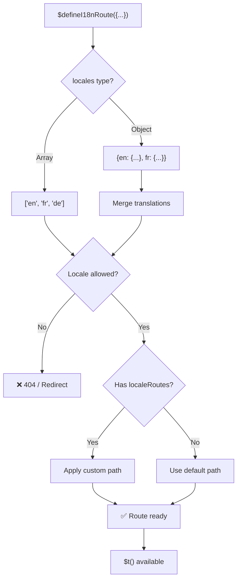
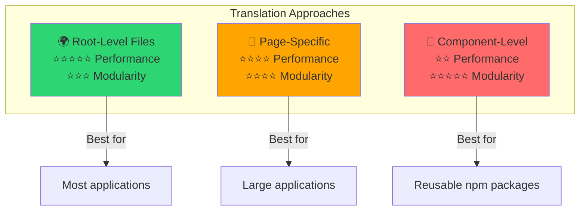

# 📖 以元件為單位的翻譯

了解如何使用 `$defineI18nRoute` 在 Vue 元件內直接定義翻譯,以達到模組化且易於維護的在地化。

## 📖 概觀

`Nuxt I18n Micro` 中的「以元件為單位的翻譯」讓你能透過 `$defineI18nRoute` 直接在特定元件或頁面中定義翻譯。此方式非常適合管理個別元件獨有的在地化內容,為翻譯處理提供更模組化、可維護的方法。

## 🚀 快速開始

### 基本用法

```vue
<template>
  <div>
    <h1>{{ $t('greeting') }}</h1>
    <p>{{ $t('farewell') }}</p>
  </div>
</template>

<script setup lang="ts">
import { useNuxtApp } from '#imports'

const { $defineI18nRoute, $t } = useNuxtApp()

$defineI18nRoute({
  locales: {
    en: { greeting: 'Hello', farewell: 'Goodbye' },
    fr: { greeting: 'Bonjour', farewell: 'Au revoir' },
    de: { greeting: 'Hallo', farewell: 'Auf Wiedersehen' },
  },
})
</script>
```

### 必要的設定(`script setup`)

`$defineI18nRoute` 是 Nuxt app 注入,而非全域巨集。
呼叫前務必先從 `useNuxtApp()` 取得。

```ts
import { useNuxtApp } from '#imports'

const { $defineI18nRoute } = useNuxtApp()
```

## 🏗️ 建置期路由 meta

在建置期,一個 Vite unplugin 會掃描頁面 `.vue` 檔中的 `defineI18nRoute(...)` / `$defineI18nRoute(...)` 呼叫,並將語系限制、`localeRoutes` 與 `disableMeta` 擷取到 `@i18n-micro/route-strategy` 所使用的路由 metadata。

- **建置**:unplugin(`src/unplugin-define-i18n-route.ts`)於 Vite transform 期間執行,並將 `i18n-route-meta.json` 寫入 Nuxt 的 build 目錄
- **執行時**:define 外掛(`03.define.ts`)仍會在 `script setup` 中暴露 `$defineI18nRoute`,供開發模式與內嵌設定使用

一般情況下,你只需在頁面中呼叫 `$defineI18nRoute` —— 模組會自動處理建置期擷取。

## 🔧 `$defineI18nRoute` 函式

`$defineI18nRoute` 依當前語系設定路由行為,提供多功能解決方案,可:

- 依可用語系控制特定路由的存取
- 為特定語系提供翻譯
- 為不同語系設定自訂路由
- 控制 meta 標籤產生

### 運作方式



### 方法簽章

```typescript
const { $defineI18nRoute } = useNuxtApp();
$defineI18nRoute(routeDefinition: DefineI18nRouteConfig);
```

### 參數

| 參數           | 型別                                       | 說明                               |
| -------------- | ------------------------------------------ | ---------------------------------- |
| `locales`      | `string[] \| Record<string, Translations>` | 該路由可用的語系                   |
| `localeRoutes` | `Record<string, string>`                   | 特定語系的自訂路由                 |
| `disableMeta`  | `boolean \| string[]`                      | 控制 i18n meta 標籤的產生          |

### 參數詳細說明

#### `locales`

定義該路由可用的語系:

<CodeGroup>
```typescript Array Format
$defineI18nRoute({
  locales: ['en', 'fr', 'de'], // Simple array of locale codes
})
```

```typescript Object Format
$defineI18nRoute({
  locales: {
    en: { greeting: 'Hello', farewell: 'Goodbye' },
    fr: { greeting: 'Bonjour', farewell: 'Au revoir' },
    de: { greeting: 'Hallo', farewell: 'Auf Wiedersehen' },
    ru: {}, // Russian locale allowed but no translations provided
  },
})
```
</CodeGroup>

#### `localeRoutes`

允許為特定語系設定自訂路由:

```typescript
$defineI18nRoute({
  localeRoutes: {
    en: '/welcome',
    fr: '/bienvenue',
    de: '/willkommen',
    ru: '/privet', // Custom route path for Russian locale
  },
})
```

#### `disableMeta`

控制 i18n meta 標籤的產生:

<CodeGroup>
```typescript Disable All Meta
$defineI18nRoute({
  locales: ['en', 'fr', 'de'],
  disableMeta: true, // Disables all i18n meta tags
})
```

```typescript Disable Specific Locales
$defineI18nRoute({
  locales: ['en', 'fr', 'de'],
  disableMeta: ['en', 'fr'], // Only English and French won't have meta tags
})
```
</CodeGroup>

## 💡 使用情境

### 1. 依語系控制存取

定義特定路由允許哪些語系:

```typescript
$defineI18nRoute({
  locales: ['en', 'fr', 'de'], // Only these locales are allowed for this route
})
```

### 2. 提供元件專屬翻譯

使用 `locales` 物件為每個路由提供特定翻譯:

```typescript
$defineI18nRoute({
  locales: {
    en: {
      greeting: 'Hello',
      farewell: 'Goodbye',
      description: 'Welcome to our application',
    },
    fr: {
      greeting: 'Bonjour',
      farewell: 'Au revoir',
      description: 'Bienvenue dans notre application',
    },
    de: {
      greeting: 'Hallo',
      farewell: 'Auf Wiedersehen',
      description: 'Willkommen in unserer Anwendung',
    },
  },
})
```

### 3. 為語系設定自訂路由

為特定語系定義自訂路徑:

```typescript
$defineI18nRoute({
  locales: ['en', 'fr', 'de'],
  localeRoutes: {
    en: '/welcome',
    fr: '/bienvenue',
    de: '/willkommen',
  },
})
```

### 4. 停用 Meta 標籤

控制特定路由或語系的 SEO meta 標籤產生:

```typescript
// Disable meta tags for all locales
$defineI18nRoute({
  locales: ['en', 'fr', 'de'],
  disableMeta: true,
})

// Disable meta tags only for specific locales
$defineI18nRoute({
  locales: ['en', 'fr', 'de'],
  disableMeta: ['en', 'fr'],
})
```

## ✅ 支援的設定格式

`$defineI18nRoute` 解析器支援多種 JavaScript 設定:

### 靜態設定

<CodeGroup>
```typescript Static Arrays
$defineI18nRoute({
  locales: ['en', 'de', 'fr'],
})
```

```typescript Static Objects
$defineI18nRoute({
  locales: {
    en: { greeting: 'Hello' },
    de: { greeting: 'Hallo' },
  },
  localeRoutes: {
    en: '/welcome',
    de: '/willkommen',
  },
})
```
</CodeGroup>

### 動態設定

<CodeGroup>
```typescript Variables and Functions
const locales = ['en', 'de', 'fr']
const routes = { en: '/welcome', de: '/willkommen' }

$defineI18nRoute({
  locales: locales,
  localeRoutes: routes,
})
```

```typescript Template Literals
const prefix = 'api'

$defineI18nRoute({
  locales: [`${prefix}-en`, `${prefix}-de`],
  localeRoutes: {
    [`${prefix}-en`]: `/api/welcome`,
    [`${prefix}-de`]: `/api/willkommen`,
  },
})
```
</CodeGroup>

### 進階設定

<CodeGroup>
```typescript Spread Operator
const baseLocales = ['en', 'de']
const additionalLocales = ['fr', 'es']

$defineI18nRoute({
  locales: [...baseLocales, ...additionalLocales],
})
```

```typescript Array of Objects
$defineI18nRoute({
  locales: [
    { code: 'en', name: 'English' },
    { code: 'de', name: 'German' },
  ],
})
```
</CodeGroup>

### 條件邏輯

```typescript
$defineI18nRoute({
  locales: process.env.NODE_ENV === 'production' ? ['en', 'de'] : ['en', 'de', 'fr', 'es'],
})
```

### 複雜的巢狀物件

```typescript
$defineI18nRoute({
  locales: {
    'en-us': {
      region: 'US',
      currency: 'USD',
      format: {
        date: 'MM/DD/YYYY',
        time: '12h',
      },
    },
    'de-de': {
      region: 'DE',
      currency: 'EUR',
      format: {
        date: 'DD.MM.YYYY',
        time: '24h',
      },
    },
  },
})
```

### 註解與格式

```typescript
$defineI18nRoute({
  // Supported locales for this component
  locales: [
    'en', // English
    'de', // German
    'fr', // French
  ],
  // Custom routes for each locale
  localeRoutes: {
    en: '/welcome',
    de: '/willkommen',
    fr: '/bienvenue',
  },
})
```

## ❌ 不支援的用法

解析器有其限制,無法處理:

- **外部 imports**(`import` 陳述)
- **Async/await 函式**
- **類別方法**
- **複雜控制流程**(loops、try-catch、switch)
- **箭頭函式**在設定中
- **Generator 函式**

## 📝 完整範例

以下是展示所有功能的綜合範例:

```vue
<template>
  <div class="welcome-page">
    <header>
      <h1>{{ $t('title') }}</h1>
      <p>{{ $t('subtitle') }}</p>
    </header>

    <main>
      <section>
        <h2>{{ $t('features.title') }}</h2>
        <ul>
          <li v-for="feature in $t('features.list')" :key="feature">
            {{ feature }}
          </li>
        </ul>
      </section>

      <section>
        <h2>{{ $t('contact.title') }}</h2>
        <p>{{ $t('contact.description') }}</p>
        <a :href="$t('contact.email')">{{ $t('contact.email') }}</a>
      </section>
    </main>

    <footer>
      <p>{{ $t('footer.copyright') }}</p>
    </footer>
  </div>
</template>

<script setup lang="ts">
import { useNuxtApp } from '#imports'

const { $defineI18nRoute, $t } = useNuxtApp()

// Define comprehensive i18n route configuration
$defineI18nRoute({
  locales: {
    en: {
      title: 'Welcome to Our Platform',
      subtitle: 'The best solution for your needs',
      features: {
        title: 'Key Features',
        list: ['High Performance', 'Easy to Use', 'Scalable Architecture'],
      },
      contact: {
        title: 'Get in Touch',
        description: "We'd love to hear from you",
        email: 'mailto:contact@example.com',
      },
      footer: {
        copyright: '© 2024 Example Company. All rights reserved.',
      },
    },
    fr: {
      title: 'Bienvenue sur Notre Plateforme',
      subtitle: 'La meilleure solution pour vos besoins',
      features: {
        title: 'Fonctionnalités Clés',
        list: ['Haute Performance', 'Facile à Utiliser', 'Architecture Évolutive'],
      },
      contact: {
        title: 'Contactez-Nous',
        description: 'Nous aimerions avoir de vos nouvelles',
        email: 'mailto:contact@example.com',
      },
      footer: {
        copyright: '© 2024 Example Company. Tous droits réservés.',
      },
    },
    de: {
      title: 'Willkommen auf Unserer Plattform',
      subtitle: 'Die beste Lösung für Ihre Bedürfnisse',
      features: {
        title: 'Hauptfunktionen',
        list: ['Hohe Leistung', 'Einfach zu Verwenden', 'Skalierbare Architektur'],
      },
      contact: {
        title: 'Kontaktieren Sie Uns',
        description: 'Wir würden gerne von Ihnen hören',
        email: 'mailto:contact@example.com',
      },
      footer: {
        copyright: '© 2024 Example Company. Alle Rechte vorbehalten.',
      },
    },
  },
  localeRoutes: {
    en: '/welcome',
    fr: '/bienvenue',
    de: '/willkommen',
  },
  disableMeta: false, // Enable SEO meta tags
})
</script>

<style scoped>
.welcome-page {
  max-width: 800px;
  margin: 0 auto;
  padding: 2rem;
}

header {
  text-align: center;
  margin-bottom: 3rem;
}

section {
  margin-bottom: 2rem;
}

footer {
  text-align: center;
  margin-top: 3rem;
  padding-top: 2rem;
  border-top: 1px solid #eee;
}
</style>
```

## ⚡ 效能考量

將翻譯嵌入單一檔案元件(SFC)可能影響效能:

### 潛在問題

- **檔案體積增加**:所有語系都在 SFC 中,不同於獨立翻譯檔可依語系載入
- **渲染較慢**:內嵌翻譯在執行時處理
- **記憶體使用**:無論當前語系,所有翻譯都會被載入

### 最佳實務

- **以頁面為單位的翻譯**以取得最佳效能
- **元件層級翻譯**保留給特定情境,例如:
  - 發布到 npm 的可重用元件
  - 不適合放在根層級檔案的翻譯
  - 需要自足式的元件

### 效能 vs 模組化

依專案需求平衡選擇:



| 方式                 | 效能         | 模組化     | 適用情境            |
| -------------------- | ------------ | ---------- | ------------------- |
| **根層級檔案**       | ⭐⭐⭐⭐⭐  | ⭐⭐⭐     | 大多數應用          |
| **頁面專屬**         | ⭐⭐⭐⭐    | ⭐⭐⭐⭐   | 大型應用            |
| **元件層級**         | ⭐⭐        | ⭐⭐⭐⭐⭐ | 可重用元件          |

## 🎯 最佳實務

### 1. 讓翻譯靠近相關元件

在相關元件中直接定義翻譯,讓在地化內容有條理且易於維護。

### 2. 使用 locale 物件以取得彈性

當需要特定翻譯或依語系控制存取時,使用 `locales` 屬性的物件格式。

### 3. 記錄自訂路由

清楚記錄為不同語系設定的自訂路由,以維持清晰度並簡化開發與維護。

### 4. 考量效能影響

評估元件層級翻譯是否為你的用途所必需,並考量效能影響。

### 5. 使用 TypeScript

善用 TypeScript 取得更好的型別安全與 IntelliSense 支援:

```typescript
interface ComponentTranslations {
  title: string
  subtitle: string
  features: {
    title: string
    list: string[]
  }
}

$defineI18nRoute({
  locales: {
    en: {
      title: 'Welcome',
      subtitle: 'Subtitle',
      features: {
        title: 'Features',
        list: ['Feature 1', 'Feature 2'],
      },
    } as ComponentTranslations,
  },
})
```

## 📚 相關主題

- **[快速開始](/quickstart)** — 基本設定與設定方式
- **[API 參考](/api/methods)** — 完整方法文件
- **[範例](/examples)** — 實際使用範例

## 摘要

由 `$defineI18nRoute` 函式驅動的「以元件為單位的翻譯」功能,為你的 Nuxt 應用提供強大且彈性的在地化管理方式。透過在元件層級定義在地化內容與路由,能協助建立高度客製化、對使用者友善的體驗,契合你目標對象的語言與地區偏好。

依專案需求選擇最合適的方式,兼顧效能與可維護性。
