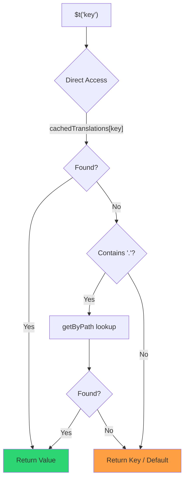

# 🚀 效能指南

## 📖 介紹

`Nuxt I18n Micro` 在設計時將效能列為首要考量，相較 `nuxt-i18n` 等傳統 i18n 模組有顯著提升。本指南深入介紹 `Nuxt I18n Micro` 的效能優勢，以及它與其他方案的比較。

## 🤔 為什麼要重視效能？

在大型專案與高流量環境中，效能瓶頸會導致建置時間變長、記憶體使用增加、伺服器回應時間變慢。若 i18n 設定涉及大型翻譯檔，這些問題會更顯著。`Nuxt I18n Micro` 專為此打造，透過最佳化速度、記憶體效率與 bundle 大小的影響來直接解決這些挑戰。

## 📊 效能比較

我們透過 `pnpm test:performance`（`pnpm -C scripts cli performance`）針對相同 fixture，對 **`@nuxtjs/i18n@10.6.0`** 進行了一系列測試。完整方法與圖表請見：[效能測試結果](/guides/performance-results)。

CLI 預設 profile：**4 個語系** × **2 個頁面**（`index`、`page`）× 約 10k 個 index 葉節點鍵。若要更重的壓力測試，可提高 `--locales`／`--keys`。報告會將**程式碼**、**翻譯**（包含 `@nuxtjs/i18n` 的 `chunks/raw/*`）與**總部署輸出**分開統計。

```bash
pnpm test:performance
pnpm -C scripts cli performance --only micro --skip-stress
pnpm -C scripts cli performance --locales 12 --keys 100000 --runs 3
```

### ⏱️ 建置時間與資源消耗

<Accordion title="**@nuxtjs/i18n v10.6**">
- **程式碼 Bundle**：2.16 MB
- **翻譯**：7.21 MB（訊息 chunk + 語系 payload）
- **總部署大小**：9.37 MB
- **最大記憶體使用**：1,821 MB
- **執行時間**：8.34 秒（3 次平均）
</Accordion>

<Tip>
- **程式碼 Bundle**：1.74 MB：**比 `@nuxtjs/i18n` v10.6 小約 19%**
- **翻譯**：6.8 MB（延遲載入 JSON）
- **總部署大小**：8.54 MB
- **最大記憶體使用**：1,065 MB：**比 `@nuxtjs/i18n` v10.6 少約 41%**
- **執行時間**：5.34 秒：**比 `@nuxtjs/i18n` v10.6 快約 36%**（≈ 純 Nuxt 基準）
</Tip>

> 舊版文件顯示 `@nuxtjs/i18n` 「code ≈ 15 MB／translations 0 B」，是把 `chunks/raw` 訊息檔算成應用程式碼。目前的分類器會將它們分開；**code** 差距因此變小，但 micro 在建置時間、尖峰 RSS 與負載測試上仍領先。

完整基準報告、Autocannon 結果與 fixture 細節請見[效能測試結果](/guides/performance-results)。

### 🌐 高負載下的伺服器效能

Artillery（6s@6 + 60s@60）與 Autocannon（10c／10s），每個 fixture 連續執行 3 次取平均。

<Accordion title="**@nuxtjs/i18n v10.6**">
- **每秒請求數（Artillery）**：143 [#/sec]
- **平均回應時間**：956 ms
- **Autocannon RPS／平均延遲**：72 / 139 ms
</Accordion>

<Tip>
- **每秒請求數（Artillery）**：275 [#/sec]：**比 `@nuxtjs/i18n` v10.6 多約 93%**
- **平均回應時間**：483 ms：**比 `@nuxtjs/i18n` v10.6 快約 49%**
- **Autocannon RPS／平均延遲**：162 / 62 ms
</Tip>

### 📈 視覺化比較

<Note>
Mintlify 文件中省略互動式圖表。請參考本頁的基準表格，或 [VitePress 文件](https://s00d.github.io/nuxt-i18n-micro/guide/performance-results) 中的圖表：`chart`。
</Note>

<Note>
Mintlify 文件中省略互動式圖表。請參考本頁的基準表格，或 [VitePress 文件](https://s00d.github.io/nuxt-i18n-micro/guide/performance-results) 中的圖表：`chart`。
</Note>

| 指標              | @nuxtjs/i18n v10.6 | i18n-micro | 改善               |
| ----------------- | ------------------ | ---------- | ------------------ |
| 建置時間           | 8.34s              | 5.34s      | **快約 36%**        |
| 記憶體（建置）      | 1,821 MB           | 1,065 MB   | **少約 41%**        |
| 程式碼 Bundle      | 2.16 MB            | 1.74 MB    | **小約 19%**        |
| 回應時間           | 956 ms             | 483 ms     | **快約 49%**        |
| RPS（Artillery）  | 143                | 275        | **多約 93%**        |

### 🔍 結果解讀

相較於目前的 `@nuxtjs/i18n` **v10.6**（預設 CLI profile，3 次平均）：

- 🗜️ **程式碼圖更小**：約 1.74 MB 對 2.16 MB（在訊息 chunk 不再被誤標為「code」之後）。
- 🧠 **建置 RSS 更低**：尖峰約 1.1 GB 對 1.8 GB。
- 🕒 **建置更快**：約 5.3 秒對 8.3 秒（在此 profile 下 micro 與純 Nuxt 基準相當）。
- ⚡ **負載下表現更佳**：Artillery 約 275 對 143 RPS，Autocannon 約 162 對 72 RPS，平均延遲更低。

絕對數字與早期發表的表格不同（字典較小、Nuxt 較舊，且對 `@nuxtjs/i18n` 有不公平的「0 B translations」拆分）。方向上仍相同：micro 在建置成本與請求吞吐量上都領先。

## ⚙️ 主要最佳化

### 🛠️ 極簡設計

`Nuxt I18n Micro` 圍繞極簡架構打造，核心小且策略以專用套件實作。這降低了負擔並簡化了內部邏輯，讓效能得以提升。

### 🚦 高效路由

v3 中，路由產生與執行時路徑邏輯拆分為專屬套件以達最佳 tree-shaking：

- **`@i18n-micro/route-strategy`**：建置期路由產生：為 Nuxt pages 擴充多語系路由。只會納入所選策略（`no_prefix`、`prefix`、`prefix_except_default`、`prefix_and_default`）。
- **`@i18n-micro/path-strategy`**：執行時的路徑解析、重新導向與連結產生。使用純函式與預先計算的 context 旗標，將熱路徑的配置降到最低。子路徑匯出（`/prefix`、`/no-prefix` 等）確保只有被選中的實作進入 bundle。

此做法讓路由設定保持輕量，並確保無論語系數量多寡都能快速解析路由。

### 📂 精簡的翻譯載入

模組僅支援 JSON 翻譯檔，並清楚區分全域與頁面專屬檔案。這確保每次只載入必要的翻譯資料，進一步提升效能。

### 🔒 GlobalThis 單例快取

自 v3.0.0 起，模組使用 `globalThis` 單例模式（搭配 `Symbol.for`）確保整個 Node.js 行程中只有一個快取實例，可防止：

- 相同模組被多次打包時的快取重複
- 每次請求重新建立物件所造成的 GC 壓力
- 孤立快取實例造成的記憶體洩漏

```mermaid
flowchart LR
    subgraph Process["Node.js Process"]
        G["globalThis[Symbol.for('CACHE')]"]

        subgraph R1["SSR Request 1"]
            P1[Plugin Instance] --> G
        end

        subgraph R2["SSR Request 2"]
            P2[Plugin Instance] --> G
        end

        subgraph R3["SSR Request 3"]
            P3[Plugin Instance] --> G
        end
    end

    G --> Cache["Single Map Instance"]
    Cache --> D1["en:index → translations"]
    Cache --> D2["en:about → translations"
```

```typescript
// Internal implementation pattern
const CACHE_KEY = Symbol.for('__NUXT_I18N_STORAGE_CACHE__')
if (!globalThis[CACHE_KEY]) {
  globalThis[CACHE_KEY] = new Map()
}
```

### ⚡ 最佳化的翻譯函式（tFast）

`$t()` 函式採用直接查找策略以最佳化速度：

1. **預先計算的 context**：語系與路由名稱在導覽期間只算一次，不會在每次 `$t()` 呼叫時重算
2. **單一來源查找**：所有翻譯（根層 + 頁面專屬 + fallback）於建置期預先合併成每頁一份檔案，不需分層搜尋
3. **導覽時累積深度合併**：在同一語系內導覽時，新頁面翻譯會被深度合併（2 層深度）進目前字典，因此轉場動畫期間仍能看到前一頁的鍵—即使頁面之間有重疊的巢狀前綴（例如兩個頁面都有 `common.*` 下的鍵）也一樣
4. **透過 `page:transition:finish` 進行 GC**：轉場動畫完全結束後，合併字典會被替換為只屬於新頁面的乾淨翻譯，釋放舊頁面鍵的記憶體
5. **直接屬性存取**：熱路徑上使用 `obj[key]` 而非 Map 查找



```typescript
// Simplified lookup logic — single active dictionary
let val = cachedTranslations[key]
if (val === undefined && key.includes('.')) {
  val = getByPath(cachedTranslations, key)
}
```

### 💉 伺服器端載入（不嵌入 HTML）

SSR 期間載入的翻譯會留在**伺服器記憶體**中供 `$t` 渲染時使用，**不會**被複製到 `nuxtApp.payload`／HTML 文件中（概念與 `@nuxtjs/i18n` 的 `experimental.preload: false` 相同）。

用戶端上，`01.plugin.ts` 會 `await` `switchContext`，在應用繼續之前載入 `/\{apiBaseUrl\}/:page/:locale/data.json`：一個請求，而非 8 MB 的內嵌 blob。

`NuxtI18n` 仍會保留目前合併字典（`cachedTranslations`）供 `$t()`／`$has()` 使用。同一語系的導覽會在 `page:transition:finish` 清理過期鍵之前，將頁面 chunk 深度合併進來。

#### 目前現況

以下數字讀取自預算檔，`pnpm run budget:payload` 會量測並強制執行。

{/* generated:payload-budget — do not edit; run `pnpm run docs:generate` */}

在 `playground` 的 `/`、`/de` 上量測：

| 量測項目 | 大小 |
| --- | --- |
| 磁碟上的翻譯來源 | 15.2 MB |
| 作為獨立 payload 檔提供 | 76.3 MB |
| 最大的 inline `__NUXT_DATA__` | 6.9 MB |
| 用戶端資產 | 449.5 KB |

playground 刻意攜帶超大字典，因此以上數字並非真實應用會遇到的實際規模，而是量測用的固定參照點。當這些指標意外成長時，預算檢查會失敗，這也是意外變動 payload 內容時能被發現的機制。

{/* /generated:payload-budget */}

### 💾 快取與預先渲染

翻譯會經過幾層快取，知道是哪一層回應了請求，可能是五分鐘與五小時除錯的差別。有四層，依請求接觸順序：

| 層級 | 位置 | 生命週期 | 由誰清除 |
| --- | --- | --- | --- |
| 瀏覽器／CDN | `/\{apiBaseUrl\}/**` 的 `Cache-Control` | `httpCacheDuration`、`immutable` | 新的 `?v=`（即改變翻譯的部署） |
| Nitro 路由快取 | `routeRules['/\{apiBaseUrl\}/**'].cache` | 60 秒，stale-while-revalidate | 伺服器重啟 |
| 伺服器 loader | 行程內 `CacheControl`，以 `locale:routeName` 為鍵 | 行程生命週期或 `cacheTtl` | 伺服器重啟、dev 中的 HMR |
| 用戶端 store | `translationStorage` + `NuxtI18n` 中的目前 chunk | 頁面生命週期 | 重新載入 |

兩條規則能讓它們不互相矛盾：

- **Nitro 路由快取只在 `?v=` 存在時運作**：有 cache-buster 時，每個 URL 都與其內容綁定，因此伺服器端快取不會過期。若設 `dateBuild: 0`，此層會被關閉，因為 URL 此時穩定不變、回應為 `must-revalidate`：若伺服器端仍快取，會有長達一分鐘回應舊資料的可能，反而破壞語意。
- **`immutable` 同樣需要 `?v=`**：若沒有 buster，無論 `httpCacheDuration` 為何，標頭都會是 `public, max-age=0, must-revalidate`：對從不變的 URL 設定長 `max-age` 會鎖住瀏覽器第一次看到的回應。

<Warning>
使用 `translationPayloads.publicAssets`（premerged 模式的預設）時，payload 會被複製到 `public/<apiBaseUrl>/\{page\}/\{locale\}/data.json`。若平台直接提供該目錄（Cloudflare Pages、Firebase Hosting、`npx serve`），則會套用該平台的標頭：Nitro `routeRules` 標頭只影響經過伺服器的回應。請在該平台自己的設定中為靜態檔案設定快取策略。
</Warning>

🏁 **預先渲染**：在 premerged 模式下，`publicAssets` 已將用戶端 URL 樹寫入 `public/`。只有在你需要 Nitro 為 handler 路由產出實體檔案且 `publicAssets` 被停用時，才需啟用 `prerenderRoutes`。

### 🗜️ 壓縮的 public payload

啟用 `nitro.compressPublicAssets` 時，複製到 public 目錄的翻譯 payload 也會產生 `.gz` 與 `.br` 副本：

```ts
export default defineNuxtConfig({
  nitro: { compressPublicAssets: true },
})
```

Nitro 會在複製 payload 的 hook 之前先壓縮 public 資產，若沒有這個設定，這些檔案就會成為靜態建置中唯一未壓縮的部分。模組不會自行開啟壓縮，只會遵循你選的設定。逐編碼選項（`\{ gzip: true, brotli: false \}`）也會被尊重。

Playground index payload：原始 6,651,984 B，gzip 1,012,831 B，brotli 821,617 B。

### ☁️ Serverless payload 輸出

在 **Node** 上，SSR 從 `public/<apiBaseUrl>` 讀取翻譯 JSON（`readFile`，不使用 Nitro `serverAssets`／Rollup `raw:`）。在 **Edge** 上，Nitro `serverAssets` 會內嵌相同的 tree（大型字典建議使用 `mode: 'source'`）。

```typescript
export default defineNuxtConfig({
  i18n: {
    translationPayloads: {
      serverAssets: true, // default — Node → public copy; Edge → serverAssets embed
      publicAssets: true, // default in premerged mode
    },
  },
})
```

若要在 Edge 上產生更精簡的內嵌檔（以及可選的精簡 public 副本），使用 `translationPayloads.mode: 'source'`：

```typescript
export default defineNuxtConfig({
  i18n: {
    translationPayloads: {
      mode: 'source',
    },
  },
})
```

`mode: 'source'` 讓 layer 合併後的來源檔保持精簡，並在執行期透過內建的 `/_locales` 路由（或 Edge 的 `assets:i18n`）合併根層／頁面／fallback。預設會停用 public 資產副本與 prerender payload 路由。

<Warning>
`prerenderRoutes` 預設為 `false`。使用 `mode: 'source'` 時，`publicAssets` 也預設為 `false`。因此純靜態託管（無 Nitro／edge 執行時）在用戶端無法載入翻譯，除非你啟用這些輸出、讓 `serverHandler` 在執行時可用，或以外部方式託管 payload。

預設的 premerged + `publicAssets` 已將 `/\{apiBaseUrl\}/\{page\}/\{locale\}/data.json` 放進 `public/`，因此靜態主機無需 Nitro 也能提供用戶端 fetch 所需檔案。
</Warning>

<Warning>
設定 `apiBaseServerHost` 或 `apiBaseClientHost` 會將 payload 提供轉移到該 origin，並有自己的相依條件。請見[設定→外部 CDN host](/guides/configuration#external-cdn-hosts)。
</Warning>

或者，你也可以停用個別 HTTP／public 輸出並將 payload 託管於外部：

```typescript
export default defineNuxtConfig({
  i18n: {
    apiBaseClientHost: 'https://cdn.example.com',
    apiBaseServerHost: 'https://cdn.example.com',
    translationPayloads: {
      serverHandler: false,
      publicAssets: false,
      prerenderRoutes: false,
    },
  },
})
```

若你仰賴內建的本地 `/\{apiBaseUrl\}/:page/:locale/data.json` 路由，請保留 `serverHandler` 啟用。當 payload 由外部託管、且 `apiBaseServerHost` 指向該外部 origin 時，才停用它。只有在你需要 Nitro 為靜態 payload 路由產出實體檔案且 `publicAssets` 尚未寫出時，才啟用 `prerenderRoutes`。

建置期，當產生的 payload 檔案數超過 `translationPayloads.warnFileCount`（預設 500）或總大小超過 `translationPayloads.warnSizeBytes`（預設 10 MB）時，模組會發出警告。若所有本地輸出都被停用且沒有外部 payload host，也會發出警告。

## 📝 讓效能發揮到最大化的建議

以下建議可讓你獲得 `Nuxt I18n Micro` 的最佳效能：

- 📉 **限制語系資料**：只納入專案實際需要的語系，讓 bundle 保持精簡。
- 🗂️ **使用頁面專屬翻譯**：依頁面組織翻譯檔，避免載入不必要資料。
- 💾 **啟用快取**：善用快取功能減少伺服器負載並提升回應時間。
- 🏁 **善用預先渲染**：預先渲染翻譯以加速頁面載入並降低執行期負擔。

詳細的效能測試結果請見[效能測試結果](/guides/performance-results)。
