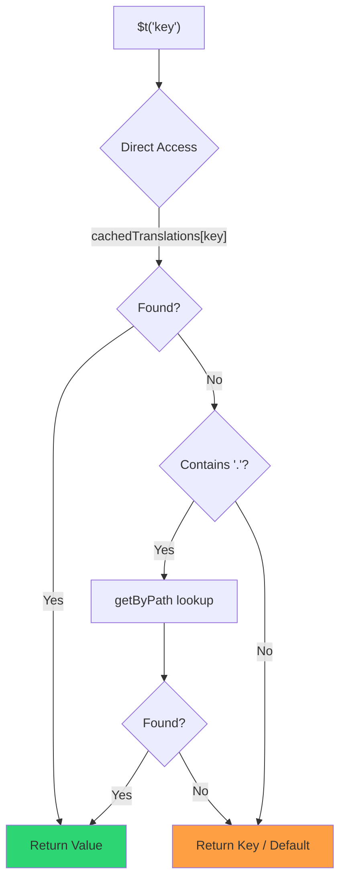

# 🚀 效能指南

## 📖 簡介

`Nuxt I18n Micro` 在設計時就以效能為考量,相較於 `nuxt-i18n` 等傳統國際化(i18n)模組有顯著提升。本指南深入介紹使用 `Nuxt I18n Micro` 的效能優勢,以及與其他方案的比較。

## 🤔 為什麼要重視效能?

在大型專案與高流量環境中,效能瓶頸可能導致較長的建置時間、較高的記憶體使用,以及較差的伺服器回應。這些問題在具有大型翻譯檔的複雜 i18n 設定中會更明顯。`Nuxt I18n Micro` 針對速度、記憶體效率及對應用 bundle 影響最小化進行了正面優化。

## 📊 效能比較

我們透過 `pnpm test:performance`(`pnpm -C scripts cli performance`)對相同的 fixture 針對 **`@nuxtjs/i18n@10.6.0`** 進行了一系列測試。完整方法與圖表:[效能測試結果](/guides/performance-results)。

預設 CLI 配置:**4 個語系** × **2 個頁面**(`index`、`page`)× 約 10k 首頁葉節點鍵。若要進行回歸雷達的重負載,可調高 `--locales` / `--keys`。報告會拆分 **code**、**translations**(包含 `@nuxtjs/i18n` 的 `chunks/raw/*`),以及**總計**可部署輸出。

```bash
pnpm test:performance
pnpm -C scripts cli performance --only micro --skip-stress
pnpm -C scripts cli performance --locales 12 --keys 100000 --runs 3
```

### ⏱️ 建置時間與資源消耗

<Accordion title="**@nuxtjs/i18n v10.6**">
- **Code Bundle**:2.16 MB
- **翻譯**:7.21 MB(訊息 chunks + 語系 payload)
- **總計可部署**:9.37 MB
- **最大記憶體使用**:1,821 MB
- **耗時**:8.34s(3 次平均)
</Accordion>

<Tip>
- **Code Bundle**:1.74 MB — 相較於 `@nuxtjs/i18n` v10.6 **程式碼小約 19%**
- **翻譯**:6.8 MB(延遲載入的 JSON)
- **總計可部署**:8.54 MB
- **最大記憶體使用**:1,065 MB — 相較於 `@nuxtjs/i18n` v10.6 **記憶體少約 41%**
- **耗時**:5.34s — 相較於 `@nuxtjs/i18n` v10.6 **快約 36%**(接近 plain-nuxt 基準)
</Tip>

> 舊版文件顯示 `@nuxtjs/i18n`「code ≈ 15 MB / translations 0 B」,是把 `chunks/raw` 訊息檔誤算為 app code。目前分類器已將它們分開;**code** 的差距較小,micro 仍在建置時間、峰值 RSS 與負載測試中領先。

完整基準報告、Autocannon 結果與 fixture 細節請參閱[完整基準報告](/guides/performance-results)。

### 🌐 負載下的伺服器效能

Artillery(6s@6 + 60s@60)與 Autocannon(10c / 10s),每個 fixture 連續 3 次執行的平均。

<Accordion title="**@nuxtjs/i18n v10.6**">
- **每秒請求數(Artillery)**:143 [#/sec]
- **平均回應時間**:956 ms
- **Autocannon RPS / 平均延遲**:72 / 139 ms
</Accordion>

<Tip>
- **每秒請求數(Artillery)**:275 [#/sec] — 相較於 `@nuxtjs/i18n` v10.6 **多約 93%**
- **平均回應時間**:483 ms — 相較於 `@nuxtjs/i18n` v10.6 **快約 49%**
- **Autocannon RPS / 平均延遲**:162 / 62 ms
</Tip>

### 📈 視覺化比較

<Note>
Mintlify 文件中略去互動式圖表。請參閱本頁的基準表格,或 [VitePress 文件](https://s00d.github.io/nuxt-i18n-micro/guide/performance-results)查看圖表:`chart`。
</Note>

<Note>
Mintlify 文件中略去互動式圖表。請參閱本頁的基準表格,或 [VitePress 文件](https://s00d.github.io/nuxt-i18n-micro/guide/performance-results)查看圖表:`chart`。
</Note>

| 指標           | @nuxtjs/i18n v10.6 | i18n-micro | 改善               |
| --------------- | ------------------ | ---------- | ------------------ |
| 建置時間        | 8.34s              | 5.34s      | **快約 36%**       |
| 記憶體(建置)  | 1,821 MB           | 1,065 MB   | **少約 41%**       |
| Code Bundle     | 2.16 MB            | 1.74 MB    | **小約 19%**       |
| 回應時間        | 956 ms             | 483 ms     | **快約 49%**       |
| RPS(Artillery) | 143                | 275        | **多約 93%**       |

### 🔍 結果解讀

相較於目前的 `@nuxtjs/i18n` **v10.6**(預設 CLI 配置,3 次平均):

- 🗜️ **較小的 code graph**:當訊息 chunks 不再被誤標為「code」時,約 1.74 MB vs 約 2.16 MB。
- 🧠 **較低的建置 RSS**:約 1.1 GB 峰值 vs 約 1.8 GB。
- 🕒 **較快的建置**:約 5.3s vs 約 8.3s(在此配置下,micro 與 plain-Nuxt 基準相當)。
- ⚡ **在負載下明顯更佳**:Artillery RPS 約 275 vs 約 143,Autocannon RPS 約 162 vs 約 72,平均延遲更低。

絕對數值與早期發佈的表格不同(較小字典、較舊 Nuxt,以及對 `@nuxtjs/i18n`「0 B translations」不公平的拆分)。方向一致:micro 在建置成本與請求吞吐上仍領先。

## ⚙️ 主要最佳化

### 🛠️ 極簡設計

`Nuxt I18n Micro` 圍繞小型核心與專屬策略套件的極簡架構打造。這降低了額外負擔並簡化內部邏輯,帶來更好的效能。

### 🚦 高效路由

在 v3 中,路由產生與執行時路徑邏輯被拆分為專屬套件,以達最佳 tree-shaking:

- **`@i18n-micro/route-strategy`** — 建置期路由產生:擴充 Nuxt pages 加入在地化路由。僅所選策略(`no_prefix`、`prefix`、`prefix_except_default`、`prefix_and_default`)會被引入。
- **`@i18n-micro/path-strategy`** — 執行時的路徑解析、重新導向與連結產生。使用純函式與預先計算的上下文旗標,在熱路徑上將分配降到最低。子路徑匯出(`/prefix`、`/no-prefix` 等)確保只有所選實作會被打包。

此方法讓路由設定保持輕量,並確保無論語系數量多少都能快速解析路由。

### 📂 精簡的翻譯載入

模組僅支援 JSON 檔的翻譯,並明確分離全域與頁面專屬檔案。這確保任何時候只載入必要的翻譯資料,進一步提升效能。

### 🔒 GlobalThis 單例快取

自 v3.0.0 起,模組使用 `globalThis` 單例模式搭配 `Symbol.for`,保證整個 Node.js 程序中僅有單一快取實例。這可避免:

- 同一模組被多次打包時出現快取重複
- 因每次請求都重建物件而造成的垃圾回收壓力
- 孤立快取實例造成的記憶體洩漏

```mermaid
flowchart LR
    subgraph Process["Node.js Process"]
        G["globalThis[Symbol.for('CACHE')]"]

        subgraph R1["SSR Request 1"]
            P1[Plugin Instance] --> G
        end

        subgraph R2["SSR Request 2"]
            P2[Plugin Instance] --> G
        end

        subgraph R3["SSR Request 3"]
            P3[Plugin Instance] --> G
        end
    end

    G --> Cache["Single Map Instance"]
    Cache --> D1["en:index → translations"]
    Cache --> D2["en:about → translations"
```

```typescript
// Internal implementation pattern
const CACHE_KEY = Symbol.for('__NUXT_I18N_STORAGE_CACHE__')
if (!globalThis[CACHE_KEY]) {
  globalThis[CACHE_KEY] = new Map()
}
```

### ⚡ 最佳化的翻譯函式(tFast)

`$t()` 函式使用最佳化速度的直接查找策略:

1. **預先計算的上下文**:語系與路由名稱在導覽期間計算一次,而非每次 `$t()` 呼叫都算
2. **單一來源查找**:所有翻譯(根 + 頁面專屬 + fallback)在建置期預先合併為每頁單一檔案 —— 不需分層搜尋
3. **導覽時的累積深度合併**:在同一語系內導覽時,新頁面翻譯會深度合併(2 層)進當前字典,因此前一頁的鍵在轉場動畫期間仍可見 —— 即使兩頁共用重疊的巢狀前綴(例如兩頁在 `common.*` 下都有鍵)
4. **透過 `page:transition:finish` 進行垃圾回收**:轉場動畫完成後,合併字典會被替換為僅該新頁的乾淨翻譯,釋放舊頁鍵佔用的記憶體
5. **直接屬性存取**:熱路徑使用 `obj[key]` 而非 Map 查找



```typescript
// Simplified lookup logic — single active dictionary
let val = cachedTranslations[key]
if (val === undefined && key.includes('.')) {
  val = getByPath(cachedTranslations, key)
}
```

### 💉 伺服器端載入(不嵌入 HTML)

在 SSR 期間載入的翻譯保留在**伺服器記憶體**中,供渲染時的 `$t` 使用。它們**不會**被複製到 `nuxtApp.payload` / HTML 文件(概念類似 `@nuxtjs/i18n` 的 `experimental.preload: false`)。

在客戶端,`01.plugin.ts` 會 `await` `switchContext`,在應用繼續之前載入 `/\{apiBaseUrl\}/:page/:locale/data.json` —— 一次請求,而非一團 8 MB 的內嵌內容。

`NuxtI18n` 仍保留當前作用中的合併字典(`cachedTranslations`)供 `$t()` / `$has()` 使用。同語系導覽會深度合併頁面 chunk,直到 `page:transition:finish` 清除過時鍵。

#### 目前狀況

以下數字是由 `pnpm run budget:payload` 量測並實施的 budget 檔讀取而來。

{/* generated:payload-budget — do not edit; run `pnpm run docs:generate` */}

在 `playground` 於 `/`、`/de` 量測:

| 量測 | 大小 |
| --- | --- |
| 硬碟上的翻譯來源 | 15.2 MB |
| 以獨立 payload 檔提供 | 76.3 MB |
| 最大內嵌 `__NUXT_DATA__` | 6.9 MB |
| 客戶端資產 | 449.5 KB |

playground 刻意攜帶超大字典,因此這些數字不能作為真實應用的預期 —— 它們是一個用來對照的固定點。當它們異常成長時 budget 會失敗,能讓 payload 攜帶內容的意外變更被察覺。

{/* /generated:payload-budget */}

### 💾 快取與預渲染

翻譯會通過多層快取,了解哪一層回應了請求,是五分鐘與五小時偵錯的差異。以下是請求會依序遇到的四層:

| 層 | 位置 | 存活期 | 由誰清除 |
| --- | --- | --- | --- |
| 瀏覽器 / CDN | `/\{apiBaseUrl\}/**` 上的 `Cache-Control` | `httpCacheDuration`、`immutable` | 新的 `?v=` —— 即改動翻譯的部署 |
| Nitro 路由快取 | `routeRules['/\{apiBaseUrl\}/**'].cache` | 60 秒,stale-while-revalidate | 伺服器重啟 |
| 伺服器 loader | 程序內 `CacheControl`,以 `locale:routeName` 為鍵 | 程序生命週期或 `cacheTtl` | 伺服器重啟,開發模式的 HMR |
| 客戶端 store | `translationStorage` 與 `NuxtI18n` 中的作用中 chunk | 頁面生命週期 | 重新載入 |

兩條規則可避免它們互相衝突:

- **Nitro 路由快取僅在有 `?v=` 時存在。** 有 cache buster 時,每個 URL 對應到唯一內容,伺服器端快取因此不會過時。若設 `dateBuild: 0`,該層會被關閉,因為此時 URL 為穩定值,回應會宣告 `must-revalidate` —— 伺服器端快取可能會回應最多一分鐘的舊項目,悄悄破壞這個機制。
- **`immutable` 也需要 `?v=`。** 沒有 buster 時,無論 `httpCacheDuration` 為何,標頭都會是 `public, max-age=0, must-revalidate`:對永不改變的 URL 使用長 `max-age`,會把瀏覽器最初看到的回應固定下來。

<Warning>
使用 `translationPayloads.publicAssets`(premerged 模式的預設)時,payload 會被複製到 `public/<apiBaseUrl>/\{page\}/\{locale\}/data.json`。若代管平台自行提供該目錄(Cloudflare Pages、Firebase Hosting、`npx serve`),它會套用自己的標頭 —— Nitro `routeRules` 的標頭只對透過伺服器的回應生效。請於平台設定中為這些靜態檔設定快取政策。
</Warning>

🏁 **預渲染**:在 premerged 模式下,`publicAssets` 已將客戶端 URL 樹寫入 `public/`。若你希望 Nitro 在該複本被停用時具體化處理器路由,才需啟用 `prerenderRoutes`。

### 🗜️ 壓縮 Public Payload

啟用 `nitro.compressPublicAssets` 後,複製到 public 目錄的翻譯 payload 也會產生 `.gz` 與 `.br` 的對應檔:

```ts
export default defineNuxtConfig({
  nitro: { compressPublicAssets: true },
})
```

Nitro 會在複製 payload 的 hook 之前壓縮 public 資產,若不啟用此設定,payload 便會成為靜態建置中唯一未壓縮的部分。模組不會自行啟用壓縮 —— 它只套用你選擇的設定。逐編碼選擇(`\{ gzip: true, brotli: false \}`)會被尊重。

Playground 首頁 payload:raw 6,651,984 B,gzip 1,012,831 B,brotli 821,617 B。

### ☁️ 無伺服器 Payload 輸出

在 **Node** 上,SSR 從 `public/<apiBaseUrl>` 讀取翻譯 JSON(`readFile`,不使用 Nitro `serverAssets` / Rollup `raw:`)。在 **Edge** 上,Nitro `serverAssets` 內嵌相同樹狀結構(大字典建議使用 `mode: 'source'`)。

```typescript
export default defineNuxtConfig({
  i18n: {
    translationPayloads: {
      serverAssets: true, // default — Node → public copy; Edge → serverAssets embed
      publicAssets: true, // default in premerged mode
    },
  },
})
```

使用 `translationPayloads.mode: 'source'` 以取得精簡 Edge 內嵌(以及可選的精簡 public 複本):

```typescript
export default defineNuxtConfig({
  i18n: {
    translationPayloads: {
      mode: 'source',
    },
  },
})
```

`mode: 'source'` 讓 layer 合併後的來源檔保持精簡,並透過內建的 `/_locales` 路由(或 Edge `assets:i18n`)於執行時合併 root/page/fallback。預設情況下會停用 public 資產複本與預渲染的 payload 路由。

<Warning>
`prerenderRoutes` 預設為 `false`。在 `mode: 'source'` 下,`publicAssets` 也預設為 `false`。因此沒有 Nitro/edge 執行時的純靜態代管無法在客戶端載入翻譯,除非你啟用其中一項輸出、保留執行時可用的 `serverHandler`,或將 payload 託管於外部。

預設 premerged + `publicAssets` 已將 `/\{apiBaseUrl\}/\{page\}/\{locale\}/data.json` 放在 `public/` 下,因此靜態代管無需 Nitro 也能提供給客戶端抓取。
</Warning>

<Warning>
設定 `apiBaseServerHost` 或 `apiBaseClientHost` 會將 payload 服務移到該來源,並附帶其自身要求 —— 請見 [Configuration → External CDN hosts](/guides/configuration#external-cdn-hosts)。
</Warning>

或停用個別 HTTP/public 輸出,並改由外部提供 payload:

```typescript
export default defineNuxtConfig({
  i18n: {
    apiBaseClientHost: 'https://cdn.example.com',
    apiBaseServerHost: 'https://cdn.example.com',
    translationPayloads: {
      serverHandler: false,
      publicAssets: false,
      prerenderRoutes: false,
    },
  },
})
```

當你依賴內建的本地 `/\{apiBaseUrl\}/:page/:locale/data.json` 路由時,請保留 `serverHandler` 啟用。當 payload 由外部託管、且 `apiBaseServerHost` 指向該外部來源時,才停用它。只有在你需要 Nitro 具體化靜態 payload 路由,且 `publicAssets` 沒有寫出時,才啟用 `prerenderRoutes`。

在建置期,若產生的 payload 超過 `translationPayloads.warnFileCount`(預設 500)或 `translationPayloads.warnSizeBytes`(預設 10 MB),模組會發出警告。若所有本地輸出都被停用而未設定外部 payload 主機,也會發出警告。

## 📝 最大化效能的建議

以下建議可協助你發揮 `Nuxt I18n Micro` 的最佳效能:

- 📉 **限制語系資料**:專案中僅包含你需要的語系,以維持較小的 bundle。
- 🗂️ **使用頁面專屬翻譯**:依頁面組織翻譯檔,避免載入不必要的資料。
- 💾 **啟用快取**:善用快取功能以降低伺服器負載、提升回應速度。
- 🏁 **善用預渲染**:預渲染翻譯以加快頁面載入並減少執行時負擔。

效能測試的詳細結果請參閱[效能測試結果](/guides/performance-results)。
