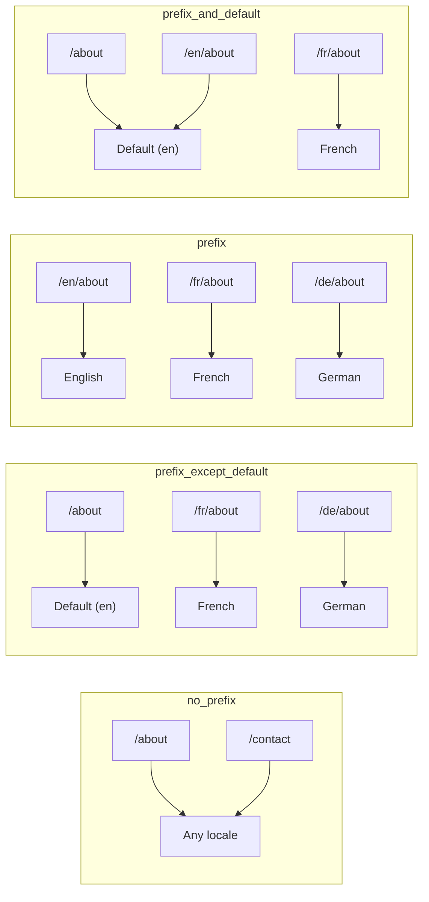
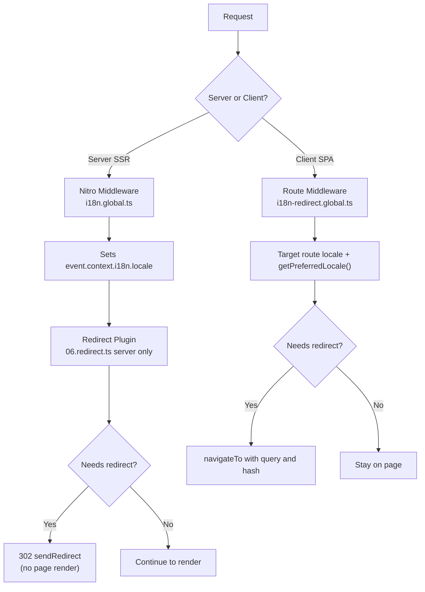

# 🗂️ Nuxt I18n Micro 中的路由策略

## 📖 概觀

Nuxt I18n Micro 透過 `strategy` 選項控制 URL 中語系前綴的呈現方式。底層由兩個套件實作:

- **`@i18n-micro/route-strategy`** — 建置期路由產生(擴充 Nuxt pages,加入在地化路由)
- **`@i18n-micro/path-strategy`** — 執行時的路徑解析、重新導向、SEO 屬性與連結產生

Nuxt 模組會在建置期選擇對應的策略類別,並透過 `#i18n-strategy` 進行別名,因此僅打包所選實作。

## 🚦 可用策略

{/* generated:option:strategy — do not edit; run `pnpm run docs:generate` */}

**型別** `Strategies` · **預設** `'prefix_except_default'`

語系前綴的 URL 路由策略。

- `'no_prefix'` — URL 中不含語系;語系儲存於 cookie。
- `'prefix_except_default'` — 除預設語系外,所有語系皆加前綴。
- `'prefix'` — 一律加前綴,包含預設語系。
- `'prefix_and_default'` — 類似 `prefix`,但預設語系亦可透過無前綴形式存取。

{/* /generated:option:strategy */}

### 策略比較



### 🛑 `no_prefix`

URL 沒有語系片段。語系由 cookies、`useI18nLocale()` 狀態或瀏覽器偵測決定。

- **路由**:`/about`、`/contact` — 所有語系皆使用相同 URL 模式(沒有 `/en/`、`/fr/` 前綴)
- **語系保留**:透過 `localeCookie`(若未指定,會自動設為 `'user-locale'`)
- **自訂路徑**:透過 [`globalLocaleRoutes`](/guides/configuration#globallocaleroutes) 與 [`defineI18nRoute`](/guides/custom-locale-routes) 支援 —— 可產生在地化 slug 而不加語系前綴(例如 `/about` vs `/ueber-uns`)。與 `prefix_except_default` 相比,巢狀路由、別名與各語系限制更為簡單。

<Tip>
使用 `no_prefix` 時,若未指定 `localeCookie`,會自動設為 `'user-locale'`。這是必要條件,因為 URL 中沒有語系資訊。
</Tip>

```typescript
i18n: {
  strategy: 'no_prefix'
  // localeCookie is automatically set to 'user-locale'
}
```

### 🚧 `prefix_except_default`

除預設語系**外**,所有路由都帶語系前綴。

- **預設語系**:`/about`、`/contact`
- **其他語系**:`/fr/about`、`/de/contact`
- **預設語系帶前綴會回傳 404**:`/en/about` → 404(當 `en` 為預設語系時)

```typescript
i18n: {
  strategy: 'prefix_except_default' // This is the default
}
```

### 🌍 `prefix`

所有路由都帶語系前綴,包括預設語系。

- **所有語系**:`/en/about`、`/fr/about`、`/de/about`
- **根路徑 `/`**:根據使用者偏好重新導向至 `/\{locale\}/`

```typescript
i18n: {
  strategy: 'prefix'
}
```

### 🔄 `prefix_and_default`

預設語系同時可透過帶前綴與不帶前綴的形式存取。非預設語系一律帶前綴。

- **預設語系**:`/about` 與 `/en/about` 都有效
- **其他語系**:`/fr/about`、`/de/about`
- **從 `/` 不會重新導向**:`/` 與 `/en/` 都提供預設語系

```typescript
i18n: {
  strategy: 'prefix_and_default'
}
```

## 🔀 重新導向架構(v3)

在 v3 中,重新導向邏輯分為兩層以達到最佳效能:

### 運作方式



### 伺服器端(無閃現)

1. **Nitro 中介層**(`i18n.global.ts`)先執行 —— 從 URL、cookie 或 `Accept-Language` 標頭偵測語系,並設定 `event.context.i18n.locale`
2. **重新導向外掛**(`06.redirect.ts`,僅伺服器)使用 `i18nStrategy.getClientRedirect()` 檢查當前路徑是否需要重新導向,並在頁面渲染**之前**發出 302
3. 這可避免使用者在重新導向前短暫看到錯誤頁面的「錯誤閃現」

### 客戶端(SPA 導覽)

1. 當啟用 `redirects` 時,全域路由中介層(`i18n-redirect.global.ts`)在每次客戶端導覽時執行
2. 先從**目標路由**推斷偏好語系,再退回 `useI18nLocale().getPreferredLocale()`
3. 使用 `i18nStrategy.getClientRedirect()` 決定是否需要重新導向
4. 重新導向時保留 `query` 與 `hash`

### 語系優先順序

在伺服器上,重新導向外掛以此順序決定偏好語系:

1. **`useState('i18n-locale')`** — 最高優先(透過 `useI18nLocale().setLocale()` 以程式設定)
2. **Cookie** — 若已設定 `localeCookie`
3. **`Accept-Language` 標頭** — 若 `autoDetectLanguage: true`
4. **`defaultLocale`** — 最終 fallback

在客戶端,路由中介層優先使用目標路由的語系,然後使用相同的 state/cookie fallback 鏈。

### 各策略的重新導向行為

| 策略                    | `GET /` 行為                                    | 是否需要 cookie? |
| ----------------------- | ----------------------------------------------- | ---------------- |
| `no_prefix`             | 不重新導向(語系由 cookie/state)              | 自動設定         |
| `prefix`                | 302 → `/\{locale\}/`                            | 建議             |
| `prefix_except_default` | 若語系 ≠ 預設,302 → `/\{locale\}/`             | 建議             |
| `prefix_and_default`    | 不重新導向(`/` 與 `/\{locale\}/` 皆有效)      | 可選             |

### 停用重新導向

```typescript
i18n: {
  redirects: false // Disables automatic locale redirects
}
```

`redirects: false` 時,自動語系重新導向會被停用:

- **伺服器**:重新導向外掛(`06.redirect.ts`,僅伺服器)仍會註冊,但會略過重新導向邏輯。仍會執行**404 檢查**(例如 `/xx/about`,其中 `xx` 不是有效語系),以及從 URL 前綴進行 **cookie 同步**(例如造訪 `/fr/about` 會將 cookie 同步為 `fr`)
- **客戶端**:**不會**註冊 `i18n-redirect` 全域路由中介層 —— 沒有 SPA 自動重新導向

## 🍪 基於 Cookie 的語系保存

<Warning>
使用 `prefix` 或 `prefix_except_default` 搭配 `redirects: true`(預設)時,**必須**設定 `localeCookie`,重新導向才會正確運作。若沒有 cookie,重新導向外掛就無法在頁面重新載入之間記住使用者的語系偏好。

```typescript
i18n: {
  strategy: 'prefix_except_default',
  localeCookie: 'user-locale' // Required for redirects to work properly
}
```
</Warning>

**v3 中 `localeCookie` 的運作方式:**

- 由 `useI18nLocale()` 內部管理 —— **請勿**透過 `useCookie()` 手動設定
- 當使用者造訪帶前綴的 URL(例如 `/fr/about`)時,cookie 會自動同步為 `fr`
- 下次造訪 `/` 時,cookie 值會用於重新導向到 `/\{locale\}/`
- 若 cookie 含有無效語系(不在 `locales` 清單中),會退回 `defaultLocale`

| 策略                    | `localeCookie` 預設    | 說明                                     |
| ----------------------- | ---------------------- | ---------------------------------------- |
| `no_prefix`             | 自動:`'user-locale'`  | 必要;自動設定                            |
| `prefix`                | `null`(停用)          | 建議設為 `'user-locale'` 以支援重新導向  |
| `prefix_except_default` | `null`(停用)          | 建議設為 `'user-locale'` 以支援重新導向  |
| `prefix_and_default`    | `null`(停用)          | 可選                                      |

## 🔍 `autoDetectLanguage` 與 `autoDetectPath`

### `autoDetectLanguage`

{/* generated:option:autoDetectLanguage — do not edit; run `pnpm run docs:generate` */}

**型別** `boolean` · **預設** `true`

從 `Accept-Language` HTTP 標頭自動偵測使用者偏好的語言。
搭配 `autoDetectPath` 決定何時執行偵測。

{/* /generated:option:autoDetectLanguage */}

檢查在伺服器中介層中執行,屬於 fallback:cookie 或既有 state 優先。

```typescript
i18n: {
  autoDetectLanguage: true
}
```

### `autoDetectPath`

{/* generated:option:autoDetectPath — do not edit; run `pnpm run docs:generate` */}

**型別** `string` · **預設** `'/'`

允許執行 cookie / Accept-Language 偏好重新導向的位置(當啟用 `redirects` 時)。

- `'/'` — 只在 `/`(預設語系的深連結仍可存取;預設值)
- `'no_prefix'` — 只在沒有語系前綴的路徑
- `'*'` — 每個路徑,包括改寫明確的語系前綴
  (例如 cookie 偏好 `de` 時,`/fr/about` → `/de/about`)

- 其他字串 — 完全相符的路徑(例如 `'/welcome'`)

前綴策略清理(例如 `prefix_except_default` 下 `/en` → `/`)不受此設定限制。

{/* /generated:option:autoDetectPath */}

```typescript
i18n: {
  autoDetectPath: '/' // Default: only root
  // autoDetectPath: '*' // All paths — redirects even /fr/about to /de/about
}
```

<Warning>
使用 `autoDetectPath: '*'` 時,若使用者的偏好語系不同,即使是帶有明確語系前綴的 URL(例如 `/fr/about`)也會被重新導向。這對網域式設定可能有用,但可能會讓分享 URL 的使用者感到困惑。
</Warning>

在預設 `autoDetectPath: '/'` 搭配語系 cookie 下:

| 請求 | cookie | 結果 |
| --- | --- | --- |
| `/` | `de` | 302 → `/de` |
| `/about` | `de` | 200,預設語系(不改寫) |

```typescript
i18n: {
  localeCookie: 'user-locale',
  strategy: 'prefix_except_default',
  // Default — remember language on entry, keep deep links stable
  autoDetectPath: '/',
  // Or redirect on every unprefixed path (but not /de/… → /fr/…):
  // autoDetectPath: 'no_prefix',
}
```

## ⚠️ 已知問題與最佳實務

### 1. `no_prefix` 策略下的 Hydration Mismatch

使用 `no_prefix` 時,語系是動態決定的。若伺服器與客戶端對語系判斷不一致,會出現 hydration mismatch。

**解法**:在伺服器外掛中(`order: -10`)使用 `useI18nLocale().setLocale()`,在 i18n 初始化前設定語系:

```ts
// plugins/i18n-loader.server.ts
export default defineNuxtPlugin({
  name: 'i18n-custom-loader',
  enforce: 'pre',
  order: -10,
  setup() {
    const { setLocale } = useI18nLocale()
    setLocale('ja') // Your detection logic here
  },
})
```

詳細範例請見[自訂語言偵測](/guides/custom-language-detection)。

### 2. 搭配 `localeRoute` 使用具名路由

以路徑為基礎的路由可能造成路由解析問題:

```typescript
// May cause issues
$localeRoute('/page')

// Preferred approach
$localeRoute({ name: 'page' })
```

### 3. 搭配 `pages: false` 使用 i18n

使用 Nuxt 搭配 `pages: false` 時:

```typescript
export default defineNuxtConfig({
  pages: false,
  i18n: {
    strategy: 'no_prefix', // Recommended
    disablePageLocales: true, // Required
    localeCookie: 'user-locale', // Required for persistence
  },
})
```

**`pages: false` 的限制:**

- 沒有自動重新導向
- 沒有基於 URL 的語系偵測
- 客戶端語系切換需要重新載入頁面或手動載入翻譯

### 4. 無效 Cookie 的處理

若 cookie 含有無效語系(不在 `locales` 清單中),模組會優雅地退回 `defaultLocale`,不會丟出錯誤。

## 📝 最佳實務摘要

| 建議                      | 詳情                                                                                |
| ------------------------- | ----------------------------------------------------------------------------------- |
| **設定 `localeCookie`**   | 前綴策略搭配 `redirects: true` 時務必設定                                          |
| **使用 `useI18nLocale()`** | 集中管理語系狀態的方式(取代手動 `useState`/`useCookie`)                          |
| **使用具名路由**          | `$localeRoute(\{ name: 'page' \})` 優於 `$localeRoute('/page')`                       |
| **以程式方式設定語系**    | 在伺服器外掛中(`order: -10`)使用 `useI18nLocale().setLocale()`                    |
| **避免手動處理 cookie**   | 請勿直接使用 `useCookie('user-locale')` —— `useI18nLocale()` 會為你管理             |
