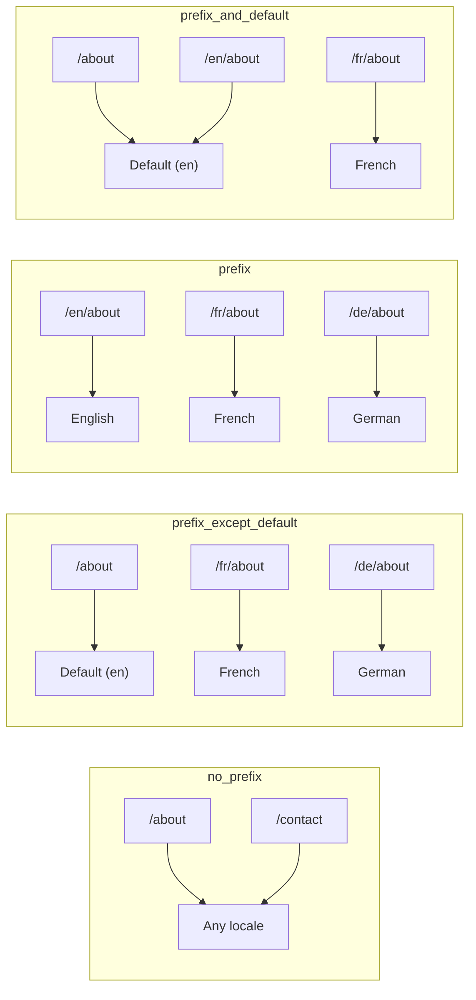
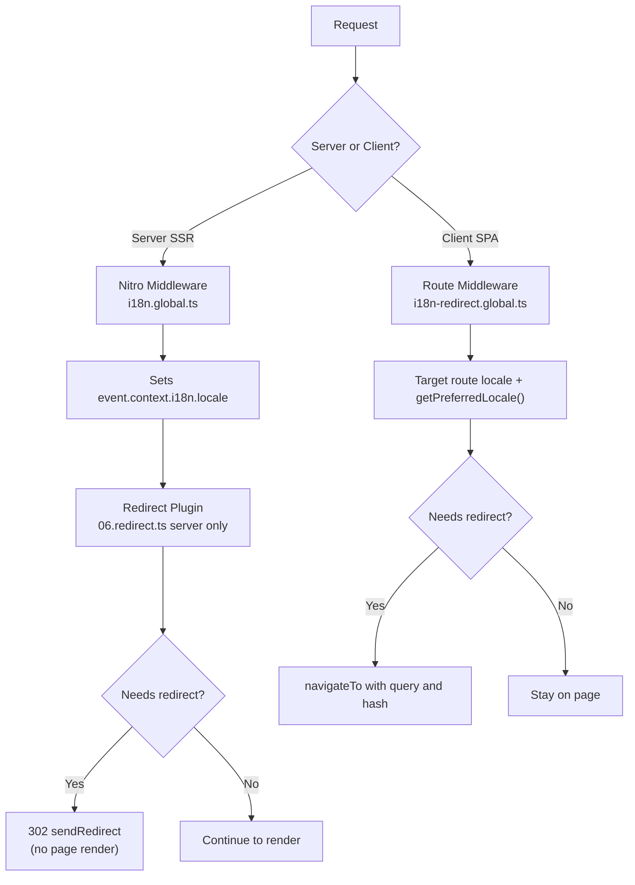

# 🗂️ Nuxt I18n Micro 的路由策略

## 📖 總覽

Nuxt I18n Micro 透過 `strategy` 選項控制語系前綴在 URL 中的呈現方式。底層由兩個套件實作：

- **`@i18n-micro/route-strategy`**：建置期產生路由（為 Nuxt pages 擴充多語系路由）
- **`@i18n-micro/path-strategy`**：執行期的路徑解析、重新導向、SEO 屬性與連結產生

Nuxt 模組會在建置期選擇正確的策略類別，並透過 `#i18n-strategy` 建立別名，因此只有被選中的實作會進入 bundle。

## 🚦 可用策略

{/* generated:option:strategy — do not edit; run `pnpm run docs:generate` */}

**型別** `Strategies` · **預設值** `'prefix_except_default'`

用於語系前綴的 URL 路由策略。

- `'no_prefix'`：URL 不含語系；語系儲存在 cookie 中。
- `'prefix_except_default'`：除了預設語系以外，全部加前綴。
- `'prefix'`：一律加前綴，包括預設語系。
- `'prefix_and_default'`：類似 `prefix`，但預設語系也能透過不加前綴的形式存取。

{/* /generated:option:strategy */}

### 策略比較



### 🛑 `no_prefix`

URL 中不含語系片段。語系由 cookie、`useI18nLocale()` state 或瀏覽器偵測決定。

- **路由**：`/about`、`/contact`：所有語系使用相同 URL（沒有 `/en/`、`/fr/` 前綴）
- **語系保存**：透過 `localeCookie`（若未指定會自動設為 `'user-locale'`）
- **自訂路徑**：支援透過 [`globalLocaleRoutes`](/guides/configuration#globallocaleroutes) 與 [`defineI18nRoute`](/guides/custom-locale-routes) 設定，產生的多語系 slug 不會為 URL 加上語系前綴（例如 `/about` 對比 `/ueber-uns`）。相較 `prefix_except_default`，巢狀路由、別名與逐語系限制皆更簡單。

<Tip>
使用 `no_prefix` 時，若未指定 `localeCookie` 會自動設為 `'user-locale'`。這是必要的，因為 URL 中不含語系資訊。
</Tip>

```typescript
i18n: {
  strategy: 'no_prefix'
  // localeCookie is automatically set to 'user-locale'
}
```

### 🚧 `prefix_except_default`

除了預設語系外，所有路由都會有語系前綴。

- **預設語系**：`/about`、`/contact`
- **其他語系**：`/fr/about`、`/de/contact`
- **預設語系加前綴會 404**：`/en/about` → 404（當 `en` 為預設）

```typescript
i18n: {
  strategy: 'prefix_except_default' // This is the default
}
```

### 🌍 `prefix`

每條路由都有語系前綴，包括預設語系。

- **所有語系**：`/en/about`、`/fr/about`、`/de/about`
- **根目錄 `/`**：依使用者偏好重新導向至 `/\{locale\}/`

```typescript
i18n: {
  strategy: 'prefix'
}
```

### 🔄 `prefix_and_default`

預設語系可帶前綴或不帶前綴訪問。非預設語系則一律帶前綴。

- **預設語系**：`/about` 與 `/en/about` 皆有效
- **其他語系**：`/fr/about`、`/de/about`
- **`/` 不重新導向**：`/` 與 `/en/` 都會提供預設語系內容

```typescript
i18n: {
  strategy: 'prefix_and_default'
}
```

## 🔀 重新導向架構（v3）

在 v3 中，重新導向邏輯拆為兩層以取得最佳效能：

### 運作方式



### 伺服器端（無閃爍）

1. **Nitro middleware**（`i18n.global.ts`）先執行：從 URL、cookie 或 `Accept-Language` 標頭偵測語系並設定 `event.context.i18n.locale`
2. **重新導向外掛**（`06.redirect.ts`，僅伺服器端）透過 `i18nStrategy.getClientRedirect()` 檢查是否需要重新導向，並在任何頁面渲染**之前**送出 302
3. 這可避免使用者短暫看到錯誤頁面的「閃爍」

### 用戶端（SPA 導覽）

1. 當 `redirects` 啟用時，全域路由 middleware（`i18n-redirect.global.ts`）會在每次用戶端導覽時執行
2. 先從**目標路由**推導偏好語系，若無則退回 `useI18nLocale().getPreferredLocale()`
3. 使用 `i18nStrategy.getClientRedirect()` 判斷是否需要重新導向
4. 重新導向時保留 `query` 與 `hash`

### 語系優先順序

伺服器端重新導向外掛依以下順序決定偏好語系：

1. **`useState('i18n-locale')`**：優先權最高（可透過 `useI18nLocale().setLocale()` 以程式化方式設定）
2. **Cookie**：若設定了 `localeCookie`
3. **`Accept-Language` 標頭**：若 `autoDetectLanguage: true`
4. **`defaultLocale`**：最後 fallback

用戶端路由 middleware 會優先使用目標路由中的語系，然後再套用相同的 state／cookie fallback 鏈。

### 各策略的重新導向行為

| 策略                    | `GET /` 行為                                    | 需要 Cookie 嗎？ |
| ----------------------- | --------------------------------------------- | ---------------- |
| `no_prefix`             | 不重新導向（語系來自 cookie／state）             | 自動設定         |
| `prefix`                | 302 → `/\{locale\}/`                             | 建議             |
| `prefix_except_default` | 若語系 ≠ 預設，302 → `/\{locale\}/`               | 建議             |
| `prefix_and_default`    | 不重新導向（`/` 與 `/\{locale\}/` 都有效）        | 選填             |

### 停用重新導向

```typescript
i18n: {
  redirects: false // Disables automatic locale redirects
}
```

當 `redirects: false` 時：

- **伺服器**：重新導向外掛（`06.redirect.ts`，僅伺服器端）仍會註冊，但跳過重新導向邏輯。它仍會執行**404 檢查**（例如 `/xx/about`，其中 `xx` 非有效語系）與**從 URL 前綴同步 cookie**（例如造訪 `/fr/about` 會把 cookie 設為 `fr`）
- **用戶端**：`i18n-redirect` 全域路由 middleware **不會**被註冊，因此不會有 SPA 自動重新導向

## 🍪 以 Cookie 保存語系

<Warning>
搭配 `redirects: true`（預設）使用 `prefix` 或 `prefix_except_default` 時，你**必須**設定 `localeCookie`，重新導向才能正確運作。若沒有 cookie，重新導向外掛無法在頁面重新載入間記住使用者的語系偏好。

```typescript
i18n: {
  strategy: 'prefix_except_default',
  localeCookie: 'user-locale' // Required for redirects to work properly
}
```
</Warning>

**v3 中 `localeCookie` 的運作方式：**

- 由 `useI18nLocale()` 內部管理，**請勿**透過 `useCookie()` 手動設定
- 當使用者造訪帶前綴的 URL（例如 `/fr/about`）時，cookie 會自動同步為 `fr`
- 下次造訪 `/` 時，會使用 cookie 值重新導向到 `/\{locale\}/`
- 若 cookie 中含無效語系（不在 `locales` 清單中），會退回 `defaultLocale`

| 策略                    | `localeCookie` 預設值    | 備註                                    |
| ----------------------- | ---------------------- | --------------------------------------- |
| `no_prefix`             | 自動：`'user-locale'`   | 必要；自動設定                            |
| `prefix`                | `null`（停用）           | 為了重新導向而設為 `'user-locale'`         |
| `prefix_except_default` | `null`（停用）           | 為了重新導向而設為 `'user-locale'`         |
| `prefix_and_default`    | `null`（停用）           | 選填                                     |

## 🔍 `autoDetectLanguage` 與 `autoDetectPath`

### `autoDetectLanguage`

{/* generated:option:autoDetectLanguage — do not edit; run `pnpm run docs:generate` */}

**型別** `boolean` · **預設值** `true`

自動從 `Accept-Language` HTTP 標頭偵測使用者偏好語言。
搭配 `autoDetectPath` 決定何時執行偵測。

{/* /generated:option:autoDetectLanguage */}

此檢查在伺服器 middleware 中執行，屬 fallback：cookie 或既有 state 會優先。

```typescript
i18n: {
  autoDetectLanguage: true
}
```

### `autoDetectPath`

{/* generated:option:autoDetectPath — do not edit; run `pnpm run docs:generate` */}

**型別** `string` · **預設值** `'/'`

cookie / Accept-Language 偏好重新導向可執行的路徑（需 `redirects` 啟用）。

- `'/'`：只在 `/`（預設語系下的 deep link 仍可到達，為預設值）
- `'no_prefix'`：只在無語系前綴的路徑上
- `'*'`：所有路徑，包括改寫明確的語系前綴（例如 cookie 偏好 `de` 時 `/fr/about` → `/de/about`）

- 其他字串：精確路徑比對（例如 `'/welcome'`）

帶前綴策略的清理（例如 `prefix_except_default` 下 `/en` → `/`）不受此設定限制。

{/* /generated:option:autoDetectPath */}

```typescript
i18n: {
  autoDetectPath: '/' // Default: only root
  // autoDetectPath: '*' // All paths — redirects even /fr/about to /de/about
}
```

<Warning>
若 `autoDetectPath: '*'`，即使 URL 帶有明確的語系前綴（例如 `/fr/about`），只要使用者偏好語系不同，也會被重新導向。這對網域為主的架構可能有用，但可能會讓分享 URL 的使用者感到困惑。
</Warning>

在預設 `autoDetectPath: '/'` 搭配語系 cookie 時：

| 請求 | Cookie | 結果 |
| --- | --- | --- |
| `/` | `de` | 302 → `/de` |
| `/about` | `de` | 200，預設語系（不改寫） |

```typescript
i18n: {
  localeCookie: 'user-locale',
  strategy: 'prefix_except_default',
  // Default — remember language on entry, keep deep links stable
  autoDetectPath: '/',
  // Or redirect on every unprefixed path (but not /de/… → /fr/…):
  // autoDetectPath: 'no_prefix',
}
```

## ⚠️ 已知問題與最佳實務

### 1. `no_prefix` 策略的 hydration mismatch

使用 `no_prefix` 時，語系是動態決定的。若伺服器與用戶端對語系判斷不同，就會出現 hydration mismatch。

**解法**：在伺服器外掛中使用 `useI18nLocale().setLocale()`（並設 `order: -10`），在 i18n 初始化之前設定語系：

```ts
// plugins/i18n-loader.server.ts
export default defineNuxtPlugin({
  name: 'i18n-custom-loader',
  enforce: 'pre',
  order: -10,
  setup() {
    const { setLocale } = useI18nLocale()
    setLocale('ja') // Your detection logic here
  },
})
```

詳細範例請見[自訂語言偵測](/guides/custom-language-detection)。

### 2. 對 `localeRoute` 使用具名路由

以路徑為基礎的路由可能造成路由解析問題：

```typescript
// May cause issues
$localeRoute('/page')

// Preferred approach
$localeRoute({ name: 'page' })
```

### 3. 搭配 `pages: false` 使用 i18n

在 Nuxt 中使用 `pages: false` 時：

```typescript
export default defineNuxtConfig({
  pages: false,
  i18n: {
    strategy: 'no_prefix', // Recommended
    disablePageLocales: true, // Required
    localeCookie: 'user-locale', // Required for persistence
  },
})
```

**`pages: false` 的限制：**

- 沒有自動重新導向
- 沒有基於 URL 的語系偵測
- 用戶端語系切換需重新載入頁面或手動載入翻譯

### 4. 無效 cookie 的處理

若 cookie 中含無效語系（不在 `locales` 清單中），模組會優雅地退回 `defaultLocale`，不會拋出錯誤。

## 📝 最佳實務摘要

| 建議                        | 細節                                                                                    |
| --------------------------- | --------------------------------------------------------------------------------------- |
| **設定 `localeCookie`**     | prefix 策略搭配 `redirects: true` 時務必設定                                              |
| **使用 `useI18nLocale()`**  | 集中管理語系狀態的建議方式（取代手動 `useState`／`useCookie`）                              |
| **使用具名路由**             | `$localeRoute(\{ name: 'page' \})` 優於 `$localeRoute('/page')`                          |
| **以程式化方式設定語系**     | 在伺服器外掛中使用 `useI18nLocale().setLocale()`，並設 `order: -10`                       |
| **避免手動操作 cookie**      | 請勿直接使用 `useCookie('user-locale')`，`useI18nLocale()` 已代為管理                     |
