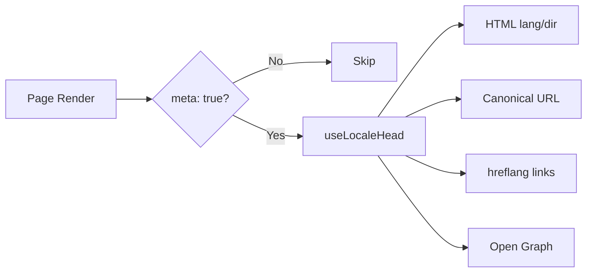

# 🌐 Nuxt I18n Micro 的 SEO 指南

## 📖 介紹

有效的 SEO（搜尋引擎最佳化）對於讓多語系站點能透過搜尋引擎讓全球使用者存取與看見至關重要。`Nuxt I18n Micro` 會自動產生告訴搜尋引擎站點結構與內容的重要 meta 標籤與屬性，簡化多語系站點的 SEO 管理。

本指南說明 `Nuxt I18n Micro` 如何處理 SEO 以提升站點可見度與使用者體驗，且不需要額外設定。

## ⚙️ 自動 SEO 處理

### SEO Meta 產生流程



**產生的標籤：**

| 標籤             | 範例                                                      |
| --------------- | -------------------------------------------------------- |
| HTML 屬性        | `<html lang="en" dir="ltr">`                             |
| Canonical       | `<link rel="canonical" href="...">`                      |
| hreflang        | `<link rel="alternate" hreflang="en" href="...">`        |
| x-default       | `<link rel="alternate" hreflang="x-default" href="...">` |
| Open Graph      | `<meta property="og:locale" content="en_US">`            |

#### 逐語系的 `og`（`og:locale` 與 BCP 47）

`<html lang>` 與 `hreflang` 使用 **BCP 47** 語系，取自 `locale.iso`（例如 `ar-AE`）。
Open Graph 依 [OG 協定](https://ogp.me/)則要求 **`language_TERRITORY`**，使用**底線**（`ar_AE`）。

預設情況下，當對應關係明確時（`en-US` → `en_US`），`og:locale` 由 `iso` 推導。
若需自訂值（例如 `zh-Hans` → `zh_CN`），請明確設定 **`og`** 字串。
若 `og` 與可轉換的 `iso` 都不存在，就不會產生 `og:locale` 標籤，在開發模式下會出現 console 警告（受 `missingWarn` 控制）。

```typescript
i18n: {
  meta: true,
  locales: [
    { code: 'ar', iso: 'ar-AE', og: 'ar_AE', dir: 'rtl' },
    { code: 'en', iso: 'en-US' }, // og:locale → en_US
    { code: 'zh', iso: 'zh-Hans', og: 'zh_CN' }, // script tags need explicit og
  ],
}
```

### 🔑 主要 SEO 功能

當 `Nuxt I18n Micro` 的 `meta` 選項啟用時，模組會自動處理以下 SEO 面向：

1. **🌍 語言與方向屬性**：
   - 模組會依目前語系與文字方向（例如英文為 `ltr`，阿拉伯文為 `rtl`）在 `<html>` 標籤上設定 `lang` 與 `dir`。

2. **🔗 Canonical URL**：
   - 模組會為每個頁面產生 canonical 連結（`<link rel="canonical">`），讓搜尋引擎能識別內容的主要版本。

3. **🌐 替代語系連結（`hreflang`）**：
   - 模組會為所有可用語系自動產生 `<link rel="alternate" hreflang="">` 標籤，協助搜尋引擎了解你有哪些語言版本，提升全球使用者體驗。
   - 每個語系會產生**一個**標籤：`hreflang = iso || code`。若已設 `iso`，則永遠不使用路由 `code` 作為 `hreflang`（避免 `mx` 這類市場鍵成為無效語言標籤）。
   - 選填的 `hreflangBaseLanguage: true` 會另外根據 `iso` 產生僅含語言的標籤（例如 `es-ES` → `es`），由 `locales` 中第一個帶地區的語系代表該語言。

4. **🌏 `x-default` Hreflang**：
   - 模組會自動產生指向預設語系 URL 的 `<link rel="alternate" hreflang="x-default">` 標籤，用來告訴搜尋引擎當使用者語言與所定義語系皆不符時該顯示哪一個 URL。無需額外設定，只要 `meta: true` 就會自動運作。

5. **🔖 Open Graph Metadata**：
   - 模組會為每個語系產生 Open Graph meta 標籤（`og:locale`、`og:url` 等），對於社群分享與搜尋引擎索引特別有用。

### 🛠️ 設定

要啟用這些 SEO 功能，請確認 `nuxt.config.ts` 中已將 `meta` 設為 `true`：

```typescript
export default defineNuxtConfig({
  modules: ['nuxt-i18n-micro'],
  i18n: {
    locales: [
      { code: 'en', iso: 'en-US', dir: 'ltr' },
      { code: 'fr', iso: 'fr-FR', dir: 'ltr' },
      { code: 'ar', iso: 'ar-SA', dir: 'rtl' },
    ],
    defaultLocale: 'en',
    translationDir: 'locales',
    meta: true, // Enables automatic SEO management
  },
})
```

### 🌍 多網域部署下的動態 `metaBaseUrl`

未設定 `metaBaseUrl` 時，絕對 SEO URL 依以下順序解析（#240）：

1. 若已安裝 [`nuxt-site-config`](https://nuxtseo.com/docs/site-config)（例如透過 `@nuxtjs/seo`）：`site.url`
2. 否則採用目前請求的 hostname（`useRequestURL()`／`window.location.origin`）

請求 origin 的 fallback 會遵循反向代理的標頭（`X-Forwarded-Host`、`X-Forwarded-Proto`），因此在 nginx、Cloudflare、AWS ALB 等代理後方也能正確運作。

這代表若你的應用已為 sitemap／robots／schema.org 設定 `site.url`，就**不需要**再另外宣告 `metaBaseUrl`：

```typescript
export default defineNuxtConfig({
  site: {
    url: process.env.NUXT_SITE_URL, // also used by micro for canonical / og:url / hreflang
  },
  i18n: {
    meta: true,
    // metaBaseUrl omitted — picks up site.url, then request origin
  },
})
```

若未設定 `site.url`，同一個應用實例仍可透過請求 origin 為**多個網域**提供正確 SEO 標籤：

```typescript
export default defineNuxtConfig({
  i18n: {
    meta: true,
    // metaBaseUrl is undefined by default — resolved dynamically from the request
  },
})
```

例如，對 `https://site-a.com/en/about` 的請求會產生：

```html
<link rel="canonical" href="https://site-a.com/en/about" /> <meta property="og:url" content="https://site-a.com/en/about" />
```

而同一個應用服務 `https://site-b.com/en/about` 時會產生：

```html
<link rel="canonical" href="https://site-b.com/en/about" /> <meta property="og:url" content="https://site-b.com/en/about" />
```

若你需要一律優先於 `site.url` 的固定基底 URL，可傳入靜態字串：

```typescript
metaBaseUrl: 'https://example.com'
```

### 🔍 Canonical 查詢參數白名單

預設情況下，canonical 與 `og:url` 會移除查詢參數以避免重複內容。你可以將特定查詢參數列入白名單保留：

```typescript
i18n: {
  canonicalQueryWhitelist: ['page', 'sort', 'filter', 'search', 'q', 'query', 'tag']
}
```

只有列於 `canonicalQueryWhitelist` 中的參數會出現在 canonical URL；其他所有參數（例如追蹤、session ID）都會被移除。

### 🚫 逐頁停用 Meta 標籤

你可以使用 `defineI18nRoute()` 為特定頁面停用 SEO meta 標籤產生：

```vue
<script setup>
// Disable all SEO meta tags for this page
defineI18nRoute({
  disableMeta: true,
})
</script>
```

也可以只停用特定語系的 meta：

```vue
<script setup>
// Disable meta tags only for English locale on this page
defineI18nRoute({
  disableMeta: ['en'],
})
</script>
```

`disableMeta` 生效時，該頁面／語系不會產生 `hreflang`、`canonical`、`og:locale`、`og:url` 或 `x-default` 標籤。

### 🔇 停用的語系

被標記為 `disabled: true` 的語系會自動從所有 SEO 標籤產生中排除：不會為它們建立 `hreflang`、`og:locale:alternate` 或替代連結：

```typescript
i18n: {
  locales: [
    { code: 'en', iso: 'en-US' },
    { code: 'fr', iso: 'fr-FR', disabled: true }, // excluded from SEO tags
  ]
}
```

### 🙈 選擇不出現在 SEO 中的語系（`seo: false`）

若語系仍可路由與翻譯，但不希望出現在跨語系探索標籤中，可設 `seo: false`。這些語系不會出現在 `hreflang` 替代與 `og:locale:alternate` 中。若你設定的**預設**語系為 `seo: false`，也不會發出 `x-default` 連結。

```typescript
i18n: {
  locales: [
    { code: 'en', iso: 'en-US' },
    { code: 'ru', iso: 'ru-RU', seo: false }, // internal / non-indexed locale
  ]
}
```

### 📌 各策略的行為

| 策略                    | hreflang 連結     | x-default              | canonical      | og:url |
| ----------------------- | ---------------- | --------------------- | -------------- | ------ |
| `prefix`                | ✅ 所有語系       | ✅ 預設語系 URL         | ✅ 目前 URL     | ✅     |
| `prefix_except_default` | ✅ 所有語系       | ✅ 無前綴 URL           | ✅ 目前 URL     | ✅     |
| `prefix_and_default`    | ✅ 所有語系       | ✅ 預設語系 URL         | ✅ 目前 URL     | ✅     |
| `no_prefix`             | ❌ 不產生         | ❌ 不產生              | ✅ 目前 URL     | ✅     |

`no_prefix` 策略下，只會產生 `canonical`、`og:url`、`og:locale` 與 `<html>` 屬性（`lang`、`dir`）。由於各語系沒有各自 URL，`hreflang` 與 `x-default` 不會產生。

## 頁面層級覆寫（`useI18nHead`）

對於**文章、指南或任何 CMS 內容**（並非每個語系都有翻譯或 URL 來自 API），請在頁面上使用 [`useI18nHead`](/api/composables/use-i18n-head)，而不是自訂 i18n head 外掛。

### 部分語系翻譯的文章

```vue
<script setup lang="ts">
const article = await loadArticle()
// article.locales = { en: '...', de: '...' } — only translated locales

useI18nHead({
  meta: [{ property: 'og:title', content: article.title }],
  replace: {
    hreflang: Object.entries(article.locales).map(([locale, href]) => ({
      rel: 'alternate',
      hreflang: locale,
      href,
    })),
    ogAlternates: Object.keys(article.locales),
  },
})
</script>
```

### 逐語系 slug 搭配 `$setI18nRouteParams`

當 slug 因語言而異時，先設定路由參數，再以實際 URL 覆寫替代連結：

```vue
<script setup lang="ts">
const { $defineI18nRoute, $setI18nRouteParams } = useNuxtApp()
const { data: article } = await useFetch(`/api/articles/${slug}`)

$defineI18nRoute({
  localeRoutes: { en: '/blog/[slug]', de: '/de/blog/[slug]' },
})

$setI18nRouteParams({
  en: { slug: article.value.slugEn },
  de: { slug: article.value.slugDe },
})

useI18nHead({
  replace: {
    hreflang: ['en', 'de'].map((locale) => ({
      rel: 'alternate',
      hreflang: locale,
      href: article.value.urls[locale],
    })),
    ogAlternates: ['en', 'de'],
  },
})
</script>
```

### 代理後的 HTTPS origin

要在不撰寫自訂 origin composable 的情況下取得正確的 SSR 絕對 URL：

```ts
i18n: {
  meta: true,
  metaBaseUrl: undefined,
  metaTrustForwardedHost: true,
  metaTrustForwardedProto: true,
}
```

更多範例（canonical 覆寫、`x-default`、響應式 fetch、共用輔助函式）請見 [useI18nHead composable](/api/composables/use-i18n-head)。

### ⚠️ 結尾斜線

模組會依 `useRoute().fullPath` 的實際路徑產生 canonical 與 `hreflang` URL。若你的應用使用結尾斜線（例如透過 Nuxt 的 `router.options`），產生的 URL 也會反映此設定。不過，`$switchLocalePath` 可能會將路徑正規化並移除結尾斜線。若結尾斜線的一致性對你的 SEO 很重要，請確認產生的 URL 與應用的 URL 結構相符。

### 🎯 好處

啟用 `meta` 選項後，你可獲得：

- **📈 搜尋引擎排名提升**：搜尋引擎能更好地索引站點，理解不同語言版本間的關係。
- **👥 更佳的使用者體驗**：依偏好提供正確的語言版本，帶來更個人化的體驗。
- **🔧 降低手動設定**：模組自動處理 SEO 任務，讓你不必手動加入 SEO 相關 meta 標籤與屬性。

## 🔗 Nuxt SEO（`@nuxtjs/seo`）

[`@nuxtjs/seo`](https://nuxtseo.com/) 整合了 sitemap、robots、schema.org、OG 圖片等相關模組。它透過 [`nuxt-site-config`](https://nuxtseo.com/docs/site-config/guides/i18n)（v4+）與 **nuxt-i18n-micro** 整合。

### 需求條件

- **`@nuxtjs/seo` 3+**（目前版本使用 `nuxt-site-config` 4+，會為 micro 註冊 `nuxt-site-config:i18n` 外掛）
- **`i18n.meta: true`**（建議：micro 提供語系感知的 head 標籤；Nuxt SEO 則加入 sitemap、schema.org 等）

### 模組順序

在 `modules` 中把 **nuxt-i18n-micro 放在 `@nuxtjs/seo` 之前**，讓 site config 能讀取到你的語系設定：

```typescript
export default defineNuxtConfig({
  modules: ['nuxt-i18n-micro', '@nuxtjs/seo'],
  site: {
    url: 'https://example.com',
    name: 'My Site',
  },
  i18n: {
    meta: true,
    defaultLocale: 'en',
    locales: [
      { code: 'en', iso: 'en-US' },
      { code: 'de', iso: 'de-DE' },
    ],
  },
})
```

### 翻譯後的站點名稱與說明

Nuxt Site Config 會從你的語系檔讀取選填的翻譯鍵：

```json
{
  "nuxtSiteConfig": {
    "name": "My Site",
    "description": "My site description"
  }
}
```

`locales/en.json`、`locales/de.json` 等中的逐語系值會自動被使用。

### 疑難排解

若看到 `Plugin nuxt-seo:defaults depends on nuxt-site-config:i18n but they are not registered`，請升級 **`@nuxtjs/seo` 至 3+**（見 [issue #133](https://github.com/s00d/nuxt-i18n-micro/issues/133)）。舊版 `nuxt-site-config` 3.x 只為 `@nuxtjs/i18n` 接線，未支援 micro。

延伸閱讀：[Sitemap i18n 指南](https://nuxtseo.com/docs/sitemap/guides/i18n)、[Site Config i18n 指南](https://nuxtseo.com/docs/site-config/guides/i18n)。
