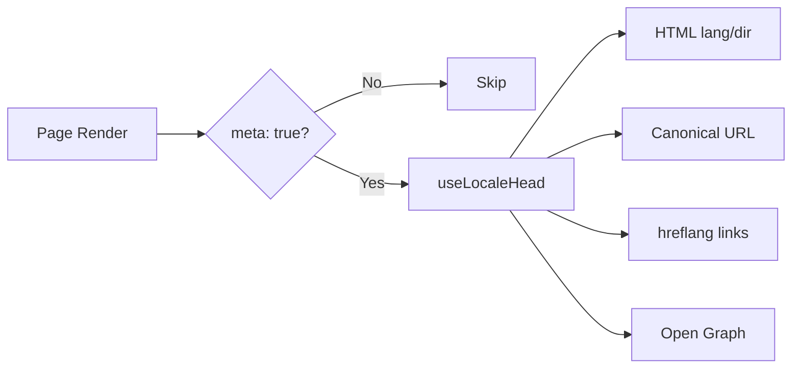

# 🌐 Nuxt I18n Micro 的 SEO 指南

## 📖 簡介

有效的 SEO(搜尋引擎最佳化)對於確保你的多語網站能透過搜尋引擎讓全球使用者存取與看見至關重要。`Nuxt I18n Micro` 透過自動產生必要的 meta 標籤與屬性,通知搜尋引擎網站的結構與內容,大幅簡化多語網站的 SEO 管理。

本指南說明 `Nuxt I18n Micro` 如何處理 SEO,以提升網站能見度與使用者體驗,並且無需額外設定。

## ⚙️ 自動 SEO 處理

### SEO Meta 產生流程



**產生的標籤:**

| 標籤            | 範例                                                     |
| --------------- | -------------------------------------------------------- |
| HTML 屬性       | `<html lang="en" dir="ltr">`                             |
| Canonical       | `<link rel="canonical" href="...">`                      |
| hreflang        | `<link rel="alternate" hreflang="en" href="...">`        |
| x-default       | `<link rel="alternate" hreflang="x-default" href="...">` |
| Open Graph      | `<meta property="og:locale" content="en_US">`            |

#### 各語系的 `og`(`og:locale` vs BCP 47)

`<html lang>` 與 `hreflang` 使用 **BCP 47**,透過 `locale.iso`(例如 `ar-AE`)。
Open Graph 依照 [OG protocol](https://ogp.me/) 要求 **`language_TERRITORY`**,以**底線**分隔(`ar_AE`)。

預設情況下,若對應明確,`og:locale` 會從 `iso` 推導(`en-US` → `en_US`)。
若需要自訂值,請明確設定 **`og`** 字串(例如 `zh-Hans` → `zh_CN`)。
若 `og` 與可轉換的 `iso` 都不可用,則不會產生 `og:locale` 標籤 —— 在開發模式下會有主控台警告(遵循 `missingWarn`)。

```typescript
i18n: {
  meta: true,
  locales: [
    { code: 'ar', iso: 'ar-AE', og: 'ar_AE', dir: 'rtl' },
    { code: 'en', iso: 'en-US' }, // og:locale → en_US
    { code: 'zh', iso: 'zh-Hans', og: 'zh_CN' }, // script tags need explicit og
  ],
}
```

### 🔑 主要 SEO 功能

在 `Nuxt I18n Micro` 中啟用 `meta` 選項後,模組會自動處理以下 SEO 面向:

1. **🌍 語言與方向屬性**:
   - 模組會依當前語系與文字方向,設定 `<html>` 上的 `lang` 與 `dir` 屬性(例如英文為 `ltr`、阿拉伯文為 `rtl`)。

2. **🔗 Canonical URL**:
   - 模組為每個頁面產生 canonical 連結(`<link rel="canonical">`),確保搜尋引擎辨識內容的主要版本。

3. **🌐 語言替代連結(`hreflang`)**:
   - 模組會為所有可用語系自動產生 `<link rel="alternate" hreflang="">` 標籤。這有助於搜尋引擎了解內容有哪些語言版本,提升全球使用者的體驗。
   - 每個語系會發出**一個**標籤:`hreflang = iso || code`。設定 `iso` 時,路由 `code` 永不作為 `hreflang`(例如市場鍵 `mx` 不會變成無效的語言標籤)。
   - 選用 `hreflangBaseLanguage: true` 也會發出由 `iso` 衍生的純語言標籤(例如 `es-ES` → `es`),由 `locales` 中第一個地區語系取得該純標籤。

4. **🌏 `x-default` Hreflang**:
   - 模組會自動產生指向預設語系 URL 的 `<link rel="alternate" hreflang="x-default">`。這告訴搜尋引擎,若使用者語言不符任何已定義語系,應顯示哪個 URL。無需額外設定 —— 只要設定 `meta: true` 就會自動運作。

5. **🔖 Open Graph 中繼資料**:
   - 模組會為每個語系產生 Open Graph meta 標籤(`og:locale`、`og:url` 等),對社群媒體分享與搜尋引擎索引特別有用。

### 🛠️ 設定

要啟用這些 SEO 功能,請確保 `nuxt.config.ts` 中的 `meta` 設為 `true`:

```typescript
export default defineNuxtConfig({
  modules: ['nuxt-i18n-micro'],
  i18n: {
    locales: [
      { code: 'en', iso: 'en-US', dir: 'ltr' },
      { code: 'fr', iso: 'fr-FR', dir: 'ltr' },
      { code: 'ar', iso: 'ar-SA', dir: 'rtl' },
    ],
    defaultLocale: 'en',
    translationDir: 'locales',
    meta: true, // Enables automatic SEO management
  },
})
```

### 🌍 多網域部署的動態 `metaBaseUrl`

當 `metaBaseUrl` 未設定時,絕對 SEO URL 依此順序解析(#240):

1. [`nuxt-site-config`](https://nuxtseo.com/docs/site-config) 的 `site.url`(若該模組存在,例如透過 `@nuxtjs/seo`)
2. 否則使用當前請求的主機名(`useRequestURL()` / `window.location.origin`)

請求來源的 fallback 會尊重反向代理標頭(`X-Forwarded-Host`、`X-Forwarded-Proto`),因此在 nginx、Cloudflare、AWS ALB 等代理後方也能正確運作。

這代表已為 sitemap / robots / schema.org 設定 `site.url` 的應用,**不必**再宣告一次 `metaBaseUrl`:

```typescript
export default defineNuxtConfig({
  site: {
    url: process.env.NUXT_SITE_URL, // also used by micro for canonical / og:url / hreflang
  },
  i18n: {
    meta: true,
    // metaBaseUrl omitted — picks up site.url, then request origin
  },
})
```

若無 `site.url`,單一應用實例仍可透過請求來源為**多個網域**分別產生正確的 SEO 標籤:

```typescript
export default defineNuxtConfig({
  i18n: {
    meta: true,
    // metaBaseUrl is undefined by default — resolved dynamically from the request
  },
})
```

例如,請求 `https://site-a.com/en/about` 會產生:

```html
<link rel="canonical" href="https://site-a.com/en/about" /> <meta property="og:url" content="https://site-a.com/en/about" />
```

而同一應用服務 `https://site-b.com/en/about` 會產生:

```html
<link rel="canonical" href="https://site-b.com/en/about" /> <meta property="og:url" content="https://site-b.com/en/about" />
```

若你需要一個固定的基底 URL,永遠優先於 `site.url`,可傳入靜態字串:

```typescript
metaBaseUrl: 'https://example.com'
```

### 🔍 Canonical 查詢白名單

預設情況下,查詢參數會從 canonical 與 `og:url` 中移除,以避免重複內容。你可以將應保留的特定查詢參數加入白名單:

```typescript
i18n: {
  canonicalQueryWhitelist: ['page', 'sort', 'filter', 'search', 'q', 'query', 'tag']
}
```

只有在 `canonicalQueryWhitelist` 中列出的參數會出現在 canonical URL。其他查詢參數(例如追蹤、session ID)會被移除。

### 🚫 依頁面停用 Meta 標籤

你可使用 `defineI18nRoute()` 為特定頁面停用 SEO meta 標籤產生:

```vue
<script setup>
// Disable all SEO meta tags for this page
defineI18nRoute({
  disableMeta: true,
})
</script>
```

也可只針對特定語系停用 meta:

```vue
<script setup>
// Disable meta tags only for English locale on this page
defineI18nRoute({
  disableMeta: ['en'],
})
</script>
```

當 `disableMeta` 生效時,受影響的頁面/語系將不會產生 `hreflang`、`canonical`、`og:locale`、`og:url` 或 `x-default` 標籤。

### 🔇 停用的語系

`disabled: true` 的語系會自動被排除於所有 SEO 標籤產生之外 —— 不會為它們建立 `hreflang`、`og:locale:alternate` 或 alternate 連結:

```typescript
i18n: {
  locales: [
    { code: 'en', iso: 'en-US' },
    { code: 'fr', iso: 'fr-FR', disabled: true }, // excluded from SEO tags
  ]
}
```

### 🙈 選擇不加入的語系(`seo: false`)

對於仍可路由與翻譯,但不希望出現於跨語系探索標籤中的語系,設定 `seo: false`。這些語系會從 `hreflang` alternates 與 `og:locale:alternate` 中省略。若你設定的**預設**語系為 `seo: false`,也不會發出 `x-default` 連結。

```typescript
i18n: {
  locales: [
    { code: 'en', iso: 'en-US' },
    { code: 'ru', iso: 'ru-RU', seo: false }, // internal / non-indexed locale
  ]
}
```

### 📌 各策略的行為

| 策略                    | hreflang 連結     | x-default             | canonical      | og:url |
| ----------------------- | ---------------- | --------------------- | -------------- | ------ |
| `prefix`                | ✅ 所有語系      | ✅ 預設語系 URL       | ✅ 當前 URL     | ✅     |
| `prefix_except_default` | ✅ 所有語系      | ✅ 無前綴 URL         | ✅ 當前 URL     | ✅     |
| `prefix_and_default`    | ✅ 所有語系      | ✅ 預設語系 URL       | ✅ 當前 URL     | ✅     |
| `no_prefix`             | ❌ 不產生         | ❌ 不產生              | ✅ 當前 URL     | ✅     |

對於 `no_prefix` 策略,只會產生 `canonical`、`og:url`、`og:locale` 與 `html` 屬性(`lang`、`dir`)。不會產生語言替代連結(`hreflang`)與 `x-default`,因為每個語系沒有獨立 URL。

## 頁面層級覆寫(`useI18nHead`)

對於**文章、指南或任何 CMS 內容**,若非每個語系都存在或 URL 由 API 提供,請在頁面上使用 [`useI18nHead`](/api/composables/use-i18n-head),而不要自訂 i18n head 外掛。

### 具備部分翻譯的文章

```vue
<script setup lang="ts">
const article = await loadArticle()
// article.locales = { en: '...', de: '...' } — only translated locales

useI18nHead({
  meta: [{ property: 'og:title', content: article.title }],
  replace: {
    hreflang: Object.entries(article.locales).map(([locale, href]) => ({
      rel: 'alternate',
      hreflang: locale,
      href,
    })),
    ogAlternates: Object.keys(article.locales),
  },
})
</script>
```

### 搭配 `$setI18nRouteParams` 的各語系 slug

當 slug 依語言而異時,先設定路由參數,再用實際 URL 覆寫 alternates:

```vue
<script setup lang="ts">
const { $defineI18nRoute, $setI18nRouteParams } = useNuxtApp()
const { data: article } = await useFetch(`/api/articles/${slug}`)

$defineI18nRoute({
  localeRoutes: { en: '/blog/[slug]', de: '/de/blog/[slug]' },
})

$setI18nRouteParams({
  en: { slug: article.value.slugEn },
  de: { slug: article.value.slugDe },
})

useI18nHead({
  replace: {
    hreflang: ['en', 'de'].map((locale) => ({
      rel: 'alternate',
      hreflang: locale,
      href: article.value.urls[locale],
    })),
    ogAlternates: ['en', 'de'],
  },
})
</script>
```

### 位於代理後方的 HTTPS origin

不需自訂 origin composable,也能在 SSR 上取得正確絕對 URL:

```ts
i18n: {
  meta: true,
  metaBaseUrl: undefined,
  metaTrustForwardedHost: true,
  metaTrustForwardedProto: true,
}
```

更多範例(canonical 覆寫、`x-default`、響應式抓取、共用輔助函式):[useI18nHead composable](/api/composables/use-i18n-head)。

### ⚠️ 尾端斜線

模組會根據 `useRoute().fullPath` 的實際路徑產生 canonical 與 `hreflang` URL。若你的應用使用尾端斜線(例如透過 Nuxt 的 `router.options`),產生的 URL 會反映此設定。然而,`$switchLocalePath` 可能會正規化路徑並移除尾端斜線。若尾端斜線的一致性對 SEO 很重要,請驗證產生的 URL 與應用 URL 結構相符。

### 🎯 好處

啟用 `meta` 選項可帶來:

- **📈 更好的搜尋引擎排名**:搜尋引擎能更好地索引你的網站,理解不同語言版本之間的關聯。
- **👥 更好的使用者體驗**:依偏好提供正確語言版本,帶來更個人化的體驗。
- **🔧 減少手動設定**:模組自動處理 SEO 任務,不需手動新增 SEO 相關的 meta 標籤與屬性。

## 🔗 Nuxt SEO(`@nuxtjs/seo`)

[`@nuxtjs/seo`](https://nuxtseo.com/) 整合了 sitemap、robots、schema.org、OG images 等相關模組。它透過 [`nuxt-site-config`](https://nuxtseo.com/docs/site-config/guides/i18n)(v4+)與 **nuxt-i18n-micro** 整合。

### 需求

- **`@nuxtjs/seo` 3+**(目前版本使用 `nuxt-site-config` 4+,會為 micro 註冊 `nuxt-site-config:i18n` 外掛)
- **`i18n.meta: true`**(建議 —— micro 提供語系相關的 head 標籤;Nuxt SEO 加入 sitemap、schema.org 等)

### 模組順序

將 **nuxt-i18n-micro 列於 `@nuxtjs/seo` 之前**,以便 site config 讀取你的語系設定:

```typescript
export default defineNuxtConfig({
  modules: ['nuxt-i18n-micro', '@nuxtjs/seo'],
  site: {
    url: 'https://example.com',
    name: 'My Site',
  },
  i18n: {
    meta: true,
    defaultLocale: 'en',
    locales: [
      { code: 'en', iso: 'en-US' },
      { code: 'de', iso: 'de-DE' },
    ],
  },
})
```

### 翻譯的網站名稱與描述

Nuxt Site Config 會讀取你語系檔中可選的翻譯鍵:

```json
{
  "nuxtSiteConfig": {
    "name": "My Site",
    "description": "My site description"
  }
}
```

`locales/en.json`、`locales/de.json` 等的各語系值會自動被讀取。

### 疑難排解

若你看到 `Plugin nuxt-seo:defaults depends on nuxt-site-config:i18n but they are not registered`,請將 **`@nuxtjs/seo` 升級至 3+**(見 [issue #133](https://github.com/s00d/nuxt-i18n-micro/issues/133))。舊版 `nuxt-site-config` 3.x 僅為 `@nuxtjs/i18n` 串接 i18n,而非 micro。

更多:[Sitemap i18n 指南](https://nuxtseo.com/docs/sitemap/guides/i18n)、[Site Config i18n 指南](https://nuxtseo.com/docs/site-config/guides/i18n)。
