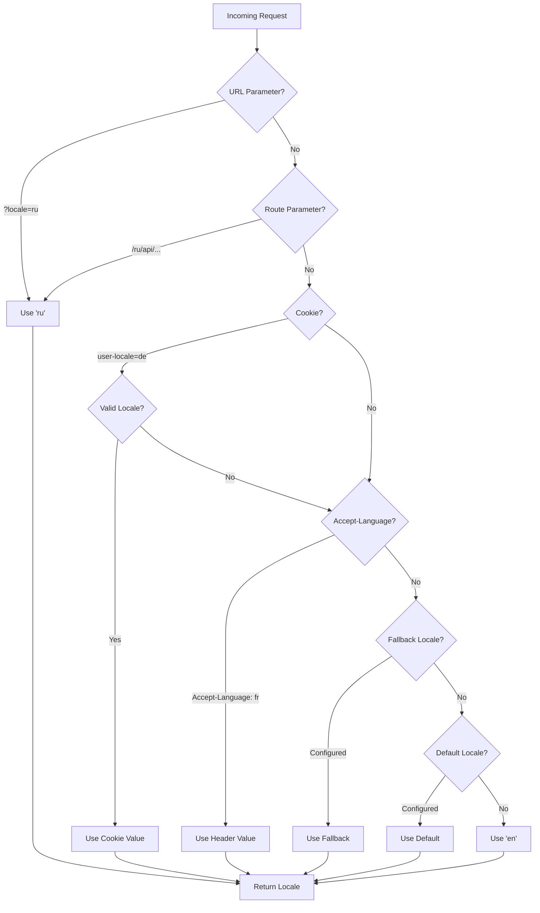

# 🌍 Nuxt I18n Micro 中的伺服器端翻譯與語系資訊

## 📖 總覽

Nuxt I18n Micro 支援伺服器端翻譯與語系資訊，讓你能在伺服器端翻譯內容並取得語系細節。這對於需要在到達用戶端前完成在地化的 API 或伺服器渲染應用特別有用。

翻譯使用 Nuxt I18n 設定中定義的語系訊息，並依偵測到的語系動態解析。

在預設的 `translationPayloads.mode: 'premerged'` 下，根層檔案會在建置期作為 `\{page\}/\{locale\}/data.json` 烘焙進每個頁面的 payload。伺服器會載入與用戶端在 `/\{apiBaseUrl\}/...` 下抓取相同的預建檔案，所以所有鍵（共用與頁面專屬）都能在伺服器 handler 中取得。

當 `translationPayloads.mode: 'source'` 啟用時，精簡的原始檔會在 `loadTranslationsFromServer()`（或 `/_locales` 路由）呼叫時於執行期合併：**Edge** 上透過 Nitro `serverAssets`，**Node** 上則從選填的 public 副本讀取。細節請見[效能指南—Serverless payload 輸出](/guides/performance#serverless-payload-output)與[快取與儲存架構](/api/cache)。

執行時與伺服器 API 的彙整清單請見 [API 參考](/api/overview)。

## 🛠️ 設定伺服器端 middleware

要啟用伺服器端翻譯與語系資訊，請使用提供的 middleware 函式：

- `useTranslationServerMiddleware`：用於翻譯內容
- `useLocaleServerMiddleware`：用於取得語系資訊

兩者在所有伺服器路由中都自動可用。

兩者的語系偵測邏輯透過 `detectCurrentLocale` 工具函式共用，以確保模組行為一致。

## ✨ 在伺服器 handler 中使用翻譯

透過翻譯 middleware，你可以在任何 `eventHandler` 中順利翻譯內容。

### 範例：基本翻譯用法

```typescript
import { defineEventHandler } from 'h3'

export default defineEventHandler(async (event) => {
  const t = await useTranslationServerMiddleware(event)
  return {
    message: t('greeting'), // Returns the translated value for the key "greeting"
  }
})
```

此範例中：

- 使用者的語系會自動從查詢參數、cookie 或標頭偵測。
- `t` 函式會依偵測到的語系取得對應翻譯。

## 🌍 在伺服器 handler 中使用語系資訊

### 基本語系資訊用法

```typescript
import { defineEventHandler } from 'h3'

export default defineEventHandler((event) => {
  const localeInfo = useLocaleServerMiddleware(event)

  return {
    success: true,
    data: localeInfo,
    timestamp: new Date().toISOString(),
  }
})
```

### 提供自訂語系參數

```typescript
import { defineEventHandler } from 'h3'

export default defineEventHandler((event) => {
  // Force specific locale with custom default
  const localeInfo = useLocaleServerMiddleware(event, 'en', 'ru')

  return {
    success: true,
    data: localeInfo,
    timestamp: new Date().toISOString(),
  }
})
```

### 回應結構

語系 middleware 會回傳一個含以下屬性的 `LocaleInfo` 物件：

```typescript
interface LocaleInfo {
  current: string // Current detected locale code
  default: string // Default locale code
  fallback: string // Fallback locale code
  available: string[] // Array of all available locale codes
  locale: Locale | null // Full locale configuration object
  isDefault: boolean // Whether current locale is the default
  isFallback: boolean // Whether current locale is the fallback
}
```

### 範例回應

```json
{
  "success": true,
  "data": {
    "current": "ru",
    "default": "en",
    "fallback": "en",
    "available": ["en", "ru", "de"],
    "locale": {
      "code": "ru",
      "iso": "ru-RU",
      "dir": "ltr",
      "displayName": "Русский"
    },
    "isDefault": false,
    "isFallback": false
  },
  "timestamp": "2024-01-15T10:30:00.000Z"
}
```

## 🌐 提供自訂語系

若需要手動指定語系（例如用於測試或特定請求），可傳入翻譯 middleware：

### 範例：自訂語系

```typescript
import { defineEventHandler } from 'h3'

function detectLocale(event): string | null {
  const urlSearchParams = new URLSearchParams(event.node.req.url?.split('?')[1])
  const localeFromQuery = urlSearchParams.get('locale')
  if (localeFromQuery) return localeFromQuery

  return 'en'
}

export default defineEventHandler(async (event) => {
  const t = await useTranslationServerMiddleware(event, 'en', detectLocale(event)) // Force French local, en - default locale
  return {
    message: t('welcome'), // Returns the French translation for "welcome"
  }
})
```

## 📋 語系偵測邏輯

兩個 middleware 函式都會依以下優先順序自動判斷使用者語系：



1. **URL 參數**：`?locale=ru`
2. **路由參數**：`/ru/api/endpoint`
3. **Cookie**：`user-locale` cookie
4. **HTTP 標頭**：`Accept-Language` 標頭
5. **Fallback 語系**：如模組選項設定
6. **預設語系**：如模組選項設定
7. **硬編碼 fallback**：`'en'`

> **備註**：`useLocaleServerMiddleware` 與 `useTranslationServerMiddleware` 共用語系偵測邏輯，確保模組行為一致。

## 📋 進階用法範例

### 依語系回傳不同內容

```typescript
import { defineEventHandler } from 'h3'

export default defineEventHandler((event) => {
  const { current, isDefault, locale } = useLocaleServerMiddleware(event)

  // Return different content based on locale
  if (current === 'ru') {
    return {
      message: 'Привет, мир!',
      locale: current,
      isDefault,
    }
  }

  if (current === 'de') {
    return {
      message: 'Hallo, Welt!',
      locale: current,
      isDefault,
    }
  }

  // Default English response
  return {
    message: 'Hello, World!',
    locale: current,
    isDefault,
  }
})
```

### 自訂語系偵測

```typescript
import { defineEventHandler } from 'h3'

export default defineEventHandler((event) => {
  // Force German locale with English as fallback
  const { current, isDefault, locale } = useLocaleServerMiddleware(event, 'en', 'de')

  return {
    message: 'Hallo, Welt!',
    locale: current,
    isDefault: false, // Will be false since we forced German
  }
})
```

### 具驗證的語系感知 API

```typescript
import { defineEventHandler, createError } from 'h3'

export default defineEventHandler((event) => {
  const { current, available, locale } = useLocaleServerMiddleware(event)

  // Validate if the detected locale is supported
  if (!available.includes(current)) {
    throw createError({
      statusCode: 400,
      statusMessage: `Unsupported locale: ${current}. Available locales: ${available.join(', ')}`,
    })
  }

  // Return locale-specific configuration
  return {
    locale: current,
    direction: locale?.dir || 'ltr',
    displayName: locale?.displayName || current,
    availableLocales: available,
  }
})
```

### 與翻譯 middleware 整合

你可以將語系資訊與翻譯 middleware 一同使用，達成完整的國際化：

```typescript
import { defineEventHandler } from 'h3'

export default defineEventHandler(async (event) => {
  const localeInfo = useLocaleServerMiddleware(event)
  const t = await useTranslationServerMiddleware(event)

  return {
    locale: localeInfo.current,
    message: t('welcome_message'),
    availableLocales: localeInfo.available,
    isDefault: localeInfo.isDefault,
  }
})
```

## 📝 最佳實務

1. **一律驗證語系**：確認偵測到的語系存在於可用語系清單。
2. **使用 fallback 邏輯**：語系偵測失敗時提供合理預設值。
3. **快取語系資訊**：對效能敏感的應用，可考慮快取語系偵測結果。
4. **處理邊界情況**：為不支援的語系提供適當錯誤回應。
5. **與翻譯結合**：搭配翻譯 middleware 使用語系資訊，取得完整 i18n 支援。

## 🚀 效能考量

- 兩個 middleware 函式皆輕量，設計用於快速執行
- 語系偵測使用有效率的 fallback 鏈
- 語系偵測過程不會呼叫外部 API
- 結果為同步計算，效能最佳
