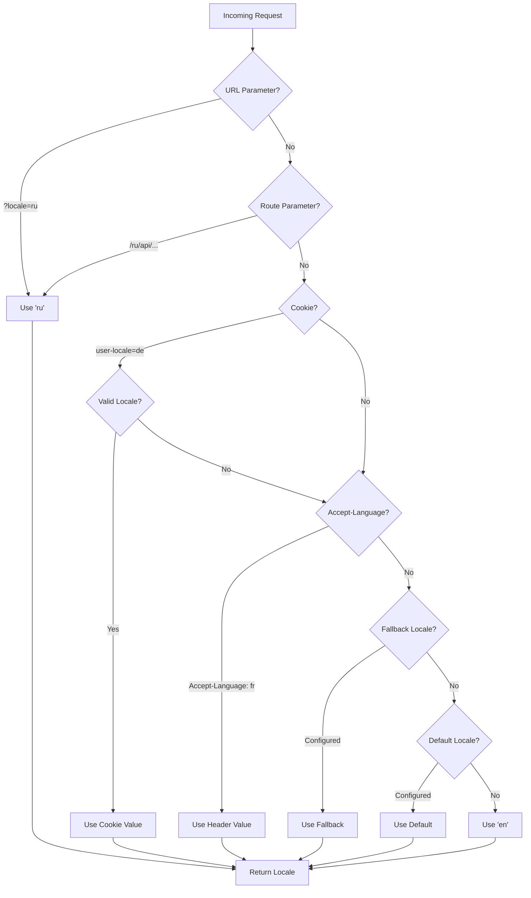

# 🌍 Nuxt I18n Micro 的伺服器端翻譯與語系資訊

## 📖 概觀

Nuxt I18n Micro 支援伺服器端翻譯與語系資訊,讓你能在伺服器上翻譯內容並存取語系細節。這對於在到達客戶端前就需要在地化的 API 或伺服器渲染應用特別有用。

翻譯使用 Nuxt I18n 設定中定義的語系訊息,並依偵測到的語系動態解析。

在預設(`translationPayloads.mode: 'premerged'`)下,根層級檔案會在建置期烘焙進每個頁面 payload 為 `\{page\}/\{locale\}/data.json`。伺服器載入的是客戶端從 `/\{apiBaseUrl\}/...` 抓取的相同預建檔,因此所有鍵(共用與頁面專屬)在伺服器處理器中皆可用。

在 `translationPayloads.mode: 'source'` 下,呼叫 `loadTranslationsFromServer()`(或 `/_locales` 路由)時,精簡的來源檔會於執行時合併 —— 在 **Edge** 上透過 Nitro `serverAssets`,在 **Node** 上從選用的 public 複本。詳情請見 [效能指南 —— 無伺服器 Payload 輸出](/guides/performance#serverless-payload-output) 與 [快取與儲存架構](/api/cache)。

執行時與伺服器 API 的整合清單,請參閱 [API 參考](/api/overview)。

## 🛠️ 設定伺服器端中介層

要啟用伺服器端翻譯與語系資訊,可使用提供的中介函式:

- `useTranslationServerMiddleware` — 用於翻譯內容
- `useLocaleServerMiddleware` — 用於存取語系資訊

兩個中介函式在所有伺服器路由中皆自動可用。

兩個中介函式共用 `detectCurrentLocale` 工具函式的語系偵測邏輯,確保模組內的一致性。

## ✨ 在伺服器處理器中使用翻譯

你可透過翻譯中介層,在任何 `eventHandler` 中無縫翻譯內容。

### 範例:基本翻譯用法

```typescript
import { defineEventHandler } from 'h3'

export default defineEventHandler(async (event) => {
  const t = await useTranslationServerMiddleware(event)
  return {
    message: t('greeting'), // Returns the translated value for the key "greeting"
  }
})
```

在此範例中:

- 使用者的語系會自動從查詢參數、cookies 或標頭偵測。
- `t` 函式為偵測到的語系取得對應翻譯。

## 🌍 在伺服器處理器中使用語系資訊

### 基本語系資訊用法

```typescript
import { defineEventHandler } from 'h3'

export default defineEventHandler((event) => {
  const localeInfo = useLocaleServerMiddleware(event)

  return {
    success: true,
    data: localeInfo,
    timestamp: new Date().toISOString(),
  }
})
```

### 提供自訂語系參數

```typescript
import { defineEventHandler } from 'h3'

export default defineEventHandler((event) => {
  // Force specific locale with custom default
  const localeInfo = useLocaleServerMiddleware(event, 'en', 'ru')

  return {
    success: true,
    data: localeInfo,
    timestamp: new Date().toISOString(),
  }
})
```

### 回應結構

語系中介層回傳一個 `LocaleInfo` 物件,包含以下屬性:

```typescript
interface LocaleInfo {
  current: string // Current detected locale code
  default: string // Default locale code
  fallback: string // Fallback locale code
  available: string[] // Array of all available locale codes
  locale: Locale | null // Full locale configuration object
  isDefault: boolean // Whether current locale is the default
  isFallback: boolean // Whether current locale is the fallback
}
```

### 回應範例

```json
{
  "success": true,
  "data": {
    "current": "ru",
    "default": "en",
    "fallback": "en",
    "available": ["en", "ru", "de"],
    "locale": {
      "code": "ru",
      "iso": "ru-RU",
      "dir": "ltr",
      "displayName": "Русский"
    },
    "isDefault": false,
    "isFallback": false
  },
  "timestamp": "2024-01-15T10:30:00.000Z"
}
```

## 🌐 提供自訂語系

若你需要手動指定語系(例如用於測試或某些請求),可將其傳入翻譯中介層:

### 範例:自訂語系

```typescript
import { defineEventHandler } from 'h3'

function detectLocale(event): string | null {
  const urlSearchParams = new URLSearchParams(event.node.req.url?.split('?')[1])
  const localeFromQuery = urlSearchParams.get('locale')
  if (localeFromQuery) return localeFromQuery

  return 'en'
}

export default defineEventHandler(async (event) => {
  const t = await useTranslationServerMiddleware(event, 'en', detectLocale(event)) // Force French local, en - default locale
  return {
    message: t('welcome'), // Returns the French translation for "welcome"
  }
})
```

## 📋 語系偵測邏輯

兩個中介函式會依以下優先順序自動判定使用者的語系:



1. **URL 參數**:`?locale=ru`
2. **路由參數**:`/ru/api/endpoint`
3. **Cookies**:`user-locale` cookie
4. **HTTP 標頭**:`Accept-Language` 標頭
5. **Fallback Locale**:模組選項中設定
6. **Default Locale**:模組選項中設定
7. **硬編碼 fallback**:`'en'`

> **說明**:`useLocaleServerMiddleware` 與 `useTranslationServerMiddleware` 共用語系偵測邏輯,以確保模組內的一致性。

## 📋 進階用法範例

### 依語系提供不同回應

```typescript
import { defineEventHandler } from 'h3'

export default defineEventHandler((event) => {
  const { current, isDefault, locale } = useLocaleServerMiddleware(event)

  // Return different content based on locale
  if (current === 'ru') {
    return {
      message: 'Привет, мир!',
      locale: current,
      isDefault,
    }
  }

  if (current === 'de') {
    return {
      message: 'Hallo, Welt!',
      locale: current,
      isDefault,
    }
  }

  // Default English response
  return {
    message: 'Hello, World!',
    locale: current,
    isDefault,
  }
})
```

### 自訂語系偵測

```typescript
import { defineEventHandler } from 'h3'

export default defineEventHandler((event) => {
  // Force German locale with English as fallback
  const { current, isDefault, locale } = useLocaleServerMiddleware(event, 'en', 'de')

  return {
    message: 'Hallo, Welt!',
    locale: current,
    isDefault: false, // Will be false since we forced German
  }
})
```

### 具備驗證的語系相關 API

```typescript
import { defineEventHandler, createError } from 'h3'

export default defineEventHandler((event) => {
  const { current, available, locale } = useLocaleServerMiddleware(event)

  // Validate if the detected locale is supported
  if (!available.includes(current)) {
    throw createError({
      statusCode: 400,
      statusMessage: `Unsupported locale: ${current}. Available locales: ${available.join(', ')}`,
    })
  }

  // Return locale-specific configuration
  return {
    locale: current,
    direction: locale?.dir || 'ltr',
    displayName: locale?.displayName || current,
    availableLocales: available,
  }
})
```

### 與翻譯中介層整合

你可將語系資訊與翻譯中介層結合,達到完整的國際化:

```typescript
import { defineEventHandler } from 'h3'

export default defineEventHandler(async (event) => {
  const localeInfo = useLocaleServerMiddleware(event)
  const t = await useTranslationServerMiddleware(event)

  return {
    locale: localeInfo.current,
    message: t('welcome_message'),
    availableLocales: localeInfo.available,
    isDefault: localeInfo.isDefault,
  }
})
```

## 📝 最佳實務

1. **務必驗證語系**:確認偵測到的語系存在於可用語系清單中
2. **使用 fallback 邏輯**:當語系偵測失敗時提供合理預設
3. **快取語系資訊**:對於效能敏感的應用,可考慮快取語系偵測結果
4. **處理邊界情境**:考量不支援的語系並提供適當錯誤回應
5. **與翻譯結合**:將語系資訊與翻譯中介層搭配,取得完整 i18n 支援

## 🚀 效能考量

- 兩個中介函式皆為輕量設計,適合快速執行
- 語系偵測使用高效 fallback 鏈
- 語系偵測時不會發出任何外部 API 呼叫
- 結果為同步計算,以取得最佳效能
