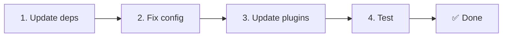

# 📦 從 v2.x 升級到 v3.x

<Tip>
若要從 vue-i18n 生態系遷移，請見[從 nuxt-i18n 遷移](/migration/from-nuxtjs-i18n)。本指南處理的是 nuxt-i18n-micro v2 升級到 v3。
</Tip>

v3.0.0 帶來根本性的架構變更：策略套件、全新的快取系統、透過 `useI18nLocale()` 的集中式語系管理，以及重新設計的重新導向流程。本節涵蓋所有破壞性變更與程式碼更新方式。

## 遷移步驟



## 破壞性變更摘要

- **語系狀態**：手動 `useState`／`useCookie` → `useI18nLocale()` composable
- **設定存取**：`useRuntimeConfig().public.i18nConfig` → `#build/i18n.strategy.mjs` 的 `getI18nConfig()`
- **重新導向元件**：`fallbackRedirectComponentPath` 選項 → 伺服器重新導向外掛 + 用戶端路由 middleware（自動）
- **`includeDefaultLocaleRoute`**：曾支援（deprecated）→ 已移除，請使用 `strategy` 選項
- **`experimental.hmr`**：位於 `experimental` 下 → 已提升為頂層選項
- **`previousPageFallback`**：完全移除（累積合併策略會自動處理）
- **快取**：`useStorage('cache')` → `TranslationStorage` 單例（`globalThis` 上的 `Symbol.for`）
- **SSR 傳輸**：Runtime config → Nuxt payload（v3 曾用 `useState`；chunk 現在放在 `payload.data`，見[效能](/guides/performance#server-side-payload-transfer)）
- **策略類別**：內部 → 獨立套件（`@i18n-micro/route-strategy`、`@i18n-micro/path-strategy`）

## 已移除：`fallbackRedirectComponentPath`

`fallbackRedirectComponentPath` 選項與 `locale-redirect.vue` fallback 元件已被移除。重新導向邏輯現在由以下部分處理：

1. **伺服器 middleware**（`i18n.global.ts`）：設定 `event.context.i18n.locale`
2. **伺服器重新導向外掛**（`06.redirect.ts`，僅伺服器端）：在渲染前發出 302
3. **用戶端路由 middleware**（`i18n-redirect.global.ts`）：hydration 後的 SPA 重新導向

```diff
 i18n: {
   strategy: 'prefix_except_default',
-  fallbackRedirectComponentPath: '~/components/MyRedirect.vue',
 }
```

若你在 fallback 元件中有自訂重新導向邏輯，請改在伺服器外掛中實作：

```ts
// plugins/i18n-loader.server.ts
export default defineNuxtPlugin({
  name: 'i18n-custom-redirect',
  enforce: 'pre',
  order: -10,
  setup() {
    const { setLocale } = useI18nLocale()
    // Your custom detection logic
    setLocale(detectedLocale)
  },
})
```

## 已移除：`includeDefaultLocaleRoute`

請改用 `strategy` 選項：

- `includeDefaultLocaleRoute: true` → `strategy: 'prefix'`
- `includeDefaultLocaleRoute: false` → `strategy: 'prefix_except_default'`（預設）

```diff
 i18n: {
-  includeDefaultLocaleRoute: true,
+  strategy: 'prefix',
 }
```

## 設定存取：`getI18nConfig()` 取代 `useRuntimeConfig`

```diff
- const config = useRuntimeConfig()
- const cookieName = config.public.i18nConfig?.localeCookie || 'user-locale'
+ import { getI18nConfig } from '#build/i18n.strategy.mjs'
+ const { localeCookie: configCookie } = getI18nConfig()
+ const cookieName = configCookie ?? 'user-locale'
```

## 語系管理：`useI18nLocale()` 取代手動狀態

v2 中你可能直接使用 `useState('i18n-locale')` 或 `useCookie('user-locale')`。v3 中請改用集中式的 `useI18nLocale()` composable：

```diff
- const locale = useState('i18n-locale')
- const cookie = useCookie('user-locale')
- locale.value = 'fr'
- cookie.value = 'fr'
+ const { setLocale } = useI18nLocale()
+ setLocale('fr') // Updates both state and cookie atomically
```

詳細範例請見[自訂語言偵測](/guides/custom-language-detection)。

## 實驗性選項已移動／移除

`hmr` 已從 `experimental` 移到頂層。`previousPageFallback` 已完全移除：模組現在採用累積深度合併策略（2 層深度），即使頁面之間有重疊的巢狀鍵，也會在轉場動畫期間自動保留前一頁的翻譯。動畫完成後，`page:transition:finish` hook 會從記憶體清除舊頁面鍵。

```diff
 i18n: {
-  experimental: {
-    hmr: true,
-    previousPageFallback: true
-  }
+  hmr: true,
+  // previousPageFallback removed — handled automatically
 }
```

## 重新導向架構（v3）

重新導向現在由兩個部分自動處理：

1. **伺服器端**（`06.redirect.ts`，僅伺服器端）：在 SSR 期間執行，於任何頁面渲染前送出 302 重新導向：沒有「錯誤閃爍」。
2. **用戶端**（`i18n-redirect.global.ts`）：SPA 導覽時的全域路由 middleware；會保留 query string 與 hash。

重新導向的語系優先順序：

1. `useState('i18n-locale')`：透過 `useI18nLocale().setLocale()` 設定
2. Cookie：若設定了 `localeCookie`
3. `Accept-Language` 標頭：若 `autoDetectLanguage: true`
4. `defaultLocale`：fallback

標準設定不需修改任何程式碼。

<Warning>
`prefix` 與 `prefix_except_default` 策略搭配 `redirects: true` 時，請設定 `localeCookie: 'user-locale'` 以在頁面重新載入間保存語系。若未設定，重新導向僅會依 `Accept-Language` 或 `defaultLocale`。
</Warning>

## TypeScript：內部模組型別（選填）

若你遇到與 `#i18n-internal/plural`、`#i18n-internal/strategy` 或 `#i18n-internal/config` 等內部匯入相關的型別錯誤，請在專案的 `package.json` 加入 `imports` 區塊：

```json
{
  "imports": {
    "#i18n-internal/plural": "nuxt-i18n-micro/internals",
    "#i18n-internal/strategy": "nuxt-i18n-micro/internals",
    "#i18n-internal/config": "nuxt-i18n-micro/internals"
  }
}
```
