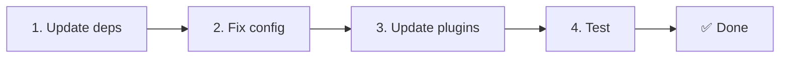

# 📦 從 v2.x 升級到 v3.x

<Tip>
請參閱[從 nuxt-i18n 遷移](/migration/from-nuxtjs-i18n) —— 該指南涵蓋從 vue-i18n 生態系遷移,而非從 nuxt-i18n-micro v2。
</Tip>

v3.0.0 引入了根本性的架構變更:策略套件、新的快取系統、透過 `useI18nLocale()` 的集中化語系管理,以及重新設計的重新導向流程。本節涵蓋所有破壞性變更及如何更新程式碼。

## 遷移步驟



## 破壞性變更摘要

- **語系狀態** — 手動 `useState` / `useCookie` → `useI18nLocale()` composable
- **設定存取** — `useRuntimeConfig().public.i18nConfig` → 由 `#build/i18n.strategy.mjs` 取得的 `getI18nConfig()`
- **重新導向元件** — `fallbackRedirectComponentPath` 選項 → 伺服器重新導向外掛 + 客戶端路由中介層(自動)
- **`includeDefaultLocaleRoute`** — 已支援(棄用) → 已移除,改用 `strategy` 選項
- **`experimental.hmr`** — 在 `experimental` 下 → 頂層選項
- **`previousPageFallback`** — 完全移除(由累積合併策略自動處理)
- **快取** — `useStorage('cache')` → `TranslationStorage` 單例(`globalThis` 上的 `Symbol.for`)
- **SSR 傳輸** — Runtime config → Nuxt payload(v3 使用 `useState`;chunk 目前存於 `payload.data`,見 [效能](/guides/performance#server-side-payload-transfer))
- **策略類別** — 內部 → 分離為套件(`@i18n-micro/route-strategy`、`@i18n-micro/path-strategy`)

## 已移除:`fallbackRedirectComponentPath`

`fallbackRedirectComponentPath` 選項與 `locale-redirect.vue` fallback 元件已被移除。重新導向邏輯現由下列元件處理:

1. **伺服器中介層**(`i18n.global.ts`)—— 設定 `event.context.i18n.locale`
2. **伺服器重新導向外掛**(`06.redirect.ts`,僅伺服器)—— 於渲染前 302 重新導向
3. **客戶端路由中介層**(`i18n-redirect.global.ts`)—— hydration 後的 SPA 重新導向

```diff
 i18n: {
   strategy: 'prefix_except_default',
-  fallbackRedirectComponentPath: '~/components/MyRedirect.vue',
 }
```

若你原本在 fallback 元件中有自訂重新導向邏輯,請改在伺服器外掛中實作:

```ts
// plugins/i18n-loader.server.ts
export default defineNuxtPlugin({
  name: 'i18n-custom-redirect',
  enforce: 'pre',
  order: -10,
  setup() {
    const { setLocale } = useI18nLocale()
    // Your custom detection logic
    setLocale(detectedLocale)
  },
})
```

## 已移除:`includeDefaultLocaleRoute`

改用 `strategy` 選項:

- `includeDefaultLocaleRoute: true` → `strategy: 'prefix'`
- `includeDefaultLocaleRoute: false` → `strategy: 'prefix_except_default'`(預設)

```diff
 i18n: {
-  includeDefaultLocaleRoute: true,
+  strategy: 'prefix',
 }
```

## 設定存取:`getI18nConfig()` 取代 `useRuntimeConfig`

```diff
- const config = useRuntimeConfig()
- const cookieName = config.public.i18nConfig?.localeCookie || 'user-locale'
+ import { getI18nConfig } from '#build/i18n.strategy.mjs'
+ const { localeCookie: configCookie } = getI18nConfig()
+ const cookieName = configCookie ?? 'user-locale'
```

## 語系管理:`useI18nLocale()` 取代手動狀態

在 v2 中,你可能直接使用 `useState('i18n-locale')` 或 `useCookie('user-locale')`。在 v3,請使用集中的 `useI18nLocale()` composable:

```diff
- const locale = useState('i18n-locale')
- const cookie = useCookie('user-locale')
- locale.value = 'fr'
- cookie.value = 'fr'
+ const { setLocale } = useI18nLocale()
+ setLocale('fr') // Updates both state and cookie atomically
```

詳細範例請見[自訂語言偵測](/guides/custom-language-detection)。

## 實驗性選項的移動 / 移除

`hmr` 已從 `experimental` 移到頂層。`previousPageFallback` 已完全移除 —— 模組現在使用累積深度合併策略(2 層深度),在轉場動畫期間會自動保留前一頁的翻譯,即使頁面共用重疊的巢狀鍵也是如此。轉場動畫完成後,`page:transition:finish` hook 會從記憶體清除舊頁鍵。

```diff
 i18n: {
-  experimental: {
-    hmr: true,
-    previousPageFallback: true
-  }
+  hmr: true,
+  // previousPageFallback removed — handled automatically
 }
```

## 重新導向架構(v3)

重新導向現由兩個元件自動處理:

1. **伺服器端**(`06.redirect.ts`,僅伺服器):在 SSR 期間執行,於任何頁面渲染前發出 302 重新導向 —— 無「錯誤閃現」
2. **客戶端**(`i18n-redirect.global.ts`):SPA 導覽時的全域路由中介層;保留 query 字串與 hash

重新導向的語系優先順序:

1. `useState('i18n-locale')` —— 透過 `useI18nLocale().setLocale()` 設定
2. Cookie —— 若已設定 `localeCookie`
3. `Accept-Language` 標頭 —— 若 `autoDetectLanguage: true`
4. `defaultLocale` —— fallback

標準設定不需程式碼變更。

<Warning>
對於 `prefix` 與 `prefix_except_default` 策略搭配 `redirects: true`,請設定 `localeCookie: 'user-locale'` 以在頁面重新載入之間保留語系。若沒有它,重新導向只會使用 `Accept-Language` 或 `defaultLocale`。
</Warning>

## TypeScript:內部模組型別(可選)

若你遇到與內部 import 相關的型別錯誤(例如 `#i18n-internal/plural`、`#i18n-internal/strategy` 或 `#i18n-internal/config`),請在專案的 `package.json` 加入 `imports` 區段:

```json
{
  "imports": {
    "#i18n-internal/plural": "nuxt-i18n-micro/internals",
    "#i18n-internal/strategy": "nuxt-i18n-micro/internals",
    "#i18n-internal/config": "nuxt-i18n-micro/internals"
  }
}
```

<Tip>

</Tip>
