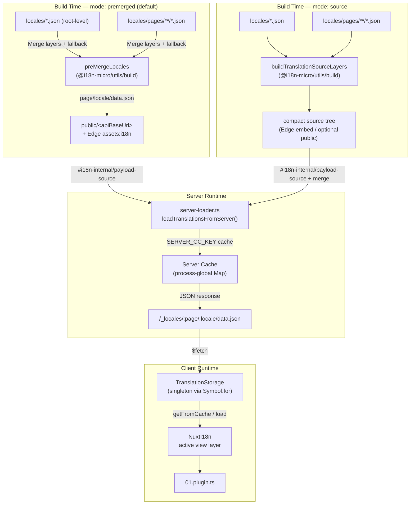

# 🗄️ 翻译缓存与存储架构

## 📖 概述

Nuxt I18n Micro v3 为翻译使用多层缓存架构。载荷加载取决于 `translationPayloads.mode`：

- **`premerged`**（默认）— 根、页面、回退和 layer 文件在构建时通过 `@i18n-micro/utils/build` 合并到 `\{page\}/\{locale\}/data.json`
- **`source`** — 保留紧凑的源文件，运行时通过 `@i18n-micro/utils/source-loader` 和 `@i18n-micro/utils/merge-source` 合并（Edge 将它们嵌入 Nitro `serverAssets`；当被复制时 Node 从 `public/` 读取）

本页描述内置缓存的工作方式，以及如何为自定义用例（管理工具、外部 API、缓存失效）进行扩展。

## 📊 架构概览

### 数据流



## 🧱 核心组件

### 1. `TranslationStorage`（客户端 + 服务端）

**文件**：`src/runtime/utils/storage.ts`

一个单例类，为客户端和服务端提供统一的翻译存储。使用 `globalThis` 上的 `Symbol.for('__NUXT_I18N_STORAGE_CACHE__')` 确保即使多个包被加载也只有一个实例。

**主要方法：**

| 方法                              | 说明                                                            |
| ----------------------------------- | ---------------------------------------------------------------------- |
| `getFromCache(locale, routeName?)`  | 同步检查：返回缓存的内存数据，或 `null`            |
| `load(locale, routeName?, options)` | 带缓存的异步加载：先检查缓存，然后通过 `$fetch` 获取 |
| `clear()`                           | 清空整个缓存                                                |

**缓存键格式**：`\{locale\}:\{routeName\}`（例如 `en:index`、`fr:about`）

```typescript
import { translationStorage } from '../utils/storage'

// Synchronous cache check
const cached = translationStorage.getFromCache('en', 'index')

// Async load (with automatic caching)
const result = await translationStorage.load('en', 'index', {
  apiBaseUrl: '_locales',
  baseURL: '/',
  dateBuild: '2024-01-01',
})
// result.data — merged translations
// result.cacheKey — cache key used
```

### ⚙️ 确定性的缓存破坏（`i18n.dateBuild`）

默认情况下，本模块在构建时使用 `Date.now()` 生成 `dateBuild`。该值随后被嵌入到生成的 `#build/i18n.strategy.mjs` 中，并作为查询参数（`?v=...`）用于在重新构建后使翻译 fetch 缓存失效。

如果你需要可复现的构建（例如为了在滚动部署中提高 chunk 缓存命中率），请在 `nuxt.config` 中设置稳定值：

```ts
export default defineNuxtConfig({
  i18n: {
    // Any stable string/number (git SHA, CI build number, release tag, etc.)
    dateBuild: process.env.GIT_SHA ?? 'local-dev',
  },
})
```

### 2. `loadTranslationsFromServer()`（仅服务端）

**文件**：`src/runtime/server/utils/server-loader.ts`

为区域/页面加载翻译，并将合并结果缓存在按 `@i18n-micro/hmr/cache-keys`（`SERVER_CC_KEY`）键控的进程级 `CacheControl` map 中。

行为：SSR 从 `#i18n-internal/payload-source` 加载 — **Node** 通过 `readFile` 从 `public/<apiBaseUrl>` 读取（在 premerged 模式下为 `\{page\}/\{locale\}/data.json`），**Edge** 通过 `assets:i18n`。`premerged` 读取单个文件；`source` 通过 `@i18n-micro/utils/source-loader` 合并根/页面/回退。

```typescript
import { loadTranslationsFromServer } from '../server/utils/server-loader'

// Returns { data: Translations, json: string }
const { data, json } = await loadTranslationsFromServer('en', 'index')
```

### 3. 客户端加载（不嵌入 HTML）

词典**不会**写入 `nuxtApp.payload`。服务器会将其保留在内存中用于 SSR 渲染；客户端插件会 `await` `switchContext`，该函数会加载 `/\{apiBaseUrl\}/:page/:locale/data.json`（与 `@nuxtjs/i18n` 的 `experimental.preload: false` 默认姿态相同）。

`NuxtI18n` 保存活动视图层字典，供 `$t()` 和 `$has()` 使用。`NuxtTranslationLoader` 切换区域/路由上下文并将 chunk 合并到该层。

### 4. 服务端 API 路由

**路由**：`/_locales/\{page\}/\{locale\}/data.json`

**文件**：`src/runtime/server/routes/i18n.ts`

该 Nitro 路由为当前载荷模式提供合并后的翻译。它调用 `loadTranslationsFromServer()` 并将结果作为 JSON 返回。

在生产环境中它还会设置：

```http
Cache-Control: public, max-age={httpCacheDuration}, immutable
```

默认 `httpCacheDuration` 为 `31536000`（1 年）。这是安全的，因为客户端在请求载荷时带有 `?v=\{dateBuild\}` 缓存破坏参数。设置 `httpCacheDuration: 0` 可省略该头。该头在开发模式下不应用。

## 📥 扩展：自定义翻译加载

### 从缓存读取（服务端路由）

```ts
// server/api/i18n/load-cache.[post].ts
import { defineEventHandler, readBody } from 'h3'
import { loadTranslationsFromServer } from '#imports'

export default defineEventHandler(async (event) => {
  const { page, locale } = await readBody<{ page: string; locale: string }>(event)
  const { data } = await loadTranslationsFromServer(locale, page)
  return { locale, page, data }
})
```

### 更新翻译（文件 + 使缓存失效）

```ts
// server/api/i18n/update.[post].ts
import { defineEventHandler, readBody, createError } from 'h3'
import { join } from 'node:path'
import { readFile, writeFile } from 'node:fs/promises'
import { deepMergeTranslations } from '@i18n-micro/utils/deep-merge'

export default defineEventHandler(async (event) => {
  const { path, updates } = await readBody<{ path: string; updates: Record<string, unknown> }>(event)

  if (!path || !updates) {
    throw createError({ statusCode: 400, statusMessage: 'Missing path or updates' })
  }

  const fullPath = join('locales', path)
  let existing: Record<string, unknown> = {}

  try {
    const content = await readFile(fullPath, 'utf-8')
    existing = JSON.parse(content) as Record<string, unknown>
  } catch {
    // File does not exist — create new
  }

  const merged = deepMergeTranslations(existing, updates)
  await writeFile(fullPath, JSON.stringify(merged, null, 2), 'utf-8')

  return { success: true, path, updated: merged }
})
```

<Tip>

</Tip>

## 🧹 清理缓存

### 通过编程方式清理缓存（客户端）

使用内置的 `$clearCache` 方法：

```vue
<script setup>
const { $clearCache } = useNuxtApp()

// Clears both TranslationStorage and plugin-level cache
$clearCache()
</script>
```

### 服务端缓存行为

服务端缓存（`loadTranslationsFromServer`）是进程级的，会一直保留，直到：

- 服务器进程重启
- 检测到新的部署（不同的 `dateBuild` 值）

对于无服务器环境，每次冷启动都会有全新的缓存。

## ⚙️ Serverless 配置

对于无服务器环境（Cloudflare Workers、AWS Lambda），内置缓存使用内存 `Map` 对象。翻译缓存本身无需外部存储配置。

不过，对于翻译源文件的 Nitro 存储可能需要配置：

```ts
export default defineNuxtConfig({
  nitro: {
    storage: {
      // Only needed if default file-system storage is unavailable
      'assets:server': {
        driver: 'cloudflare-kv-binding',
        binding: 'MY_KV_NAMESPACE',
      },
    },
  },
})
```

## 💡 与 v2 的主要差异

| 方面           | v2                            | v3                                                                       |
| ---------------- | ----------------------------- | ------------------------------------------------------------------------ |
| 客户端缓存     | `useStorage('cache')`         | `TranslationStorage` 单例（globalThis 上的 Symbol.for）                |
| SSR 传输     | Runtime config                | 通过 `payload.data` 传输完整 chunk（v3.0 使用 `useState`）                    |
| 服务端缓存     | Nitro cache storage           | 通过 `Symbol.for` 的进程级 `Map`                                    |
| 合并逻辑      | 客户端                   | 构建时（`premerged`）或运行时（`source`）通过 `@i18n-micro/utils/*` |
| 缓存键格式 | `i18n:merged:\{page\}:\{locale\}` | `\{locale\}:\{routeName\}`                                                   |

## 📚 相关

- [性能指南](/guides/performance) — 缓存如何影响性能
- [服务端翻译](/guides/server-side-translations) — 在服务端路由中使用翻译
- [Firebase 部署](/guides/firebase) — 与部署相关的缓存考量
