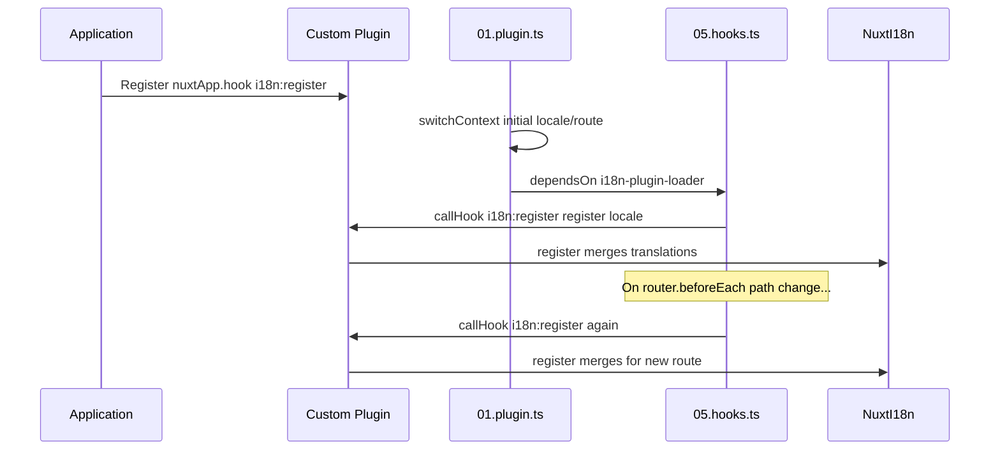

# 📢 事件

## 🔄 `i18n:register`

`Nuxt I18n Micro` 中的 `i18n:register` 事件支持将翻译动态地添加到应用的 i18n 上下文，从而使国际化过程无缝且灵活。此事件允许你按需集成新翻译，增强应用的本地化能力。

### 📝 事件详情

- **用途**：
  - 允许将额外的翻译动态地整合到某个区域已有的翻译集合中。

- **载荷**：
  - **`register`**：
    - 事件提供的函数，接收两个参数：
      - **`translations`**（`Translations`）：
        - 一个键值对对象，按 `Translations` 接口组织翻译。
      - **`locale`**（`string`，可选）：
        - 注册翻译对应的区域代码（例如 `'en'`、`'ru'`）。若未指定，默认使用事件提供的区域。

- **行为**：
  - 触发时，`register` 函数会将新翻译合并到指定区域的当前上下文，更新整个应用中可用的翻译。

### ⏱️ 触发时机

模块的 hooks 插件（`05.hooks.ts`，`dependsOn: ['i18n-plugin-loader']`）会调用 `nuxtApp.callHook('i18n:register', …)`：

1. **启动时一次** — 在主 i18n 插件（`01.plugin.ts`）加载了初始路由的翻译之后
2. **导航时** — 在路径变化的 `router.beforeEach` 中，或在 `strategy: 'no_prefix'` 时每次导航

在普通的 Nuxt 插件中通过 `nuxtApp.hook('i18n:register', …)` 注册你的监听器。hooks 插件会在加载器就绪后运行，因此你的回调会在翻译需要扩展时被调用。

在 `nuxt.config` 中设置 `hooks: false` 可禁用自动的 `i18n:register` 调用（参见[配置 — `hooks`](/guides/configuration#hooks)）。

### 💡 示例用法

以下示例展示了如何使用 `i18n:register` 事件动态添加翻译：

```typescript
nuxt.hook('i18n:register', async (register: (translations: unknown, locale?: string) => void, locale: string) => {
  register(
    {
      greeting: 'Hello',
      farewell: 'Goodbye',
    },
    locale,
  )
})
```

### 🛠️ 说明



- **触发事件**：
  - hooks 插件（`05.hooks.ts`）会在主加载器就绪后以及相关导航时触发 `i18n:register`。

- **添加翻译**：
  - 该示例为 `"greeting"` 和 `"farewell"` 注册英文翻译。
  - `register` 函数将这些翻译合并到指定区域已有的集合中。

### 🔗 主要优势

- **动态更新**：
  - 无需重新部署整个应用即可轻松更新或添加翻译。

- **本地化灵活性**：
  - 支持根据用户或应用需求进行实时本地化调整。

通过使用 `i18n:register` 事件，你可以确保应用的本地化策略保持灵活且可适应，从而提升整体用户体验。

---

## 🛠️ 通过插件修改翻译

要在你的 Nuxt 应用中动态修改翻译，推荐使用插件。插件提供了一种结构化的方式来处理本地化更新，特别是在使用模块或外部翻译文件时。

### **注册插件**

如果你在使用模块，请在模块配置中注册将进行翻译修改的插件：

```javascript
addPlugin({
  src: resolve('./plugins/extend_locales'),
})
```

这会注册位于 `./plugins/extend_locales` 的插件，用于处理翻译的动态加载和注册。

### **实现插件**

在插件中，你可以管理区域修改。以下是一个 Nuxt 插件的示例实现：

```typescript
import { defineNuxtPlugin } from '#app'

export default defineNuxtPlugin(async (nuxtApp) => {
  // Function to load translations from JSON files and register them
  const loadTranslations = async (lang: string) => {
    try {
      const translations = await import(`../locales/${lang}.json`)
      return translations.default
    } catch (error) {
      console.error(`Error loading translations for language: ${lang}`, error)
      return null
    }
  }

  // Hook into the 'i18n:register' event to dynamically add translations
  // eslint-disable-next-line @typescript-eslint/ban-ts-comment
  // @ts-expect-error
  nuxtApp.hook('i18n:register', async (register: (translations: unknown, locale?: string) => void, locale: string) => {
    const translations = await loadTranslations(locale)
    if (translations) {
      register(translations, locale)
    }
  })
})
```

### 📝 详细说明

1. **加载翻译**：

- `loadTranslations` 函数根据区域动态导入翻译文件。文件应位于 `locales` 目录，并按区域代码命名（例如 `en.json`、`de.json`）。
- 加载成功时返回翻译；否则记录错误。

2. **注册翻译**：

- 插件通过 `nuxtApp.hook` 挂钩 `i18n:register` 事件。
- 事件触发时，使用加载到的翻译和对应区域调用 `register` 函数。
- 这会将新翻译合并到指定区域的 i18n 上下文中，更新整个应用可用的翻译。

### 🔗 使用插件修改翻译的优点

- **关注点分离**：
  - 将本地化逻辑与主应用代码分离，便于管理和维护。

- **动态与可扩展**：
  - 通过动态加载和注册翻译，你可以在不完整重新部署应用的情况下更新内容，这对于内容频繁更新或多语言的应用尤其有用。

- **增强的本地化灵活性**：
  - 插件允许你根据需要修改或扩展翻译，提供更适应且响应用户偏好或业务需求的本地化策略。

采用此方式，你可以通过结构化且可维护的插件流程高效地扩展和修改应用的本地化，让国际化持续适应变化的需求并提升整体用户体验。
