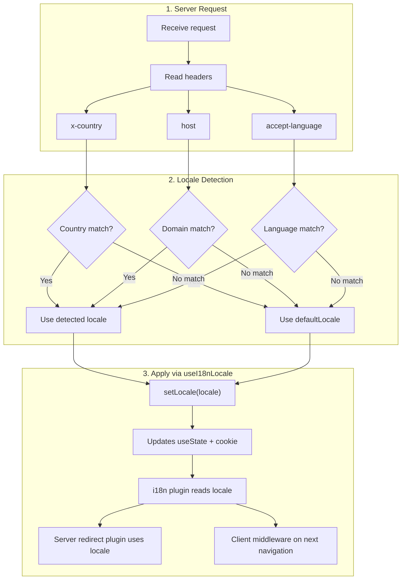

# 🔧 Nuxt I18n Micro 中的自定义语言检测

## 📖 概述

Nuxt I18n Micro v3 为所有区域管理提供了一个集中的组合式函数 — `useI18nLocale()`。它取代了 v2 中的手动 `useState`/`useCookie` 模式。通过在服务端插件中使用 `useI18nLocale().setLocale()`，你可以实现任意自定义检测逻辑，同时完全兼容模块的重定向和 cookie 系统。

## 🏗️ 架构

```mermaid
flowchart TB
    subgraph Plugins["Plugin Execution Order"]
        A["Your plugin<br/>order: -10"] -->|setLocale()| B["01.plugin.ts<br/>order: -5"]
        B --> C["06.redirect.ts server<br/>order: 10"]
    end

    subgraph Client["Client SPA Navigation"]
        D["i18n-redirect.global.ts<br/>route middleware"]
    end

    subgraph State["Locale State"]
        E["useState('i18n-locale')"]
        F["localeCookie"]
    end

    A -->|"setLocale() updates both"| E
    A -->|"setLocale() updates both"| F
    B -->|reads| E
    C -->|reads| E
    C -->|reads| F
    D -->|reads target route +| E
```

**关键原则**：在服务端插件中以 `order: -10` 调用 `useI18nLocale().setLocale()`。这会原子地更新 `useState('i18n-locale')` 和区域 cookie，使 i18n 插件（`order: -5`）和服务端重定向插件（`order: 10`）在第一次 SSR 请求上看到正确的区域。客户端自动重定向在后续导航时由全局路由中间件运行。

## 🛠️ 禁用内置自动检测

如果你希望完全控制区域检测，请禁用内置机制：

```ts
export default defineNuxtConfig({
  i18n: {
    autoDetectLanguage: false,
  },
})
```

## ✨ 示例：使用 `useI18nLocale` 进行服务端检测

这是**推荐的方式**，适用于所有策略。

### 第 1 步：配置 `nuxt.config.ts`

```ts
export default defineNuxtConfig({
  modules: ['nuxt-i18n-micro'],
  i18n: {
    strategy: 'no_prefix', // Works with ANY strategy
    defaultLocale: 'en',
    localeCookie: 'user-locale',
    autoDetectLanguage: false,
    locales: [
      { code: 'en', iso: 'en-US' },
      { code: 'de', iso: 'de-DE' },
      { code: 'ja', iso: 'ja-JP' },
    ],
  },
})
```

### 第 2 步：创建 `plugins/i18n-loader.server.ts`

```ts
import { defineNuxtPlugin, useRequestHeaders } from '#imports'

export default defineNuxtPlugin({
  name: 'i18n-custom-loader',
  enforce: 'pre',
  order: -10, // Execute BEFORE the i18n plugin (which has order -5)

  setup() {
    const { setLocale } = useI18nLocale()
    const headers = useRequestHeaders(['host', 'x-country', 'accept-language'])
    let detectedLocale = 'en'

    // --- YOUR DETECTION LOGIC ---

    // Example 1: By domain
    const host = headers['host']
    if (host?.includes('example.de')) {
      detectedLocale = 'de'
    }
    // Example 2: By custom header
    else if (headers['x-country'] === 'JP') {
      detectedLocale = 'ja'
    }
    // Example 3: By Accept-Language header
    else if (headers['accept-language']?.includes('de')) {
      detectedLocale = 'de'
    }

    // --- APPLY THE LOCALE ---
    setLocale(detectedLocale)
  },
})
```

### 工作原理



1. **插件先运行**（`order: -10`）— 从头、域名或其他来源检测区域
2. **`setLocale()` 同时更新** `useState('i18n-locale')` 和 cookie — 确保对所有后续插件立即可见
3. **i18n 插件**（`order: -5`）读取区域并加载正确的翻译
4. **服务端重定向插件**（`order: 10`）在 SSR 时使用该区域进行重定向决策
5. **客户端路由中间件**（`i18n-redirect`）在 URL 区域与偏好不匹配时对 SPA 导航执行重定向

## 🌐 各策略下的行为

`useI18nLocale().setLocale()` 适用于**所有策略**。重定向行为取决于策略：

<Tip>
| 策略 | `setLocale('de')` 的效果 |
|----------|---------------------------|
| `no_prefix` | 以德语渲染，URL 无变化 |
| `prefix` | 302 → `/de/`（服务端重定向） |
| `prefix_except_default` | 如果 `de` ≠ 默认，302 → `/de/`；如果 `de` = 默认，则不重定向 |
| `prefix_and_default` | 不重定向（`/` 和 `/de/` 都有效） |
</Tip>

**重要说明：**

- 基于 cookie 的区域检测默认禁用（`localeCookie: null`）
- 设置 `localeCookie: 'user-locale'` 以启用 cookie 持久化
- 如果 cookie/state 中的值不在 `locales` 列表中，则回退到 `defaultLocale`

## 🏢 进阶：基于域名的检测

对于每个域名对应不同区域的多域名部署：

```ts
import { defineNuxtPlugin, useRequestHeaders } from '#imports'

export default defineNuxtPlugin({
  name: 'i18n-domain-loader',
  enforce: 'pre',
  order: -10,

  setup() {
    const { setLocale } = useI18nLocale()
    const headers = useRequestHeaders(['host'])
    const host = headers['host'] || ''

    let detectedLocale = 'en'

    if (host.endsWith('.de') || host.includes('german.')) {
      detectedLocale = 'de'
    } else if (host.endsWith('.fr') || host.includes('french.')) {
      detectedLocale = 'fr'
    } else if (host.endsWith('.jp') || host.includes('japanese.')) {
      detectedLocale = 'ja'
    }

    setLocale(detectedLocale)
  },
})
```

## 🔄 进阶：尊重用户偏好

如果用户可以手动切换语言，请让其选择优先于自动检测：

```ts
import { defineNuxtPlugin, useRequestHeaders } from '#imports'

export default defineNuxtPlugin({
  name: 'i18n-smart-loader',
  enforce: 'pre',
  order: -10,

  setup() {
    const { getLocale, setLocale } = useI18nLocale()

    // If user already has a preference (from cookie), respect it
    if (getLocale()) {
      return
    }

    // Otherwise, detect locale from headers
    const headers = useRequestHeaders(['accept-language'])
    let detectedLocale = 'en'

    const acceptLanguage = headers['accept-language'] || ''
    if (acceptLanguage.includes('de')) {
      detectedLocale = 'de'
    } else if (acceptLanguage.includes('ja')) {
      detectedLocale = 'ja'
    }

    setLocale(detectedLocale)
  },
})
```

## ⚙️ 仅服务端或仅客户端插件

使用 [Nuxt 文件名约定](https://nuxt.com/docs/getting-started/directory-structure#plugins)控制插件运行位置：

- **仅服务端**：`i18n-loader.server.ts` — 仅在 SSR 期间运行（推荐用于基于头部的检测）
- **仅客户端**：`i18n-loader.client.ts` — 仅在浏览器中运行（用于基于 `localStorage` 或 DOM 的检测）

<Tip>

</Tip>

## ✅ 总结

| 特性                                | 说明                                                       |
| -------------------------------------- | ----------------------------------------------------------------- |
| `useI18nLocale().setLocale()`          | 原子地更新 `useState` + cookie；适用于所有策略 |
| `useI18nLocale().getLocale()`          | 从 state 或 cookie 返回当前区域                       |
| `useI18nLocale().getPreferredLocale()` | 返回偏好区域（根据 `locales` 列表校验）       |
| 插件 `order: -10`                    | 确保你的插件在 i18n 初始化之前运行               |
| `enforce: 'pre'`                       | 在 "pre" 插件组中运行                                    |

**请勿：**

- 直接使用 `useCookie('user-locale')` — `useI18nLocale()` 会在内部管理 cookie
- 直接使用 `useState('i18n-locale')` — 请改用 `useI18nLocale().setLocale()`
- 将 `order` 设为 >= -5 — 你的插件必须在 i18n 插件之前运行
