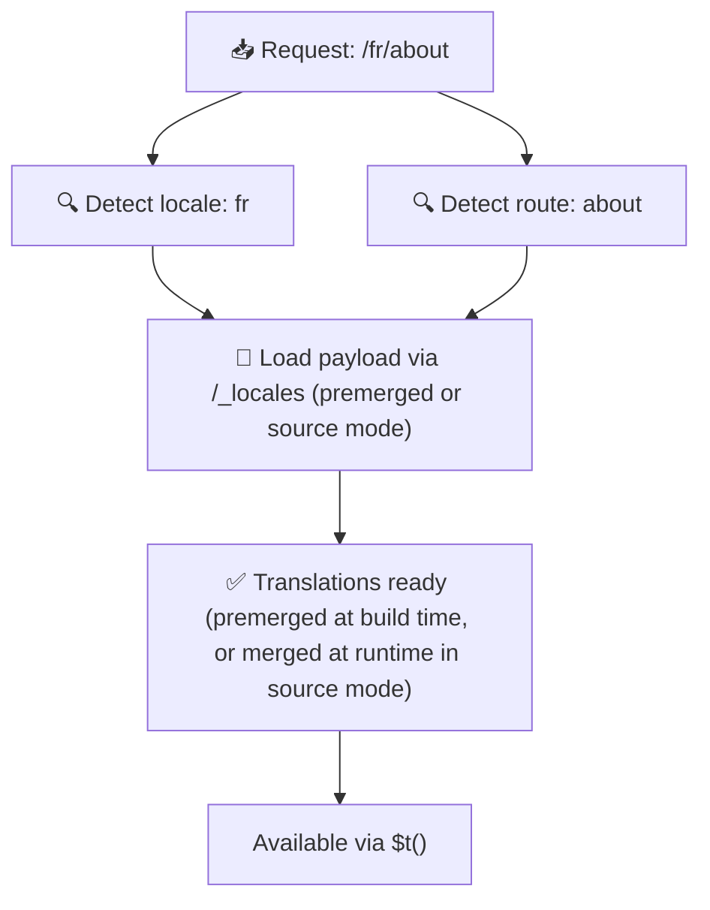

# 📂 目录结构指南

## 📖 引言

有效地组织翻译文件对于维护可扩展且高效的国际化（i18n）系统至关重要。`Nuxt I18n Micro` 通过提供一种清晰的方式管理根级和页面级翻译，简化了这一流程。本指南将带你了解推荐的目录结构，并说明 `Nuxt I18n Micro` 如何处理这些翻译。

## 🗂️ 推荐的目录结构

`Nuxt I18n Micro` 将翻译组织为根级文件和位于 `pages` 目录下的页面级文件。使用默认的 `translationPayloads.mode: 'premerged'` 时，根级翻译会在构建时自动合并到每个页面文件中，因此每个页面都拥有完整的翻译，无需运行时合并开销。

使用 `mode: 'source'` 时，源文件在 Nitro 资源中保持独立，并通过 `/_locales` 路由在运行时合并。请参阅 [Serverless 载荷输出](/guides/performance#serverless-payload-output)。

### 🔧 基本结构

以下是你应遵循的目录结构基本示例：

```text
locales/
├── pages/
│   ├── index/
│   │   ├── en.json
│   │   ├── fr.json
│   │   └── ar.json
│   ├── about/
│   │   ├── en.json
│   │   ├── fr.json
│   │   └── ar.json
├── en.json
├── fr.json
└── ar.json

```

### 📄 结构说明

#### 1. 🌍 根级翻译文件

- **路径：** `/locales/\{locale\}.json`（例如 `/locales/en.json`）
- **用途：** 这些文件包含在整个应用中共享的翻译（导航菜单、页眉、页脚等）。使用默认的 `mode: 'premerged'` 时，它们会在构建时自动合并到每个页面级文件中，因此服务器会为每个页面返回一个预先构建好的文件。

  **示例内容（`/locales/en.json`）：**

  ```json
  {
    "menu": {
      "home": "Home",
      "about": "About Us",
      "contact": "Contact"
    },
    "footer": {
      "copyright": "© 2024 Your Company"
    }
  }
  ```

#### 2. 📄 页面级翻译文件

- **路径：** `/locales/pages/\{routeName\}/\{locale\}.json`（例如 `/locales/pages/index/en.json`）
- **用途：** 这些文件包含各个页面独有的翻译。使用默认的 `mode: 'premerged'` 时，根级翻译会在构建时作为基础合并进来，因此每个页面文件都是自包含的。

  **示例内容（`/locales/pages/index/en.json`）：**

  ```json
  {
    "title": "Welcome to Our Website",
    "description": "We offer a wide range of products and services to meet your needs."
  }
  ```

  **示例内容（`/locales/pages/about/en.json`）：**

  ```json
  {
    "title": "About Us",
    "description": "Learn more about our mission, vision, and values."
  }
  ```

### 📂 处理动态路由和嵌套路径

`Nuxt I18n Micro` 会自动使用特定的重命名约定，将路由中的动态段和嵌套路径转换为扁平的目录结构。这确保所有翻译都以一致且易于访问的方式存储。

#### 动态路由的翻译目录结构

处理动态路由（例如 `/products/[id]`）时，模块会在文件结构中将动态段 `[id]` 转换为静态格式。

**动态路由的目录结构示例：**

对于类似 `/products/[id]` 的路由，翻译文件会存储在名为 `products-id` 的文件夹中：

```text
locales/pages/
├── products-id/
│   ├── en.json
│   ├── fr.json
│   └── ar.json

```

**嵌套动态路由的目录结构示例：**

对于类似 `/products/key/[id]` 的嵌套路由，翻译文件会存储在名为 `products-key-id` 的文件夹中：

```text
locales/pages/
├── products-key-id/
│   ├── en.json
│   ├── fr.json
│   └── ar.json

```

**多层嵌套路由的目录结构示例：**

对于类似 `/products/category/[id]/details` 的更复杂嵌套路由，翻译文件会存储在名为 `products-category-id-details` 的文件夹中：

```text
locales/pages/
├── products-category-id-details/
│   ├── en.json
│   ├── fr.json
│   └── ar.json

```

### 🛠 自定义目录结构

如果你更倾向于将翻译存储在其他目录，`Nuxt I18n Micro` 允许你自定义翻译文件的存储目录。你可以在 `nuxt.config.ts` 文件中进行配置。

**示例：自定义翻译目录**

```typescript
export default defineNuxtConfig({
  i18n: {
    translationDir: 'i18n', // Custom directory path
  },
})
```

此配置会指示 `Nuxt I18n Micro` 在 `/i18n` 目录（而不是默认的 `/locales` 目录）中查找翻译文件。

## ⚙️ 翻译的加载方式

### 🌍 动态区域路由

`Nuxt I18n Micro` 使用动态区域路由高效地加载翻译。当用户访问页面时，模块会根据当前路由和区域确定合适的区域并加载对应的翻译文件。



例如：

- 访问 `/en/index` 将从 `/locales/pages/index/en.json` 加载翻译。
- 访问 `/fr/about` 将从 `/locales/pages/about/fr.json` 加载翻译。

这种方式确保只加载必要的翻译，同时优化了服务器负载和客户端性能。

### 💾 缓存与预渲染

为进一步提升性能，`Nuxt I18n Micro` 支持翻译文件的缓存和预渲染：

- **缓存**：翻译文件一旦被加载，就会被缓存以供后续请求使用，从而无需重复获取相同数据。
- **预渲染**：在构建过程中，你可以针对所有已配置的区域和路由预渲染翻译文件，使其能直接从服务器提供，避免运行时延迟。

## 📝 最佳实践

### 📂 合理使用页面级文件

利用页面级文件保持翻译的有序组织。这可以让每个页面的翻译保持精简且加载迅速，对内容复杂或篇幅较大的页面尤为重要。

### 🔑 保持翻译键一致

在各文件中为翻译键使用一致的命名约定。这有助于保持清晰度，防止在管理翻译时出现问题，尤其是应用不断扩大时。

### 🗂️ 按上下文组织翻译

将相关翻译分组存放。例如，将所有按钮标签放在 `buttons` 键下，将所有表单相关文本放在 `forms` 键下。这不仅能提升可读性，还能让跨区域翻译管理更加轻松。

### ⚠️ 嵌套深度限制（建议 2 层）

在客户端导航期间，`Nuxt I18n Micro` 使用优化的 2 层深度合并策略来组合离开和进入页面的翻译。这确保了嵌套键重叠（例如两个页面都在 `common.*` 下有键）时，在过渡动画期间不会丢失内容。

**这种方式在标准的 `Section → Key → Value` 结构（2 层）下能正确工作：**

```json
// Page A translations
{ "common": { "fromA": "Text A" } }

// Page B translations
{ "common": { "fromB": "Text B" } }

// During transition, both are available:
// { "common": { "fromA": "Text A", "fromB": "Text B" } }
```

**然而，如果使用 3 层及以上的嵌套，更深层的键在过渡期间可能会被覆盖：**

```json
// Page A translations
{ "auth": { "form": { "login": "Login" } } }

// Page B translations
{ "auth": { "form": { "register": "Register" } } }

// During transition: "login" key is lost
// { "auth": { "form": { "register": "Register" } } }
```

<Tip>

</Tip>

### 🧹 定期清理未使用的翻译

随着时间推移，你的应用可能会积累未使用的翻译键，尤其是在功能被移除或重构后。请定期审阅并清理翻译文件，以保持它们精简和易于维护。
