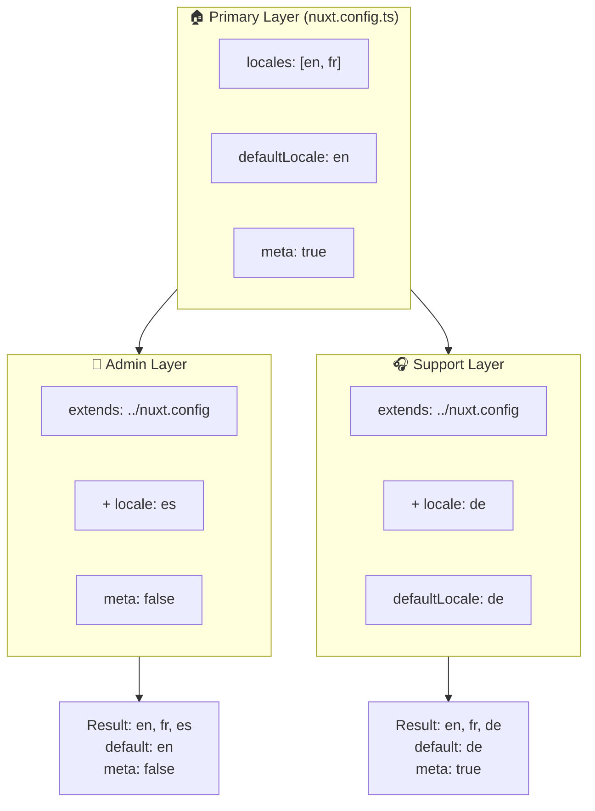

# 🗂️ `Nuxt I18n Micro` 中的 Layers

## 📖 Layers 介绍

`Nuxt I18n Micro` 中的 layers 允许你在应用的不同部分之间灵活地管理和自定义本地化设置。通过定义不同的 layer，你可以为不同的上下文调整配置，例如为站点某些区域覆盖设置，或者创建可被应用其他部分扩展的可复用基础配置。

### Layer 继承流程



## 🛠️ 主配置 Layer

**主配置 Layer**用于为整个应用设置默认的本地化配置。此 layer 至关重要，它定义了全局配置，包括支持的区域、默认语言以及其他关键的 i18n 设置。

### 📄 示例：定义主配置 Layer

以下是在 `nuxt.config.ts` 文件中定义主配置 layer 的示例：

```typescript
export default defineNuxtConfig({
  i18n: {
    locales: [
      { code: 'en', iso: 'en-EN', dir: 'ltr' },
      { code: 'fr', iso: 'fr-FR', dir: 'ltr' },
      { code: 'ar', iso: 'ar-SA', dir: 'rtl' },
    ],
    defaultLocale: 'en', // The default locale for the entire app
    translationDir: 'locales', // Directory where translations are stored
    meta: true, // Automatically generate SEO-related meta tags like `alternate`
    autoDetectLanguage: true, // Automatically detect and use the user's preferred language
  },
})
```

## 🌱 子 Layer

子 layer 用于扩展或覆盖主配置，以满足应用中特定部分的需求。例如，你可能希望为站点的某个区域添加额外的区域，或修改其默认区域。子 layer 在模块化应用中特别有用，因为应用不同部分的本地化需求可能各不相同。

### 📄 示例：在子 layer 中扩展主 layer

假设你有一个部分需要支持额外的区域，或者你希望在某个上下文中禁用某个区域。以下是如何通过扩展主配置 layer 实现这一点：

```typescript
// basic/nuxt.config.ts (Primary Layer)
export default defineNuxtConfig({
  i18n: {
    locales: [
      { code: 'en', iso: 'en-EN', dir: 'ltr' },
      { code: 'fr', iso: 'fr-FR', dir: 'ltr' },
    ],
    defaultLocale: 'en',
    meta: true,
    translationDir: 'locales',
  },
})
```

```typescript
// extended/nuxt.config.ts (Child Layer)
export default defineNuxtConfig({
  extends: '../basic', // Inherit the base configuration from the 'basic' layer
  i18n: {
    locales: [
      { code: 'en', iso: 'en-EN', dir: 'ltr' }, // Inherited from the base layer
      { code: 'fr', iso: 'fr-FR', dir: 'ltr' }, // Inherited from the base layer
      { code: 'de', iso: 'de-DE', dir: 'ltr' }, // Added in the child layer
    ],
    defaultLocale: 'fr', // Override the default locale to French for this section
    autoDetectLanguage: false, // Disable automatic language detection in this section
  },
})
```

### 🌐 在模块化应用中使用 Layers

在更大的模块化 Nuxt 应用中，你可能有多个部分，每个部分都需要自己的 i18n 设置。通过利用 layers，你可以维护一个清晰且可扩展的配置结构。

### 📄 示例：模块化应用中的分层配置

想象一下你有一个电子商务网站，其中包含主站点、后台管理面板和客户支持门户等不同部分。每个部分可能需要不同的区域集合或其他 i18n 设置。

#### **主 Layer（全局配置）：**

```typescript
// nuxt.config.ts
export default defineNuxtConfig({
  i18n: {
    locales: [
      { code: 'en', iso: 'en-EN', dir: 'ltr' },
      { code: 'fr', iso: 'fr-FR', dir: 'ltr' },
    ],
    defaultLocale: 'en',
    meta: true,
    translationDir: 'locales',
    autoDetectLanguage: true,
  },
})
```

#### **后台管理面板的子 Layer：**

```typescript
// admin/nuxt.config.ts
export default defineNuxtConfig({
  extends: '../nuxt.config', // Inherit the global settings
  i18n: {
    locales: [
      { code: 'en', iso: 'en-EN', dir: 'ltr' }, // Inherited
      { code: 'fr', iso: 'fr-FR', dir: 'ltr' }, // Inherited
      { code: 'es', iso: 'es-ES', dir: 'ltr' }, // Specific to the admin panel
    ],
    defaultLocale: 'en',
    meta: false, // Disable automatic meta generation in the admin panel
  },
})
```

#### **客户支持门户的子 Layer：**

```typescript
// support/nuxt.config.ts
export default defineNuxtConfig({
  extends: '../nuxt.config', // Inherit the global settings
  i18n: {
    locales: [
      { code: 'en', iso: 'en-EN', dir: 'ltr' }, // Inherited
      { code: 'fr', iso: 'fr-FR', dir: 'ltr' }, // Inherited
      { code: 'de', iso: 'de-DE', dir: 'ltr' }, // Specific to the support portal
    ],
    defaultLocale: 'de', // Default to German in the support portal
    autoDetectLanguage: false, // Disable automatic language detection
  },
})
```

在这个模块化示例中：

- 每个部分（admin、support）都有自己的 i18n 设置，但它们都继承了基础配置。
- 后台管理面板添加了西班牙语（`es`）作为区域并禁用了 meta 标签生成。
- 支持门户添加了德语（`de`）作为区域，并将用户界面默认设置为德语。

## 📝 使用 Layers 的最佳实践

- **🔧 保持主 Layer 简单：** 主 layer 应包含全局适用于应用的最常用设置。保持简单可确保一致性。
- **⚙️ 在子 Layer 中进行特定自定义：** 仅在必要时在子 layer 中覆盖或扩展设置，避免不必要的配置复杂度。
- **📚 为你的 Layers 编写文档：** 明确记录每个 layer 的用途和细节。这有助于保持清晰，也让他人（或未来的你）更容易理解配置。
