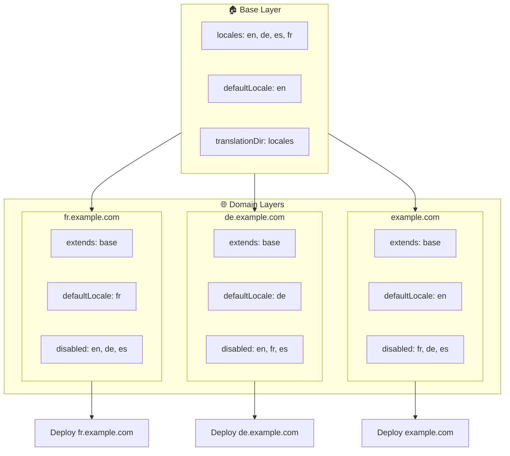

# 🌍 使用 layers 通过 `Nuxt I18n Micro` 设置多域名区域

## 📝 引言

借助 `Nuxt I18n Micro` 中的 layers，你可以创建一个灵活且易于维护的多域名本地化方案。这种方式不仅简化了域名管理（无需复杂功能），还允许高效的负载分配并降低项目复杂度。通过为不同区域运行独立项目，你的应用可以轻松扩展并适应多域名下不同的区域需求，从而为全球化应用提供强健、可扩展的解决方案。

## 🎯 目标

创建一种方案，让不同域名通过在子 layer 中自定义配置来服务特定区域。此方法充分利用 Nuxt 的分层系统，允许你在维护基础配置的同时为每个域名扩展或修改配置。

### 多域名架构



## 🛠 实现多域名区域的步骤

### 1. **创建基础 layer**

先创建一个基础配置 layer，其中包含应用所有通用的区域设置。此配置将作为其他特定域名配置的基础。

#### **基础 layer 配置**

在 `base/nuxt.config.ts` 创建基础配置文件：

```typescript
// base/nuxt.config.ts

export default defineNuxtConfig({
  i18n: {
    locales: [
      { code: 'en', iso: 'en-US', dir: 'ltr' },
      { code: 'de', iso: 'de-DE', dir: 'ltr' },
      { code: 'es', iso: 'es-ES', dir: 'ltr' },
    ],
    defaultLocale: 'en',
    translationDir: 'locales',
    meta: true,
    autoDetectLanguage: true,
  },
})
```

### 2. **创建特定域名的子 layer**

为每个域名创建一个子 layer，用以修改基础配置以满足该域名的特定需求。你可以禁用该域名不需要的区域。

#### **示例：法语域名的配置**

在 `fr/nuxt.config.ts` 为法语域名创建子 layer 配置：

```typescript
// fr/nuxt.config.ts

export default defineNuxtConfig({
  extends: '../base', // Inherit from the base configuration

  i18n: {
    locales: [
      { code: 'en', iso: 'en-US', dir: 'ltr', disabled: true }, // Disable English
      { code: 'fr', iso: 'fr-FR', dir: 'ltr' }, // Add and enable the French locale
      { code: 'de', iso: 'de-DE', dir: 'ltr', disabled: true }, // Disable German
      { code: 'es', iso: 'es-ES', dir: 'ltr', disabled: true }, // Disable Spanish
    ],
    defaultLocale: 'fr', // Set French as the default locale
    autoDetectLanguage: false, // Disable automatic language detection
  },
})
```

#### **示例：德语域名的配置**

同样，在 `de/nuxt.config.ts` 为德语域名创建子 layer 配置：

```typescript
// de/nuxt.config.ts

export default defineNuxtConfig({
  extends: '../base', // Inherit from the base configuration

  i18n: {
    locales: [
      { code: 'en', iso: 'en-US', dir: 'ltr', disabled: true }, // Disable English
      { code: 'fr', iso: 'fr-FR', dir: 'ltr', disabled: true }, // Disable French
      { code: 'de', iso: 'de-DE', dir: 'ltr' }, // Use the German locale
      { code: 'es', iso: 'es-ES', dir: 'ltr', disabled: true }, // Disable Spanish
    ],
    defaultLocale: 'de', // Set German as the default locale
    autoDetectLanguage: false, // Disable automatic language detection
  },
})
```

### 3. **为每个域名部署应用**

为每个域名部署对应配置的应用。例如：

- 将 `fr` layer 配置部署到 `fr.example.com`。
- 将 `de` layer 配置部署到 `de.example.com`。

### 4. **为不同区域搭建多个项目**

对于每个区域和域名，你需要运行独立的应用实例。这可以确保每个域名提供正确的区域配置，优化负载分布并简化项目结构。通过为每个区域运行专属项目，你可以保持配置之间的清晰隔离，降低整体设置的复杂度。

### 5. **基于域名配置路由**

确保你的路由已配置为根据用户访问的域名将用户导向正确的项目。这将确保每个域名都提供合适的区域，从而提升用户体验并在不同地区间保持一致性。

### 6. **部署并验证**

在为各域名配置好 layer 并部署后，请确保每个域名都提供了正确的区域。请全面测试应用，确认根据域名加载了正确的区域。

## 📝 最佳实践

- **保持基础配置通用**：基础配置应涵盖适用于所有域名的通用设置。
- **隔离特定域名逻辑**：将特定域名的配置放在对应的 layer 中，以保持清晰性和关注点分离。

## 🎉 结语

借助 `Nuxt I18n Micro` 中的 layers，你可以创建灵活且易于维护的多域名本地化方案。这种方式不仅消除了复杂域名管理功能的必要性，还允许高效地分配负载并降低项目复杂度。为不同区域运行独立项目可以确保应用能够轻松扩展并适应多域名的不同区域需求，从而为全球化应用提供强健且可扩展的解决方案。
