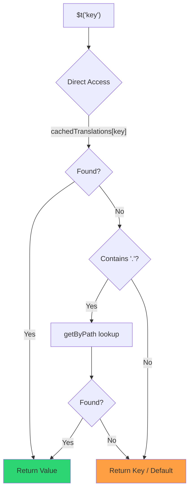

# 🚀 性能指南

## 📖 引言

`Nuxt I18n Micro` 从设计之初就注重性能，相较于 `nuxt-i18n` 等传统国际化（i18n）模块提供了显著改进。本指南深入介绍使用 `Nuxt I18n Micro` 的性能优势，以及与其他方案的对比。

## 🤔 为什么关注性能？

在大型项目和高流量环境中，性能瓶颈可能导致构建时间变慢、内存占用升高以及服务器响应变差。当 i18n 配置复杂并涉及大型翻译文件时，这些问题会更加突出。`Nuxt I18n Micro` 通过针对速度、内存效率以及对应用打包体积影响最小的方式进行优化，正面应对这些挑战。

## 📊 性能对比

我们在相同的 fixture 上通过 `pnpm test:performance`（`pnpm -C scripts cli performance`）与 **`@nuxtjs/i18n@10.6.0`** 进行了一系列测试。完整方法论与图表：[性能测试结果](/guides/performance-results)。

默认 CLI 配置：**4 个区域** × **2 个页面**（`index`、`page`）× 约 10k 个 index 叶键。可以提高 `--locales` / `--keys` 来加大回归监控负载。报告将 **代码**、**翻译**（包括 `@nuxtjs/i18n` `chunks/raw/*`）和**总体**可部署输出分开呈现。

```bash
pnpm test:performance
pnpm -C scripts cli performance --only micro --skip-stress
pnpm -C scripts cli performance --locales 12 --keys 100000 --runs 3
```

### ⏱️ 构建时间与资源占用

<Accordion title="**@nuxtjs/i18n v10.6**">
- **代码包**：2.16 MB
- **翻译**：7.21 MB（消息 chunk + 区域载荷）
- **总部署量**：9.37 MB
- **最大内存占用**：1,821 MB
- **耗时**：8.34s（3 次均值）
</Accordion>

<Tip>
- **代码包**：1.74 MB — **比 `@nuxtjs/i18n` v10.6 的代码小约 19%**
- **翻译**：6.8 MB（惰性加载的 JSON）
- **总部署量**：8.54 MB
- **最大内存占用**：1,065 MB — **比 `@nuxtjs/i18n` v10.6 少约 41% 内存**
- **耗时**：5.34s — **比 `@nuxtjs/i18n` v10.6 快约 36%**（≈ plain-nuxt 基线）
</Tip>

> 旧版文档中显示 `@nuxtjs/i18n` "代码 ≈ 15 MB / 翻译 0 B" 是将 `chunks/raw` 消息文件当作应用代码统计的结果。当前分类器将它们分开；**代码**上的差距变小，但 micro 在构建时间、峰值 RSS 和负载测试上仍然领先。

参见[完整基准报告](/guides/performance-results)以获取图表、Autocannon 结果和 fixture 详情。

### 🌐 负载下的服务器性能

Artillery（6s@6 + 60s@60）与 Autocannon（10c / 10s），每个 fixture 连续运行 3 次取均值。

<Accordion title="**@nuxtjs/i18n v10.6**">
- **每秒请求数（Artillery）**：143 [#/sec]
- **平均响应时间**：956 ms
- **Autocannon RPS / 平均延迟**：72 / 139 ms
</Accordion>

<Tip>
- **每秒请求数（Artillery）**：275 [#/sec] — **比 `@nuxtjs/i18n` v10.6 多约 93%**
- **平均响应时间**：483 ms — **比 `@nuxtjs/i18n` v10.6 快约 49%**
- **Autocannon RPS / 平均延迟**：162 / 62 ms
</Tip>

### 📈 可视化对比

<Note>
Mintlify 文档中省略了交互式图表。请查看本页的基准表，或参见 [VitePress 文档](https://s00d.github.io/nuxt-i18n-micro/guide/performance-results) 中的图表：`chart`。
</Note>

<Note>
Mintlify 文档中省略了交互式图表。请查看本页的基准表，或参见 [VitePress 文档](https://s00d.github.io/nuxt-i18n-micro/guide/performance-results) 中的图表：`chart`。
</Note>

| 指标          | @nuxtjs/i18n v10.6 | i18n-micro | 改进        |
| --------------- | ------------------ | ---------- | ------------------ |
| 构建时间      | 8.34s              | 5.34s      | **约快 36%**    |
| 内存（构建）  | 1,821 MB           | 1,065 MB   | **约减 41%**      |
| 代码包     | 2.16 MB            | 1.74 MB    | **约小 19%**   |
| 响应时间   | 956 ms             | 483 ms     | **约快 49%**    |
| RPS (Artillery) | 143                | 275        | **约多 93%**      |

### 🔍 结果解读

与当前 `@nuxtjs/i18n` **v10.6**（默认 CLI 配置，3 次均值）相比：

- 🗜️ **更小的代码图**：将消息 chunk 不误标为 "代码" 后，约 1.74 MB vs 约 2.16 MB。
- 🧠 **更低的构建 RSS**：约 1.1 GB 峰值 vs 约 1.8 GB。
- 🕒 **更快的构建**：约 5.3s vs 约 8.3s（在该配置下 micro 与 plain-Nuxt 基线持平）。
- ⚡ **在负载下表现更好**：约 275 vs 约 143 Artillery RPS，约 162 vs 约 72 Autocannon RPS，平均延迟更低。

绝对数字与旧版发布的表格不同（词典更小、Nuxt 更旧，以及针对 `@nuxtjs/i18n` 不公平的 "翻译 0 B" 拆分）。方向上一致：micro 在构建成本和请求吞吐上保持领先。

## ⚙️ 关键优化

### 🛠️ 极简设计

`Nuxt I18n Micro` 围绕一个极简架构构建，拥有小型核心和专用策略包。这减少了开销，简化了内部逻辑，从而提高性能。

### 🚦 高效路由

在 v3 中，路由生成和运行时路径逻辑被拆分到专用包中，以便进行最佳 tree-shaking：

- **`@i18n-micro/route-strategy`** — 构建时路由生成：用本地化路由扩展 Nuxt 页面。只有所选策略（`no_prefix`、`prefix`、`prefix_except_default`、`prefix_and_default`）会被包含。
- **`@i18n-micro/path-strategy`** — 运行时路径解析、重定向和链接生成。使用纯函数和预计算的上下文标志，最小化热点路径上的分配。子路径导出（`/prefix`、`/no-prefix` 等）确保只有所选实现被打包。

这种方式保持路由配置的轻量，并确保无论区域数量多少都能快速解析路由。

### 📂 精简的翻译加载

模块仅支持 JSON 格式的翻译，并明确区分全局与页面级文件。这确保任何时候只加载所需的翻译数据，进一步提升性能。

### 🔒 GlobalThis 单例缓存

从 v3.0.0 起，模块使用 `globalThis` 单例模式配合 `Symbol.for`，确保整个 Node.js 进程中只有一个缓存实例。这可以避免：

- 同一模块被多次打包时的缓存重复
- 每次请求重新创建对象带来的垃圾回收压力
- 孤立缓存实例导致的内存泄漏

```mermaid
flowchart LR
    subgraph Process["Node.js Process"]
        G["globalThis[Symbol.for('CACHE')]"]

        subgraph R1["SSR Request 1"]
            P1[Plugin Instance] --> G
        end

        subgraph R2["SSR Request 2"]
            P2[Plugin Instance] --> G
        end

        subgraph R3["SSR Request 3"]
            P3[Plugin Instance] --> G
        end
    end

    G --> Cache["Single Map Instance"]
    Cache --> D1["en:index → translations"]
    Cache --> D2["en:about → translations"
```

```typescript
// Internal implementation pattern
const CACHE_KEY = Symbol.for('__NUXT_I18N_STORAGE_CACHE__')
if (!globalThis[CACHE_KEY]) {
  globalThis[CACHE_KEY] = new Map()
}
```

### ⚡ 优化的翻译函数（tFast）

`$t()` 函数使用针对速度优化的直接查找策略：

1. **预计算的上下文**：区域和路由名在导航期间只计算一次，而不是在每次 `$t()` 调用时
2. **单一来源查找**：所有翻译（根 + 页面级 + 回退）在构建时被预合并到每个页面一个文件 — 无需分层查找
3. **导航时累积深度合并**：在同一区域内导航时，新页面翻译会被深度合并（2 层深度）到活动字典中，这样前一页面的键在过渡动画期间保持可见 — 即使页面共享重叠的嵌套前缀（例如两个页面都在 `common.*` 下有键）
4. **通过 `page:transition:finish` 触发的垃圾回收**：过渡动画完全结束后，合并的字典被替换为仅新页面的干净翻译，从而释放旧页面键的内存
5. **直接属性访问**：热点路径使用 `obj[key]` 而不是 Map 查找



```typescript
// Simplified lookup logic — single active dictionary
let val = cachedTranslations[key]
if (val === undefined && key.includes('.')) {
  val = getByPath(cachedTranslations, key)
}
```

### 💉 服务端加载（不嵌入 HTML）

SSR 期间加载的翻译保留在**服务器内存**中供渲染时 `$t` 使用。它们**不会**被复制到 `nuxtApp.payload` / HTML 文档中（与 `@nuxtjs/i18n` 的 `experimental.preload: false` 思路相同）。

在客户端，`01.plugin.ts` 会 `await` `switchContext`，在应用继续之前加载 `/\{apiBaseUrl\}/:page/:locale/data.json` — 一次请求，而不是 8 MB 的内联块。

`NuxtI18n` 仍然为 `$t()` / `$has()` 保留活动的合并字典（`cachedTranslations`）。相同区域内的导航会深度合并页面 chunk，直到 `page:transition:finish` 清理陈旧的键。

#### 当前状况

以下数字来自 `pnpm run budget:payload` 测量并强制执行的预算文件。

{/* generated:payload-budget — do not edit; run `pnpm run docs:generate` */}

在 `playground` 中测量 `/`、`/de`：

| 测量项 | 大小 |
| --- | --- |
| 磁盘上的翻译源 | 15.2 MB |
| 作为独立载荷文件提供 | 76.3 MB |
| 最大的内联 `__NUXT_DATA__` | 6.9 MB |
| 客户端资源 | 449.5 KB |

playground 使用了有意放大的词典，因此这些并非真实应用会遇到的数字 — 它们是用于对照的固定参考点。当预算意外增长时它就会失败，从而让载荷携带内容的意外变化被察觉。

{/* /generated:payload-budget */}

### 💾 缓存与预渲染

翻译会经过多个缓存层，弄清是哪一层响应了请求，可能是五分钟与五小时调试之间的差别。共有四层，按请求经过的顺序：

| 层 | 位置 | 生命周期 | 由什么清理 |
| --- | --- | --- | --- |
| 浏览器 / CDN | `/\{apiBaseUrl\}/**` 上的 `Cache-Control` | `httpCacheDuration`、`immutable` | 新的 `?v=` — 即改变了翻译的部署 |
| Nitro 路由缓存 | `routeRules['/\{apiBaseUrl\}/**'].cache` | 60 秒，stale-while-revalidate | 服务器重启 |
| 服务端加载器 | 进程内的 `CacheControl`，键为 `locale:routeName` | 进程生命周期，或 `cacheTtl` | 服务器重启，开发时的 HMR |
| 客户端存储 | `translationStorage` 加上 `NuxtI18n` 中的当前 chunk | 页面生命周期 | 重新加载 |

两条规则确保它们不会互相矛盾：

- **Nitro 路由缓存仅在存在 `?v=` 时启用。** 有缓存破坏参数时，每个 URL 都与其内容一一对应，因此在服务端缓存不会出现陈旧问题。设置 `dateBuild: 0` 会关闭该层，因为此时 URL 稳定不变，响应会带上 `must-revalidate` — 服务端缓存会在最多一分钟内返回陈旧条目，从而悄悄使其失效。
- **`immutable` 也需要 `?v=`。** 若没有缓存破坏，头会是 `public, max-age=0, must-revalidate`，无论 `httpCacheDuration` 设为什么：在从不变化的 URL 上使用长 `max-age` 会永久锁定浏览器首次看到的响应。

<Warning>
在 `translationPayloads.publicAssets`（premerged 模式的默认）下，载荷会被复制到 `public/<apiBaseUrl>/\{page\}/\{locale\}/data.json`。自己提供该目录的平台（Cloudflare Pages、Firebase Hosting、`npx serve`）会应用它们自己的头 — Nitro `routeRules` 头仅对经过服务器的响应生效。请在这些平台自身的配置中为静态文件设置缓存策略。
</Warning>

🏁 **预渲染**：在 premerged 模式下，`publicAssets` 已经将客户端 URL 树写入 `public/`。仅当禁用了该复制时你需要 Nitro 物化 handler 路由时，才启用 `prerenderRoutes`。

### 🗜️ 压缩的公共载荷

启用 `nitro.compressPublicAssets` 时，复制到公共目录的翻译载荷也会生成 `.gz` 和 `.br` 副本：

```ts
export default defineNuxtConfig({
  nitro: { compressPublicAssets: true },
})
```

Nitro 会在复制载荷的 hook 之前压缩 public 资源，若不启用此选项，它们将成为静态构建中唯一未压缩的部分。模块不会自动开启压缩 — 它只应用你选择的设置。逐编码选择（`\{ gzip: true, brotli: false \}`）会被遵守。

playground index 载荷：6 651 984 B 原始，1 012 831 B gzip，821 617 B brotli。

### ☁️ Serverless 载荷输出

在 **Node** 上，SSR 从 `public/<apiBaseUrl>` 读取翻译 JSON（`readFile`，不使用 Nitro `serverAssets` / Rollup `raw:`）。在 **Edge** 上，Nitro `serverAssets` 嵌入相同的树（对大词典建议使用 `mode: 'source'`）。

```typescript
export default defineNuxtConfig({
  i18n: {
    translationPayloads: {
      serverAssets: true, // default — Node → public copy; Edge → serverAssets embed
      publicAssets: true, // default in premerged mode
    },
  },
})
```

对紧凑的 Edge 嵌入（以及可选的紧凑 public 副本）使用 `translationPayloads.mode: 'source'`：

```typescript
export default defineNuxtConfig({
  i18n: {
    translationPayloads: {
      mode: 'source',
    },
  },
})
```

`mode: 'source'` 保持 layer 合并后的源文件紧凑，并通过内置的 `/_locales` 路由（或 Edge 的 `assets:i18n`）在运行时合并根 / 页面 / 回退。默认情况下，它会禁用 public 资源副本和预渲染载荷路由。

<Warning>
`prerenderRoutes` 默认为 `false`。使用 `mode: 'source'` 时，`publicAssets` 也默认为 `false`。因此，无 Nitro/edge 运行时的纯静态托管无法在客户端加载翻译，除非你启用其中一种输出、保留 `serverHandler` 可在运行时使用，或将载荷托管在外部。

默认 premerged + `publicAssets` 已经在 `public/` 下放置了 `/\{apiBaseUrl\}/\{page\}/\{locale\}/data.json`，因此静态主机可以在无 Nitro 的情况下响应客户端 fetch。
</Warning>

<Warning>
设置 `apiBaseServerHost` 或 `apiBaseClientHost` 会将载荷服务移到该源站，并伴随自身的要求 — 参见[配置 → 外部 CDN 主机](/guides/configuration#external-cdn-hosts)。
</Warning>

或禁用单个 HTTP/public 输出并将载荷外部托管：

```typescript
export default defineNuxtConfig({
  i18n: {
    apiBaseClientHost: 'https://cdn.example.com',
    apiBaseServerHost: 'https://cdn.example.com',
    translationPayloads: {
      serverHandler: false,
      publicAssets: false,
      prerenderRoutes: false,
    },
  },
})
```

当你依赖内置的本地 `/\{apiBaseUrl\}/:page/:locale/data.json` 路由时，请保持 `serverHandler` 启用。载荷托管在外部并且 `apiBaseServerHost` 指向该外部源站时禁用它。仅当你需要 Nitro 物化静态载荷路由而 `publicAssets` 未写出这些文件时才启用 `prerenderRoutes`。

构建期间，当生成的载荷输出超过 `translationPayloads.warnFileCount`（默认 500）或 `translationPayloads.warnSizeBytes`（默认 10 MB）时，模块会发出警告。当所有本地输出都被禁用而没有配置外部载荷主机时，也会发出警告。

## 📝 最大化性能的建议

以下几条建议可确保你从 `Nuxt I18n Micro` 获取最佳性能：

- 📉 **限制区域数据**：仅包含项目所需的区域，以减少打包体积。
- 🗂️ **使用页面级翻译**：按页面组织翻译文件，避免加载不必要的数据。
- 💾 **启用缓存**：利用缓存特性减轻服务器负载并改善响应时间。
- 🏁 **利用预渲染**：预渲染翻译以加快页面加载并减少运行时开销。

若需性能测试的详细结果，请参见[性能测试结果](/guides/performance-results)。
