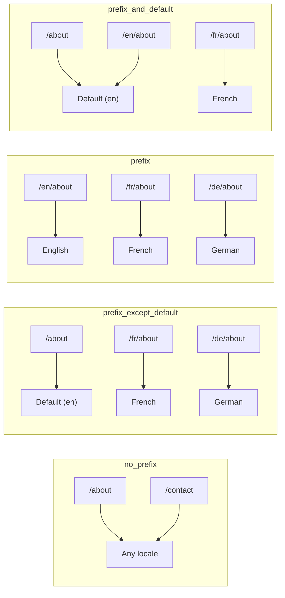
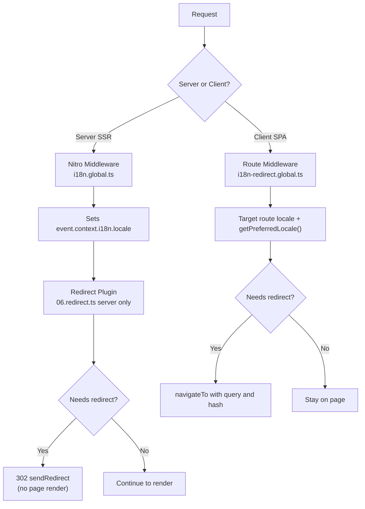

# 🗂️ Nuxt I18n Micro 中的路由策略

## 📖 概述

Nuxt I18n Micro 通过 `strategy` 选项控制 URL 中区域前缀的显示方式。底层由两个包实现：

- **`@i18n-micro/route-strategy`** — 构建时路由生成（用本地化路由扩展 Nuxt 页面）
- **`@i18n-micro/path-strategy`** — 运行时路径解析、重定向、SEO 属性以及链接生成

Nuxt 模块会在构建时选择正确的策略类，并通过 `#i18n-strategy` 进行别名映射，因此只有被选中的实现会被打包。

## 🚦 可用策略

{/* generated:option:strategy — do not edit; run `pnpm run docs:generate` */}

**Type** `Strategies` · **Default** `'prefix_except_default'`

区域前缀的 URL 路由策略。

- `'no_prefix'` — URL 中不包含区域；区域存储在 cookie 中。
- `'prefix_except_default'` — 除默认区域外的所有区域都添加前缀。
- `'prefix'` — 始终添加前缀，包括默认区域。
- `'prefix_and_default'` — 类似 `prefix`，但默认区域也可以在没有前缀的情况下访问。

{/* /generated:option:strategy */}

### 策略对比



### 🛑 `no_prefix`

URL 中没有区域段。区域由 cookie、`useI18nLocale()` 状态或浏览器检测决定。

- **路由**：`/about`、`/contact` — 所有区域使用相同的 URL 模式（没有 `/en/`、`/fr/` 前缀）
- **区域持久化**：通过 `localeCookie`（若未指定，则会自动设置为 `'user-locale'`）
- **自定义路径**：通过 [`globalLocaleRoutes`](/guides/configuration#globallocaleroutes) 和 [`defineI18nRoute`](/guides/custom-locale-routes) 支持 — 本地化 slug 会在不为 URL 添加区域前缀的情况下生成（例如 `/about` 与 `/ueber-uns`）。相比 `prefix_except_default`，嵌套路由、别名和针对区域的限制更简单。

<Tip>
使用 `no_prefix` 时，如果未指定，`localeCookie` 会自动设置为 `'user-locale'`。这是必需的，因为 URL 中不包含任何区域信息。
</Tip>

```typescript
i18n: {
  strategy: 'no_prefix'
  // localeCookie is automatically set to 'user-locale'
}
```

### 🚧 `prefix_except_default`

所有路由都带有区域前缀，**默认区域除外**。

- **默认区域**：`/about`、`/contact`
- **其他区域**：`/fr/about`、`/de/contact`
- **默认区域带前缀会返回 404**：当 `en` 为默认时，`/en/about` → 404

```typescript
i18n: {
  strategy: 'prefix_except_default' // This is the default
}
```

### 🌍 `prefix`

每个路由都带有区域前缀，包括默认区域。

- **所有区域**：`/en/about`、`/fr/about`、`/de/about`
- **根路径 `/`**：根据用户偏好重定向到 `/\{locale\}/`

```typescript
i18n: {
  strategy: 'prefix'
}
```

### 🔄 `prefix_and_default`

默认区域既可以带前缀访问也可以不带前缀访问。非默认区域始终带有前缀。

- **默认区域**：`/about` 和 `/en/about` 都是有效的
- **其他区域**：`/fr/about`、`/de/about`
- **从 `/` 不重定向**：`/` 和 `/en/` 都会提供默认区域

```typescript
i18n: {
  strategy: 'prefix_and_default'
}
```

## 🔀 重定向架构（v3）

在 v3 中，重定向逻辑被拆分为两个层次以实现最佳性能：

### 工作原理



### 服务端（无闪烁）

1. **Nitro 中间件**（`i18n.global.ts`）首先运行 — 从 URL、cookie 或 `Accept-Language` 头检测区域并设置 `event.context.i18n.locale`
2. **重定向插件**（`06.redirect.ts`，仅服务端）使用 `i18nStrategy.getClientRedirect()` 检查当前路径是否需要重定向，并在**任何页面渲染发生之前**发出 302
3. 这可以避免"错误闪烁"，即用户在重定向前短暂看到错误页面

### 客户端（SPA 导航）

1. 当启用 `redirects` 时，全局路由中间件（`i18n-redirect.global.ts`）会在每次客户端导航时运行
2. 首先从**目标路由**推导出偏好区域，然后回退到 `useI18nLocale().getPreferredLocale()`
3. 使用 `i18nStrategy.getClientRedirect()` 决定是否需要重定向
4. 重定向时保留 `query` 和 `hash`

### 区域优先级顺序

在服务端，重定向插件按如下顺序确定偏好区域：

1. **`useState('i18n-locale')`** — 最高优先级（通过 `useI18nLocale().setLocale()` 编程式设置）
2. **Cookie** — 若配置了 `localeCookie`
3. **`Accept-Language` 头** — 若 `autoDetectLanguage: true`
4. **`defaultLocale`** — 最终回退

在客户端，路由中间件优先使用目标路由中的区域，然后使用相同的 state/cookie 回退链。

### 各策略下的重定向行为

| 策略                | `GET /` 行为                              | 是否需要 Cookie？ |
| ----------------------- | --------------------------------------------- | ---------------- |
| `no_prefix`             | 不重定向（区域来自 cookie/state）        | 自动设置         |
| `prefix`                | 302 → `/\{locale\}/`                            | 建议开启      |
| `prefix_except_default` | 若区域 ≠ 默认，302 → `/\{locale\}/`        | 建议开启      |
| `prefix_and_default`    | 不重定向（`/` 和 `/\{locale\}/` 都有效） | 可选         |

### 禁用重定向

```typescript
i18n: {
  redirects: false // Disables automatic locale redirects
}
```

当 `redirects: false` 时，自动区域重定向被禁用：

- **服务端**：重定向插件（`06.redirect.ts`，仅服务端）仍会注册，但会跳过重定向逻辑。它仍然会为无效的区域前缀执行 **404 检查**（例如 `xx` 不是有效区域时的 `/xx/about`），并**根据 URL 前缀同步 cookie**（例如访问 `/fr/about` 时会将 cookie 同步为 `fr`）
- **客户端**：`i18n-redirect` 全局路由中间件**不会被注册** — 没有 SPA 自动重定向

## 🍪 基于 Cookie 的区域持久化

<Warning>
在使用 `prefix` 或 `prefix_except_default` 且启用 `redirects: true`（默认值）时，你**必须**设置 `localeCookie` 才能让重定向正常工作。如果没有 cookie，重定向插件无法在页面刷新之间记住用户的区域偏好。

```typescript
i18n: {
  strategy: 'prefix_except_default',
  localeCookie: 'user-locale' // Required for redirects to work properly
}
```
</Warning>

**`localeCookie` 在 v3 中的工作原理：**

- 由 `useI18nLocale()` 内部管理 — **不要**通过 `useCookie()` 手动设置
- 当用户访问带前缀的 URL（例如 `/fr/about`）时，cookie 会自动同步为 `fr`
- 下次访问 `/` 时，cookie 值会用于重定向到 `/\{locale\}/`
- 如果 cookie 中包含无效区域（不在 `locales` 列表中），则回退到 `defaultLocale`

| 策略                | `localeCookie` 默认值 | 备注                                |
| ----------------------- | ---------------------- | ------------------------------------ |
| `no_prefix`             | 自动：`'user-locale'`  | 必需；自动设置          |
| `prefix`                | `null`（禁用）      | 若需重定向，请设置为 `'user-locale'` |
| `prefix_except_default` | `null`（禁用）      | 若需重定向，请设置为 `'user-locale'` |
| `prefix_and_default`    | `null`（禁用）      | 可选                             |

## 🔍 `autoDetectLanguage` 与 `autoDetectPath`

### `autoDetectLanguage`

{/* generated:option:autoDetectLanguage — do not edit; run `pnpm run docs:generate` */}

**Type** `boolean` · **Default** `true`

自动从 `Accept-Language` HTTP 头检测用户偏好语言。
与 `autoDetectPath` 结合使用，决定何时进行检测。

{/* /generated:option:autoDetectLanguage */}

该检查在服务端中间件中运行，并作为回退：cookie 或已有状态优先。

```typescript
i18n: {
  autoDetectLanguage: true
}
```

### `autoDetectPath`

{/* generated:option:autoDetectPath — do not edit; run `pnpm run docs:generate` */}

**Type** `string` · **Default** `'/'`

Cookie / Accept-Language 偏好重定向可运行的路径（当启用 `redirects` 时）。

- `'/'` — 仅 `/`（默认区域的深链接仍可访问；默认）
- `'no_prefix'` — 仅不带区域前缀的路径
- `'*'` — 所有路径，包括重写显式的区域前缀
  （例如当 cookie 偏好 `de` 时，`/fr/about` → `/de/about`）

- 任意其他字符串 — 精确路径匹配（例如 `'/welcome'`）

在 `prefix_except_default` 下的前缀策略清理（例如 `/en` → `/`）不受此设置限制。

{/* /generated:option:autoDetectPath */}

```typescript
i18n: {
  autoDetectPath: '/' // Default: only root
  // autoDetectPath: '*' // All paths — redirects even /fr/about to /de/about
}
```

<Warning>
当 `autoDetectPath: '*'` 时，即使 URL 带有显式的区域前缀（例如 `/fr/about`），如果与用户偏好区域不同也会被重定向。这在基于域名的设置中可能有用，但可能会让分享 URL 的用户感到困惑。
</Warning>

在默认 `autoDetectPath: '/'` 且带有区域 cookie 的情况下：

| 请求 | cookie | 结果 |
| --- | --- | --- |
| `/` | `de` | 302 → `/de` |
| `/about` | `de` | 200，默认区域（不重写） |

```typescript
i18n: {
  localeCookie: 'user-locale',
  strategy: 'prefix_except_default',
  // Default — remember language on entry, keep deep links stable
  autoDetectPath: '/',
  // Or redirect on every unprefixed path (but not /de/… → /fr/…):
  // autoDetectPath: 'no_prefix',
}
```

## ⚠️ 已知问题与最佳实践

### 1. `no_prefix` 策略中的水合失配

使用 `no_prefix` 时，区域是动态确定的。如果服务端和客户端对区域判断不一致，你会看到水合失配。

**解决方案**：在服务端插件中使用 `useI18nLocale().setLocale()`（配合 `order: -10`），在 i18n 初始化之前设置区域：

```ts
// plugins/i18n-loader.server.ts
export default defineNuxtPlugin({
  name: 'i18n-custom-loader',
  enforce: 'pre',
  order: -10,
  setup() {
    const { setLocale } = useI18nLocale()
    setLocale('ja') // Your detection logic here
  },
})
```

详见[自定义语言检测](/guides/custom-language-detection)获取详细示例。

### 2. 在 `localeRoute` 中使用命名路由

基于路径的路由可能导致路由解析问题：

```typescript
// May cause issues
$localeRoute('/page')

// Preferred approach
$localeRoute({ name: 'page' })
```

### 3. 在启用 i18n 时使用 `pages: false`

在 Nuxt 中使用 `pages: false` 时：

```typescript
export default defineNuxtConfig({
  pages: false,
  i18n: {
    strategy: 'no_prefix', // Recommended
    disablePageLocales: true, // Required
    localeCookie: 'user-locale', // Required for persistence
  },
})
```

**使用 `pages: false` 时的限制：**

- 无自动重定向
- 无基于 URL 的区域检测
- 客户端切换区域需要页面重载或手动加载翻译

### 4. 无效 Cookie 处理

如果 cookie 中包含无效区域（不在 `locales` 列表中），模块会优雅地回退到 `defaultLocale`。不会抛出错误。

## 📝 最佳实践摘要

| 建议            | 详情                                                                             |
| ------------------------- | ----------------------------------------------------------------------------------- |
| **设置 `localeCookie`**    | 对启用 `redirects: true` 的前缀策略始终设置                             |
| **使用 `useI18nLocale()`** | 管理区域状态的集中方式（取代手动 `useState`/`useCookie`） |
| **使用命名路由**      | 优先使用 `$localeRoute(\{ name: 'page' \})`，而非 `$localeRoute('/page')`                       |
| **编程式区域**   | 在服务端插件中使用 `useI18nLocale().setLocale()`，配合 `order: -10`              |
| **避免手动 cookie**  | 不要直接使用 `useCookie('user-locale')` — `useI18nLocale()` 会管理它      |
