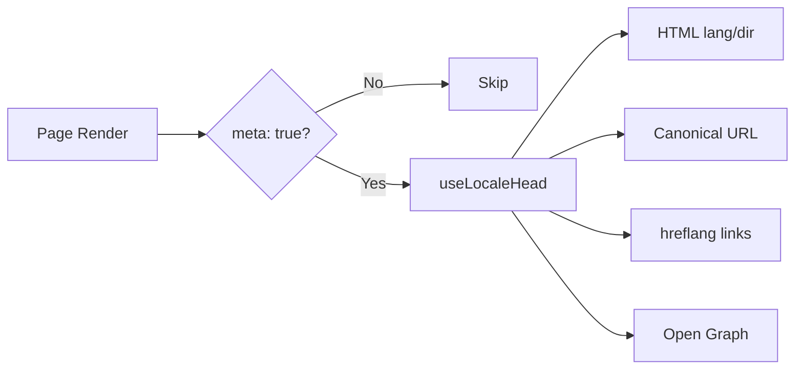

# 🌐 Nuxt I18n Micro 的 SEO 指南

## 📖 引言

有效的 SEO（搜索引擎优化）对于确保你的多语言网站能通过搜索引擎被全球用户访问和发现至关重要。`Nuxt I18n Micro` 通过自动生成必要的元标签和属性，简化了多语言网站的 SEO 管理，使搜索引擎了解站点结构和内容。

本指南解释 `Nuxt I18n Micro` 如何在无需额外配置的情况下处理 SEO，以提升站点可见性和用户体验。

## ⚙️ 自动 SEO 处理

### SEO Meta 生成流程



**生成的标签：**

| 标签             | 示例                                                  |
| --------------- | -------------------------------------------------------- |
| HTML 属性 | `<html lang="en" dir="ltr">`                             |
| Canonical       | `<link rel="canonical" href="...">`                      |
| hreflang        | `<link rel="alternate" hreflang="en" href="...">`        |
| x-default       | `<link rel="alternate" hreflang="x-default" href="...">` |
| Open Graph      | `<meta property="og:locale" content="en_US">`            |

#### 按区域生成 `og`（`og:locale` vs BCP 47）

`<html lang>` 和 `hreflang` 通过 `locale.iso` 使用 **BCP 47**（例如 `ar-AE`）。  
Open Graph 需要按 [OG 协议](https://ogp.me/) 使用带**下划线**的 **`language_TERRITORY`**（例如 `ar_AE`）。

默认情况下，当映射明确时，`og:locale` 会从 `iso` 推导（`en-US` → `en_US`）。  
当你需要自定义值时（例如 `zh-Hans` → `zh_CN`），请设置显式的 **`og`** 字符串。  
如果既没有 `og` 也没有可转换的 `iso`，则不会生成 `og:locale` 标签 — 在开发环境下你会得到控制台警告（受 `missingWarn` 控制）。

```typescript
i18n: {
  meta: true,
  locales: [
    { code: 'ar', iso: 'ar-AE', og: 'ar_AE', dir: 'rtl' },
    { code: 'en', iso: 'en-US' }, // og:locale → en_US
    { code: 'zh', iso: 'zh-Hans', og: 'zh_CN' }, // script tags need explicit og
  ],
}
```

### 🔑 主要 SEO 特性

在 `Nuxt I18n Micro` 中启用 `meta` 选项时，模块会自动管理以下 SEO 相关内容：

1. **🌍 语言与方向属性**：
   - 模块会根据当前区域和文本方向（例如英语的 `ltr` 或阿拉伯语的 `rtl`）设置 `<html>` 标签上的 `lang` 和 `dir` 属性。

2. **🔗 Canonical URL**：
   - 模块为每个页面生成 canonical 链接（`<link rel="canonical">`），确保搜索引擎识别内容的主版本。

3. **🌐 备用语言链接（`hreflang`）**：
   - 模块会自动为所有可用区域生成 `<link rel="alternate" hreflang="">` 标签。这有助于搜索引擎了解你的内容有哪些语言版本，从而提升全球用户的体验。
   - 每个区域发出**一个**标签：`hreflang = iso || code`。当设置了 `iso` 时，路由 `code` 绝不会用作 `hreflang`（因此像 `mx` 这样的市场标识不会变成无效的语言标签）。
   - 可选的 `hreflangBaseLanguage: true` 也会发出从 `iso` 派生的纯语言标签（例如 `es-ES` → `es`），由 `locales` 中第一个匹配地区的区域声明。

4. **🌏 `x-default` Hreflang**：
   - 模块会自动生成一个 `<link rel="alternate" hreflang="x-default">` 标签指向默认区域的 URL。这告诉搜索引擎当用户语言不匹配任何已定义区域时应展示哪个 URL。无需额外配置 — 只要设置了 `meta: true` 就会自动生效。

5. **🔖 Open Graph 元数据**：
   - 模块为每个区域生成 Open Graph 元标签（`og:locale`、`og:url` 等），这对社交媒体分享和搜索引擎索引尤其有用。

### 🛠️ 配置

要启用这些 SEO 特性，请确保在 `nuxt.config.ts` 中将 `meta` 选项设为 `true`：

```typescript
export default defineNuxtConfig({
  modules: ['nuxt-i18n-micro'],
  i18n: {
    locales: [
      { code: 'en', iso: 'en-US', dir: 'ltr' },
      { code: 'fr', iso: 'fr-FR', dir: 'ltr' },
      { code: 'ar', iso: 'ar-SA', dir: 'rtl' },
    ],
    defaultLocale: 'en',
    translationDir: 'locales',
    meta: true, // Enables automatic SEO management
  },
})
```

### 🌍 多域名部署的动态 `metaBaseUrl`

当 `metaBaseUrl` 未设置时，绝对 SEO URL 按以下顺序解析（#240）：

1. 来自 [`nuxt-site-config`](https://nuxtseo.com/docs/site-config) 的 `site.url`（如果存在该模块 — 例如通过 `@nuxtjs/seo`）
2. 否则使用当前请求的主机名（`useRequestURL()` / `window.location.origin`）

请求来源的回退会尊重反向代理的头（`X-Forwarded-Host`、`X-Forwarded-Proto`），因此在 nginx、Cloudflare、AWS ALB 等代理之后也能正确工作。

这意味着已经为 sitemap / robots / schema.org 设置 `site.url` 的应用**不**需要再声明 `metaBaseUrl`：

```typescript
export default defineNuxtConfig({
  site: {
    url: process.env.NUXT_SITE_URL, // also used by micro for canonical / og:url / hreflang
  },
  i18n: {
    meta: true,
    // metaBaseUrl omitted — picks up site.url, then request origin
  },
})
```

在没有 `site.url` 的情况下，单个应用实例仍然可以通过请求来源为**多个域名**提供正确的 SEO 标签：

```typescript
export default defineNuxtConfig({
  i18n: {
    meta: true,
    // metaBaseUrl is undefined by default — resolved dynamically from the request
  },
})
```

例如，对 `https://site-a.com/en/about` 的请求会产生：

```html
<link rel="canonical" href="https://site-a.com/en/about" /> <meta property="og:url" content="https://site-a.com/en/about" />
```

而同一个应用响应 `https://site-b.com/en/about` 时会产生：

```html
<link rel="canonical" href="https://site-b.com/en/about" /> <meta property="og:url" content="https://site-b.com/en/about" />
```

如果你需要一个始终优先于 `site.url` 的固定 base URL，请传入一个静态字符串：

```typescript
metaBaseUrl: 'https://example.com'
```

### 🔍 Canonical 查询白名单

默认情况下，查询参数会从 canonical 和 `og:url` 中去除，以避免重复内容。你可以将特定查询参数加入白名单以保留：

```typescript
i18n: {
  canonicalQueryWhitelist: ['page', 'sort', 'filter', 'search', 'q', 'query', 'tag']
}
```

只有 `canonicalQueryWhitelist` 中列出的参数才会出现在 canonical URL 中。所有其他查询参数（例如跟踪、会话 ID）都会被移除。

### 🚫 按页面禁用 Meta 标签

你可以使用 `defineI18nRoute()` 为特定页面禁用 SEO meta 标签生成：

```vue
<script setup>
// Disable all SEO meta tags for this page
defineI18nRoute({
  disableMeta: true,
})
</script>
```

你也可以仅为特定区域禁用 meta：

```vue
<script setup>
// Disable meta tags only for English locale on this page
defineI18nRoute({
  disableMeta: ['en'],
})
</script>
```

当 `disableMeta` 生效时，对应页面/区域不会生成 `hreflang`、`canonical`、`og:locale`、`og:url` 或 `x-default` 标签。

### 🔇 禁用的区域

带有 `disabled: true` 的区域会自动从所有 SEO 标签生成中排除 — 不会为其创建 `hreflang`、`og:locale:alternate` 或备用链接：

```typescript
i18n: {
  locales: [
    { code: 'en', iso: 'en-US' },
    { code: 'fr', iso: 'fr-FR', disabled: true }, // excluded from SEO tags
  ]
}
```

### 🙈 选择性退出的区域（`seo: false`）

对于应保持可路由并被翻译，但不应出现在跨区域发现标签中的区域，请设置 `seo: false`。这些区域会从 `hreflang` alternates 与 `og:locale:alternate` 中省略。如果你配置的**默认**区域设为 `seo: false`，则 `x-default` 链接也不会发出。

```typescript
i18n: {
  locales: [
    { code: 'en', iso: 'en-US' },
    { code: 'ru', iso: 'ru-RU', seo: false }, // internal / non-indexed locale
  ]
}
```

### 📌 各策略下的行为

| 策略                | hreflang 链接   | x-default             | canonical      | og:url |
| ----------------------- | ---------------- | --------------------- | -------------- | ------ |
| `prefix`                | ✅ 所有区域   | ✅ 默认区域 URL | ✅ 当前 URL | ✅     |
| `prefix_except_default` | ✅ 所有区域   | ✅ 未加前缀 URL     | ✅ 当前 URL | ✅     |
| `prefix_and_default`    | ✅ 所有区域   | ✅ 默认区域 URL | ✅ 当前 URL | ✅     |
| `no_prefix`             | ❌ 不生成 | ❌ 不生成      | ✅ 当前 URL | ✅     |

对于 `no_prefix` 策略，只生成 `canonical`、`og:url`、`og:locale` 和 `html` 属性（`lang`、`dir`）。备用语言链接（`hreflang`）和 `x-default` 不会生成，因为不同区域没有不同的 URL。

## 页面级覆盖（`useI18nHead`）

对于**文章、指南或任何 CMS 内容**，若并非每个区域都存在，或 URL 来自 API，请在页面上使用 [`useI18nHead`](/api/composables/use-i18n-head)，而不是自定义 i18n head 插件。

### 有部分翻译的文章

```vue
<script setup lang="ts">
const article = await loadArticle()
// article.locales = { en: '...', de: '...' } — only translated locales

useI18nHead({
  meta: [{ property: 'og:title', content: article.title }],
  replace: {
    hreflang: Object.entries(article.locales).map(([locale, href]) => ({
      rel: 'alternate',
      hreflang: locale,
      href,
    })),
    ogAlternates: Object.keys(article.locales),
  },
})
</script>
```

### 每个区域各自的 slug 与 `$setI18nRouteParams`

当 slug 因语言而异时，请先设置路由参数，再用真实 URL 覆盖 alternates：

```vue
<script setup lang="ts">
const { $defineI18nRoute, $setI18nRouteParams } = useNuxtApp()
const { data: article } = await useFetch(`/api/articles/${slug}`)

$defineI18nRoute({
  localeRoutes: { en: '/blog/[slug]', de: '/de/blog/[slug]' },
})

$setI18nRouteParams({
  en: { slug: article.value.slugEn },
  de: { slug: article.value.slugDe },
})

useI18nHead({
  replace: {
    hreflang: ['en', 'de'].map((locale) => ({
      rel: 'alternate',
      hreflang: locale,
      href: article.value.urls[locale],
    })),
    ogAlternates: ['en', 'de'],
  },
})
</script>
```

### 代理背后的 HTTPS 源

在无需自定义 origin 组合式函数的情况下，在 SSR 上获取正确的绝对 URL：

```ts
i18n: {
  meta: true,
  metaBaseUrl: undefined,
  metaTrustForwardedHost: true,
  metaTrustForwardedProto: true,
}
```

更多示例（canonical 覆盖、`x-default`、响应式 fetch、共享辅助函数）：[useI18nHead 组合式函数](/api/composables/use-i18n-head)。

### ⚠️ 尾部斜杠

模块根据 `useRoute().fullPath` 中的实际路径生成 canonical 和 `hreflang` URL。如果你的应用使用尾部斜杠（例如通过 Nuxt 的 `router.options`），生成的 URL 将反映这一点。然而，`$switchLocalePath` 可能会规范化路径并去除尾部斜杠。如果尾部斜杠一致性对你的 SEO 至关重要，请核对生成的 URL 是否与应用的 URL 结构匹配。

### 🎯 益处

启用 `meta` 选项后你将获得：

- **📈 更好的搜索引擎排名**：搜索引擎能更好地索引你的站点，理解不同语言版本之间的关系。
- **👥 更好的用户体验**：用户会根据自己的偏好获得正确的语言版本，从而获得更个性化的体验。
- **🔧 减少手动配置**：模块会自动处理 SEO 任务，让你不再需要手动添加 SEO 相关的元标签和属性。

## 🔗 Nuxt SEO（`@nuxtjs/seo`）

[`@nuxtjs/seo`](https://nuxtseo.com/) 集合了 sitemap、robots、schema.org、OG 图片以及相关模块。它通过 [`nuxt-site-config`](https://nuxtseo.com/docs/site-config/guides/i18n)（v4+）与 **nuxt-i18n-micro** 集成。

### 前置要求

- **`@nuxtjs/seo` 3+**（当前版本使用 `nuxt-site-config` 4+，该版本会为 micro 注册 `nuxt-site-config:i18n` 插件）
- **`i18n.meta: true`**（推荐 — micro 提供基于区域的头标签；Nuxt SEO 添加 sitemap、schema.org 等）

### 模块顺序

将 **nuxt-i18n-micro 列在 `@nuxtjs/seo` 之前**，以便 site config 可以读取你的区域设置：

```typescript
export default defineNuxtConfig({
  modules: ['nuxt-i18n-micro', '@nuxtjs/seo'],
  site: {
    url: 'https://example.com',
    name: 'My Site',
  },
  i18n: {
    meta: true,
    defaultLocale: 'en',
    locales: [
      { code: 'en', iso: 'en-US' },
      { code: 'de', iso: 'de-DE' },
    ],
  },
})
```

### 翻译后的站点名与描述

Nuxt Site Config 会从你的区域文件中读取可选的翻译键：

```json
{
  "nuxtSiteConfig": {
    "name": "My Site",
    "description": "My site description"
  }
}
```

`locales/en.json`、`locales/de.json` 等中的按区域值会被自动采用。

### 故障排查

如果看到 `Plugin nuxt-seo:defaults depends on nuxt-site-config:i18n but they are not registered`，请将 **`@nuxtjs/seo` 升级到 3+**（参见 [issue #133](https://github.com/s00d/nuxt-i18n-micro/issues/133)）。旧版 `nuxt-site-config` 3.x 只为 `@nuxtjs/i18n` 连接 i18n，未支持 micro。

更多：[Sitemap i18n 指南](https://nuxtseo.com/docs/sitemap/guides/i18n)、[Site Config i18n 指南](https://nuxtseo.com/docs/site-config/guides/i18n)。
