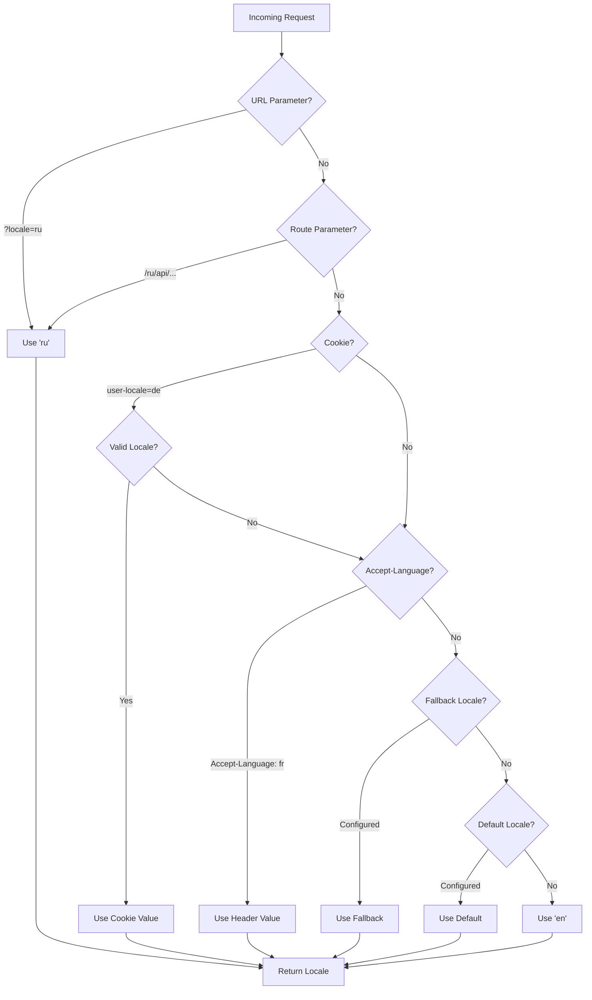

# 🌍 Nuxt I18n Micro 中的服务端翻译与区域信息

## 📖 概述

Nuxt I18n Micro 支持服务端翻译与区域信息，允许你在服务器上翻译内容并访问区域详细信息。这对于在到达客户端之前需要本地化的 API 或服务端渲染应用尤为有用。

翻译使用 Nuxt I18n 配置中定义的区域消息，并根据检测到的区域动态解析。

默认（`translationPayloads.mode: 'premerged'`）情况下，根级文件在构建时会被烘焙到每个页面载荷 `\{page\}/\{locale\}/data.json` 中。服务器加载与客户端在 `/\{apiBaseUrl\}/...` 下获取的相同预构建文件，因此所有键（共享和页面级）都在服务端 handler 中可用。

在 `translationPayloads.mode: 'source'` 下，当调用 `loadTranslationsFromServer()`（或 `/_locales` 路由）时，紧凑源文件会在运行时合并 — 在 **Edge** 上通过 Nitro `serverAssets`，在 **Node** 上从可选的 public 副本读取。详情请参见[性能指南 — Serverless 载荷输出](/guides/performance#serverless-payload-output)和[缓存与存储架构](/api/cache)。

若需运行时与服务端 API 的汇总列表，请参见 [API 参考](/api/overview)。

## 🛠️ 设置服务端中间件

要启用服务端翻译和区域信息，请使用提供的中间件函数：

- `useTranslationServerMiddleware` - 用于翻译内容
- `useLocaleServerMiddleware` - 用于访问区域信息

两个中间件函数在所有服务端路由中都会自动可用。

区域检测逻辑通过 `detectCurrentLocale` 工具函数在两个中间件间共享，以确保模块内的一致性。

## ✨ 在服务端 Handler 中使用翻译

你可以通过翻译中间件在任意 `eventHandler` 中无缝翻译内容。

### 示例：基础翻译用法

```typescript
import { defineEventHandler } from 'h3'

export default defineEventHandler(async (event) => {
  const t = await useTranslationServerMiddleware(event)
  return {
    message: t('greeting'), // Returns the translated value for the key "greeting"
  }
})
```

在这个示例中：

- 用户区域会自动从查询参数、cookie 或头部检测出来。
- `t` 函数为检测到的区域获取合适的翻译。

## 🌍 在服务端 Handler 中使用区域信息

### 基础区域信息用法

```typescript
import { defineEventHandler } from 'h3'

export default defineEventHandler((event) => {
  const localeInfo = useLocaleServerMiddleware(event)

  return {
    success: true,
    data: localeInfo,
    timestamp: new Date().toISOString(),
  }
})
```

### 提供自定义区域参数

```typescript
import { defineEventHandler } from 'h3'

export default defineEventHandler((event) => {
  // Force specific locale with custom default
  const localeInfo = useLocaleServerMiddleware(event, 'en', 'ru')

  return {
    success: true,
    data: localeInfo,
    timestamp: new Date().toISOString(),
  }
})
```

### 响应结构

区域中间件返回一个 `LocaleInfo` 对象，包含以下属性：

```typescript
interface LocaleInfo {
  current: string // Current detected locale code
  default: string // Default locale code
  fallback: string // Fallback locale code
  available: string[] // Array of all available locale codes
  locale: Locale | null // Full locale configuration object
  isDefault: boolean // Whether current locale is the default
  isFallback: boolean // Whether current locale is the fallback
}
```

### 示例响应

```json
{
  "success": true,
  "data": {
    "current": "ru",
    "default": "en",
    "fallback": "en",
    "available": ["en", "ru", "de"],
    "locale": {
      "code": "ru",
      "iso": "ru-RU",
      "dir": "ltr",
      "displayName": "Русский"
    },
    "isDefault": false,
    "isFallback": false
  },
  "timestamp": "2024-01-15T10:30:00.000Z"
}
```

## 🌐 提供自定义区域

如果你需要手动指定区域（例如用于测试或特定请求），可以将其传递给翻译中间件：

### 示例：自定义区域

```typescript
import { defineEventHandler } from 'h3'

function detectLocale(event): string | null {
  const urlSearchParams = new URLSearchParams(event.node.req.url?.split('?')[1])
  const localeFromQuery = urlSearchParams.get('locale')
  if (localeFromQuery) return localeFromQuery

  return 'en'
}

export default defineEventHandler(async (event) => {
  const t = await useTranslationServerMiddleware(event, 'en', detectLocale(event)) // Force French local, en - default locale
  return {
    message: t('welcome'), // Returns the French translation for "welcome"
  }
})
```

## 📋 区域检测逻辑

两个中间件函数按以下优先级顺序自动确定用户区域：



1. **URL 参数**：`?locale=ru`
2. **路由参数**：`/ru/api/endpoint`
3. **Cookie**：`user-locale` cookie
4. **HTTP 头**：`Accept-Language` 头
5. **回退区域**：模块选项中配置的值
6. **默认区域**：模块选项中配置的值
7. **硬编码回退**：`'en'`

> **注意**：区域检测逻辑在 `useLocaleServerMiddleware` 和 `useTranslationServerMiddleware` 之间共享，以确保模块的一致性。

## 📋 高级用法示例

### 基于区域的条件响应

```typescript
import { defineEventHandler } from 'h3'

export default defineEventHandler((event) => {
  const { current, isDefault, locale } = useLocaleServerMiddleware(event)

  // Return different content based on locale
  if (current === 'ru') {
    return {
      message: 'Привет, мир!',
      locale: current,
      isDefault,
    }
  }

  if (current === 'de') {
    return {
      message: 'Hallo, Welt!',
      locale: current,
      isDefault,
    }
  }

  // Default English response
  return {
    message: 'Hello, World!',
    locale: current,
    isDefault,
  }
})
```

### 自定义区域检测

```typescript
import { defineEventHandler } from 'h3'

export default defineEventHandler((event) => {
  // Force German locale with English as fallback
  const { current, isDefault, locale } = useLocaleServerMiddleware(event, 'en', 'de')

  return {
    message: 'Hallo, Welt!',
    locale: current,
    isDefault: false, // Will be false since we forced German
  }
})
```

### 带校验的区域感知 API

```typescript
import { defineEventHandler, createError } from 'h3'

export default defineEventHandler((event) => {
  const { current, available, locale } = useLocaleServerMiddleware(event)

  // Validate if the detected locale is supported
  if (!available.includes(current)) {
    throw createError({
      statusCode: 400,
      statusMessage: `Unsupported locale: ${current}. Available locales: ${available.join(', ')}`,
    })
  }

  // Return locale-specific configuration
  return {
    locale: current,
    direction: locale?.dir || 'ltr',
    displayName: locale?.displayName || current,
    availableLocales: available,
  }
})
```

### 与翻译中间件的集成

你可以将区域信息与翻译中间件结合，实现完整的国际化：

```typescript
import { defineEventHandler } from 'h3'

export default defineEventHandler(async (event) => {
  const localeInfo = useLocaleServerMiddleware(event)
  const t = await useTranslationServerMiddleware(event)

  return {
    locale: localeInfo.current,
    message: t('welcome_message'),
    availableLocales: localeInfo.available,
    isDefault: localeInfo.isDefault,
  }
})
```

## 📝 最佳实践

1. **始终校验区域**：检查检测到的区域是否在你的可用区域列表中
2. **使用回退逻辑**：在区域检测失败时提供合理的默认值
3. **缓存区域信息**：对于性能关键的应用，可以考虑缓存区域检测结果
4. **处理边缘情况**：考虑不支持的区域并提供合适的错误响应
5. **与翻译结合**：将区域信息与翻译中间件一起使用以获得完整的 i18n 支持

## 🚀 性能考量

- 两个中间件函数轻量且面向快速执行设计
- 区域检测使用高效的回退链
- 区域检测期间不进行外部 API 调用
- 结果同步计算以获得最佳性能
